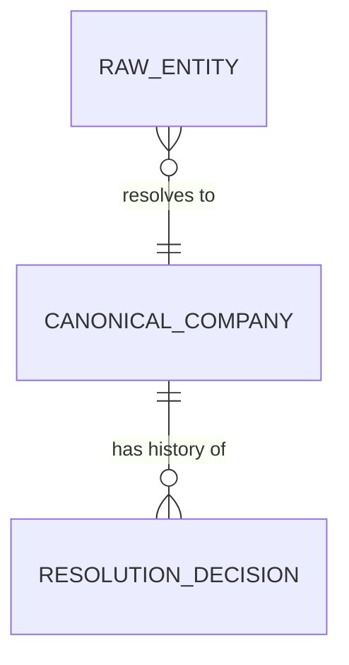
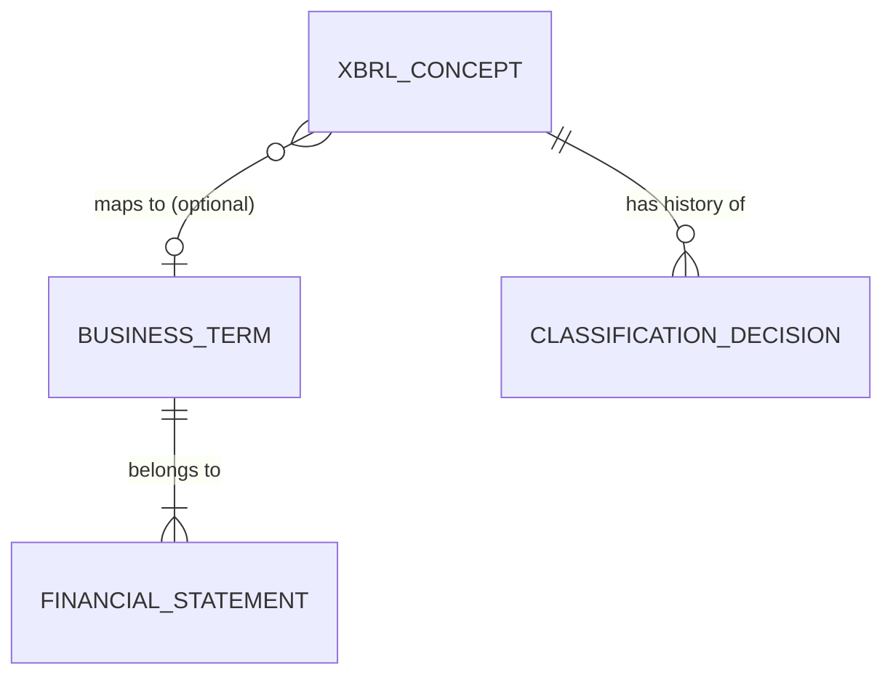
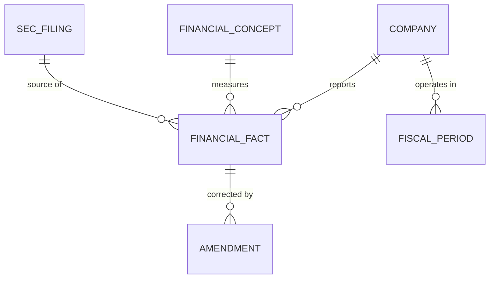
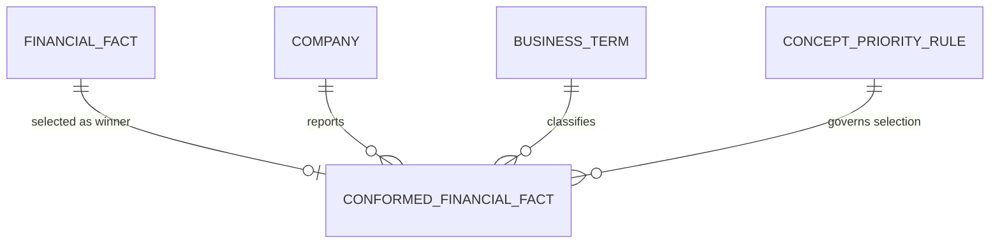
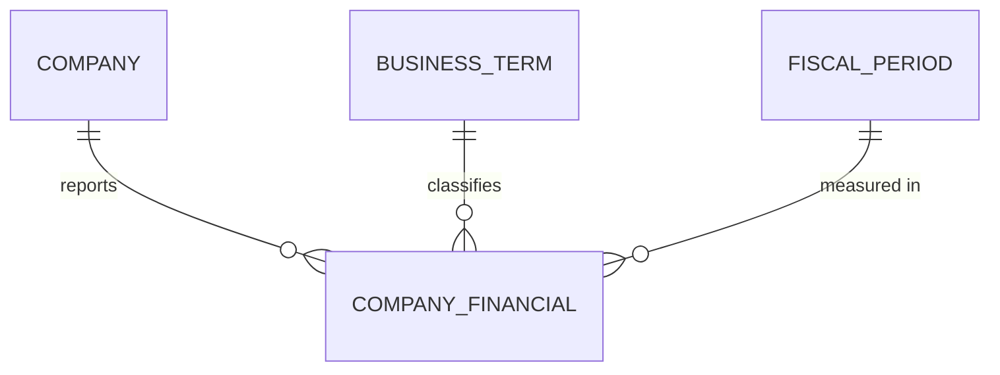
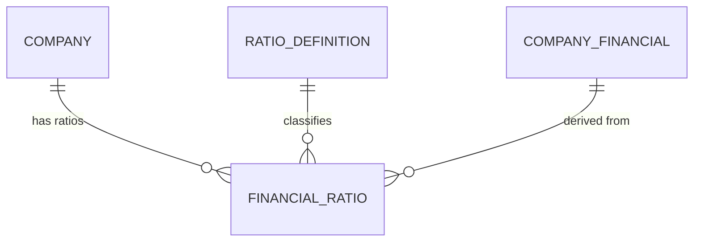
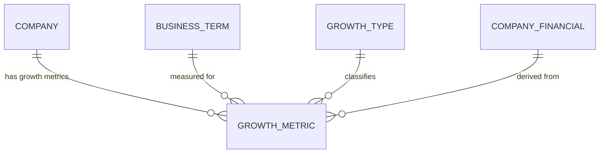
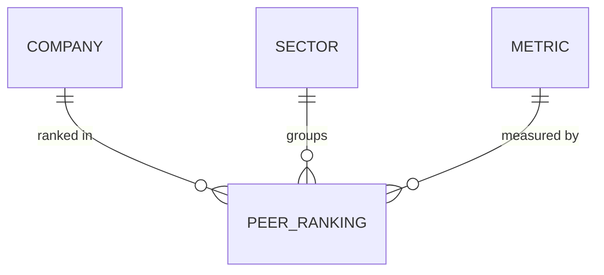
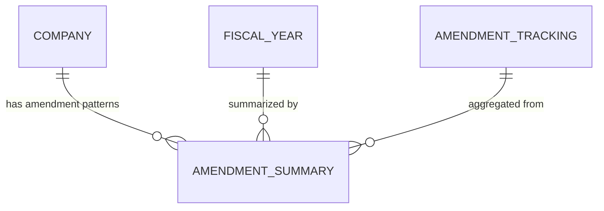

# SEC EDGAIR


-brightgreen)


AI agent pipeline that takes raw SEC EDGAR XBRL data and delivers it as a clean, tested, governed, semantically meaningful, AI-ready data product — with a natural language chat interface.

**Stack:** Python 3.11+, DuckDB + Apache Iceberg, Claude API (tool use), Claude Code with specialized agents

**Status:** Complete — all 4 zones shipped and verified against known 10-K figures

## Background

**SEC** (Securities and Exchange Commission) is the US government agency that regulates public companies. **EDGAR** (Electronic Data Gathering, Analysis, and Retrieval) is the SEC's public database where every public company files their financial reports — quarterly earnings (10-Q), annual reports (10-K), insider trades, etc.

**XBRL** (eXtensible Business Reporting Language) is a standardized format for tagging financial data so computers can read it. Instead of a PDF that says "Revenue: $50B", XBRL tags that number with metadata — concept name, currency, reporting period, filing entity. Every fact gets a machine-readable label.

Without XBRL, comparing Apple's revenue to Microsoft's means reading two different PDFs with different layouts. With XBRL, you can programmatically pull every public company's revenue into a table in seconds.

This project takes that raw XBRL data and pipes it through a 4-zone pipeline (Raw → Base → Consumable → AI-Ready) so it ends up clean, normalized, and ready for AI models to reason over — turning government financial filings into structured data an LLM can actually use.

## Architecture

```
SEC EDGAR XBRL → Raw → Base → Consumable → AI-Ready Chat
  20 companies    547K   786K    136K rows    7 tool functions
  17 years        rows   rows    5 tables     Claude API agent
```

Each zone is governed by AI agents that produce lineage, data quality rules, business term mappings, and audit trails as a byproduct of the transformation work. Every spec follows a mandatory agent pipeline: @data-analyst (EDA) → @dq-rule-writer (rules from evidence) → @dq-engineer (execute + gate) → @staff-engineer (final review).

Principal Data Architect Agent review: [full review (A)](governance/reviews/principal-data-architect-re-review.md)

## What's Built

### Infrastructure

| Spec | What It Does |
|------|-------------|
| `infra-setup-duckdb-iceberg` | DuckDB + Apache Iceberg local read/write with PyIceberg SqlCatalog |
| `infra-dq-execution-framework` | DQ execution engine: 111 SQL rules, P0 gating, automatic triggers, dedup guards |
| `infra-runtime-lineage` | Runtime lineage events to Iceberg — every promote emits START/COMPLETE/FAIL with snapshot IDs, row counts, duration |
| `infra-create-agent-definitions` | 10+ specialized Claude Code agents |

### Raw Zone

| Spec | What It Does |
|------|-------------|
| `raw-ingest-xbrl-company-facts` | Ingests XBRL Company Facts from SEC EDGAR for 20 companies. **547,398 facts**, 3,285 XBRL concepts. |
| `raw-profile-classify-company-facts` | Statistical profiling, PII scanning (none found), data classification |

### Base Zone

| Spec | What It Does |
|------|-------------|
| `base-entity-resolution` | Maps 20 CIKs to canonical company identities with human approval gate |
| `base-xbrl-tag-normalization` | Maps 3,285 XBRL concepts to 25 canonical business terms via tiered matching |
| `base-financial-facts-model` | 547K enriched facts with supersession, fiscal calendar, amendment tracking |
| `base-conformed-facts` | One authoritative fact per (company, metric, year, period) — collision resolution, unit filtering, supersession filtering moved from consumable to base |
| `base-bitemporal-schema` | Temporal queries, point-in-time lookups, Iceberg time travel |
| `base-fiscal-year-fix` | Fixed fiscal year derivation (from end_date, not XBRL fy) + TTM disambiguation |

### Consumable Zone

| Spec | Rows | What It Does |
|------|------|-------------|
| `consumable-company-financials` | 28,849 | Cross-company financial comparison — one row per (company, metric, year, period) |
| `consumable-financial-ratios` | 7,102 | 7 computed ratios: margins, leverage, efficiency |
| `consumable-period-over-period` | 71,402 | YoY change, YoY % change, 5-year CAGR |
| `consumable-peer-comparison` | 28,633 | Sector rankings, percentiles, averages (17 companies in 5 sectors) |
| `consumable-amendment-analysis` | 371 | Restatement frequency, magnitude, patterns per company/year |

### AI-Ready Zone

| Spec | What It Does |
|------|-------------|
| `ai-ready-chat-interface` | 8 validated tool functions over DuckDB + Claude API agent. Natural language chat with the data. No RAG, no embeddings — tool use over structured queries. |
| `ai-ready-dedup-tool-enrichment` | Deduplicated enrichment logic in tool functions — extracted 6 shared helpers, reduced financial_tools.py from 1,391 to 1,202 lines |
| `infra-architect-remediation` | All 7 findings from Principal Data Architect review: DQ gates on promotes, scalable dedup (DuckDB anti-join), DQ pushdown, generic anomaly detection, amendment tool, dead code cleanup |

## Data Pipeline

```
SEC EDGAR API/Bulk ZIP
    ↓
raw.xbrl_company_facts              547,398 facts, 20 companies, 19 columns
    ↓
base.entity_mappings                20 CIK → canonical company identity mappings
base.concept_mappings               3,285 XBRL concept → business term classifications
base.financial_facts                547K enriched facts, 28 columns, supersession + TTM dedup
base.conformed_facts                28,849 rows — one authoritative fact per grain (collision-resolved)
base.fiscal_calendar                1,483 fiscal periods across 20 companies
base.amendment_tracking             264K supersession pairs with value changes
    ↓
consumable.company_financials       28,849 rows — presentation layer (+sector, +companies_reporting)
consumable.financial_ratios         7,102 rows — 7 computed ratios
consumable.period_over_period       71,402 rows — YoY growth + 5yr CAGR
consumable.peer_comparison          28,633 rows — sector ranks + percentiles
consumable.amendment_analysis       371 rows — restatement patterns
    ↓
AI-Ready Chat Interface             8 tool functions → Claude API → natural language answers

governance.lineage_events           Runtime lineage: START/COMPLETE/FAIL per promote
                                    (snapshot IDs, row counts, DQ results, duration)
```

## Verification

**88 checks against known 10-K figures — all pass.**

### Cross-Company (57 checks)
All 20 companies verified for Revenue + Net Income, plus Total Assets, EPS, Operating Income, Operating Cash Flow, Capital Expenditures, Stockholders Equity for select companies. All FY-end patterns tested (Dec, Sep, Jun, Jan).

### All-Metrics Deep Dive (31 checks)
All 24 business terms + 7 computed ratios verified for Apple FY2023 against the official 10-K filing.

### Negative Verification (10 checks)
Proves incorrect data is absent: no duplicate grains, no superseded fact leaks, no wrong-unit values, no fiscal year collisions, no orphan ratios, row count alignment across zones.

```bash
# Run verification
PYTHONPATH=. uv run python scripts/verify.py               # 57 cross-company checks
PYTHONPATH=. uv run python scripts/verify_all_metrics.py    # 31 all-metrics checks
PYTHONPATH=. uv run python scripts/verify_negative.py       # 10 negative checks
```

## Governance

Every transformation produces governance artifacts automatically:

- **54 business terms** in `governance/business-glossary.json` (25 XBRL + 7 SEC EDGAR + 22 project-specific)
- **31 CDEs** in `governance/cde-catalog.json`
- **14 Iceberg tables** documented in `governance/data-dictionary.json`
- **128 DQ rules** across 9 dimensions with execution engine and scorecards (127 pass, 1 P1 advisory)
- **DQ gates enforced on all promote paths** — P0 failures block writes
- **Runtime lineage** — every promote emits START/COMPLETE/FAIL events to `governance.lineage_events` Iceberg table with snapshot IDs, row counts, DQ results, and duration
- **Structural lineage docs** in `governance/lineage/` — generated from runtime events via `python -m src.infra.lineage generate-docs`
- **21 data models** (conceptual, logical, physical) in `governance/models/`
- **Concept priority rules** governed as data artifact in `governance/conformation/`
- **Principal Data Architect Agent review** — A ([full review](governance/reviews/principal-data-architect-re-review.md))
- **PII:** None detected. All data is public SEC filings.

## Data Quality

128 SQL-based DQ rules across 9 dimensions, executed against real Iceberg tables via `python -m src.infra.dq_runner run`.

### Latest Results

| Zone | Specs | Rules | Passed | Failed | P0 Gate |
|------|-------|-------|--------|--------|---------|
| Raw | 1 | 8 | 8 | 0 | PASS |
| Base | 5 | 49 | 48 | 1 (P1) | PASS |
| Consumable | 5 | 71 | 71 | 0 | PASS |
| **Total** | **11** | **128** | **127** | **1 (P1)** | **PASS** |

The single P1 failure (BASE-BT-003) is advisory — comparative data in newer filings legitimately supersedes older filings' values, which can violate the temporal ordering assumption. Documented and expected.

P0 failures **block** spec completion. P1 failures **warn**. P2/P3 are **informational**.

## Business Glossary

54 business terms defined across three source tiers — all approved:

| Source | Terms | Approved By | Description |
|--------|-------|-------------|-------------|
| XBRL Taxonomy | 25 | Auto (external standard) | Financial reporting metrics (Revenue, Net Income, etc.) |
| SEC EDGAR | 7 | Auto (external standard) | Filing types, entity identifiers, regulatory concepts |
| Project-Specific | 22 | human:jeff / auto | Pipeline concepts + derived metrics (ratios, growth, sectors, peer comparison, amendments) |

### 25 Financial Metrics

| Category | Metrics |
|----------|---------|
| Balance Sheet (8) | Total Assets, Total Liabilities, Total Stockholders Equity, Cash & Equivalents, Accounts Receivable, Inventory, PP&E, Goodwill |
| Income Statement (8) | Revenue, Cost of Revenue, Gross Profit, Operating Income, Net Income, Income Tax Expense, R&D Expense, SG&A Expense |
| Cash Flow (4) | Operating CF, Investing CF, Financing CF, Capital Expenditures |
| Per-Share (3) | EPS Basic, EPS Diluted, Dividends Per Share |
| Other (2) | Comprehensive Income, Retained Earnings |

### 7 Computed Ratios

| Ratio | Formula | Coverage |
|-------|---------|----------|
| Gross Margin | Gross Profit / Revenue | 8 companies |
| Operating Margin | Operating Income / Revenue | 18 companies |
| Net Margin | Net Income / Revenue | 20 companies |
| Debt-to-Equity | Total Liabilities / Stockholders Equity | 20 companies |
| R&D Intensity | R&D Expense / Revenue | 12 companies |
| SGA Ratio | SG&A Expense / Revenue | 17 companies |
| CapEx-to-Revenue | abs(Capital Expenditures) / Revenue | 19 companies |

Full glossary: [`governance/business-glossary.json`](governance/business-glossary.json)

## Data Models

Full model documentation (conceptual, logical, physical) lives in [`governance/models/`](governance/models/). All models cross-reference the [business glossary](governance/business-glossary.json).

### Base Zone Models

#### Conceptual: Entity Resolution

> Full model: [base-entity-resolution-conceptual.md](governance/models/base-entity-resolution-conceptual.md)

#### Conceptual: XBRL Tag Normalization

> Full model: [base-xbrl-tag-normalization-conceptual.md](governance/models/base-xbrl-tag-normalization-conceptual.md)

#### Conceptual: Financial Facts Model

> Full model: [base-financial-facts-model-conceptual.md](governance/models/base-financial-facts-model-conceptual.md)

#### Conceptual: Conformed Facts

> Full model: [base-conformed-facts-conceptual.md](governance/models/base-conformed-facts-conceptual.md)

### Consumable Zone Models

#### Conceptual: Company Financials

> Full model: [consumable-company-financials-conceptual.md](governance/models/consumable-company-financials-conceptual.md)

#### Conceptual: Financial Ratios

> Full model: [consumable-financial-ratios-conceptual.md](governance/models/consumable-financial-ratios-conceptual.md)

#### Conceptual: Period-Over-Period Growth

> Full model: [consumable-period-over-period-conceptual.md](governance/models/consumable-period-over-period-conceptual.md)

#### Conceptual: Peer Comparison

> Full model: [consumable-peer-comparison-conceptual.md](governance/models/consumable-peer-comparison-conceptual.md)

#### Conceptual: Amendment Analysis

> Full model: [consumable-amendment-analysis-conceptual.md](governance/models/consumable-amendment-analysis-conceptual.md)

### AI-Ready Zone

The AI-Ready zone is an application layer, not a data transformation zone. No new Iceberg tables. Architecture diagram: [ai-ready-chat-interface-conceptual.md](governance/models/ai-ready-chat-interface-conceptual.md)

## Quick Start

```bash
# Install
uv sync

# Run tests (466 tests)
uv run pytest

# Data quality — execute rules against real Iceberg data
uv run python -m src.infra.dq_runner run

# Verify against known 10-K figures
PYTHONPATH=. uv run python scripts/verify.py

# Consumable zone
uv run python -m src.consumable.company_financials.cli all
uv run python -m src.consumable.financial_ratios.cli all
uv run python -m src.consumable.period_over_period.cli all
uv run python -m src.consumable.peer_comparison.cli all
uv run python -m src.consumable.amendment_analysis.cli all

# Runtime lineage — check latest pipeline runs
uv run python -m src.infra.lineage status

# AI-Ready chat interface — talk to the data
export ANTHROPIC_API_KEY=sk-ant-...
uv run python -m src.ai_ready.cli
uv run python -m src.ai_ready.cli --single "What was Apple's revenue in 2024?"
```

## Project Structure

```
src/                            Source code organized by zone
  infra/                        DuckDB + Iceberg utilities, DQ engine, scorecard generator
  raw/                          Raw zone ingestion + profiling
  base/                         Base zone normalization
    entity_resolution/           CIK → canonical company identity
    xbrl_tag_normalization/      XBRL concept → business term
    financial_facts_model/       Denormalized facts + fiscal calendar + amendments
    conformed_facts/             One authoritative fact per grain (collision-resolved from financial_facts)
    bitemporal/                  Temporal queries + snapshot management + validation
  consumable/                   Consumable zone data products
    company_financials/          Cross-company financial comparison table
    financial_ratios/            Computed financial ratios (margins, leverage)
    period_over_period/          YoY growth, CAGR, trend analysis
    peer_comparison/             Sector rankings, percentiles, peer stats
    amendment_analysis/          Restatement patterns and magnitude analysis
  ai_ready/                     AI-Ready zone — chat interface
    tools/                       8 validated query functions over DuckDB
    chat/                        Claude API tool use agent + system prompt
scripts/                        Verification and query scripts
data/                           Data files organized by zone (gitignored)
governance/                     Governance artifacts
  business-glossary.json        54 business terms (XBRL, SEC EDGAR, project-specific)
  cde-catalog.json              31 Critical Data Element definitions
  data-dictionary.json          13 table schemas with field-level docs
  models/                       18 data models (conceptual, logical, physical) with Mermaid diagrams
  insights/                     Zone transition insight reports from @insight-manager
  lineage/                      OpenLineage events
  eda/                          EDA reports from @data-analyst
  conformation/                  Concept priority rules (collision resolution governance artifact)
  dq-rules/                     Data quality rule definitions (111 rules, JSON + SQL)
  dq-results/                   Timestamped DQ execution results
  dq-scorecards/                DQ scorecards from real data execution
  audit-trail/                  Design decision logs
docs/
  specs/                        Spec-driven development specs
  sessions/                     Claude Code session logs
tests/                          Tests organized by zone (466 passing)
governance/reviews/             Agent architecture reviews
.claude/agents/                 Agent definitions for Claude Code
```
