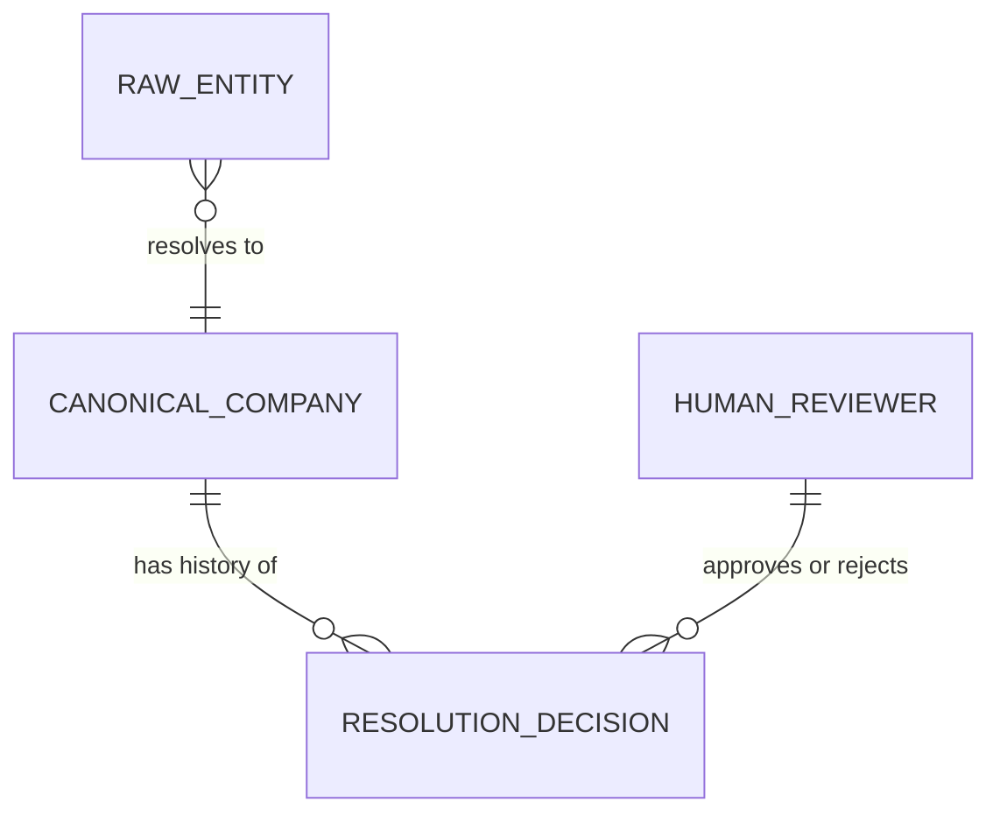
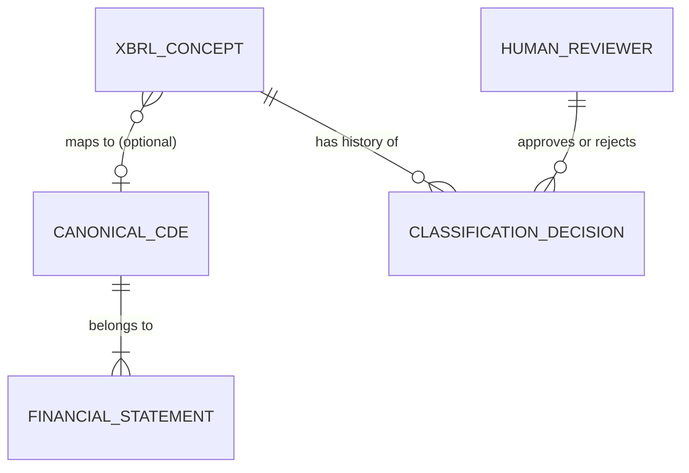
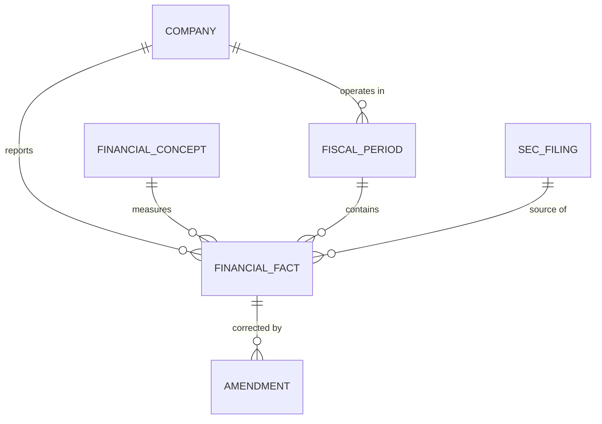
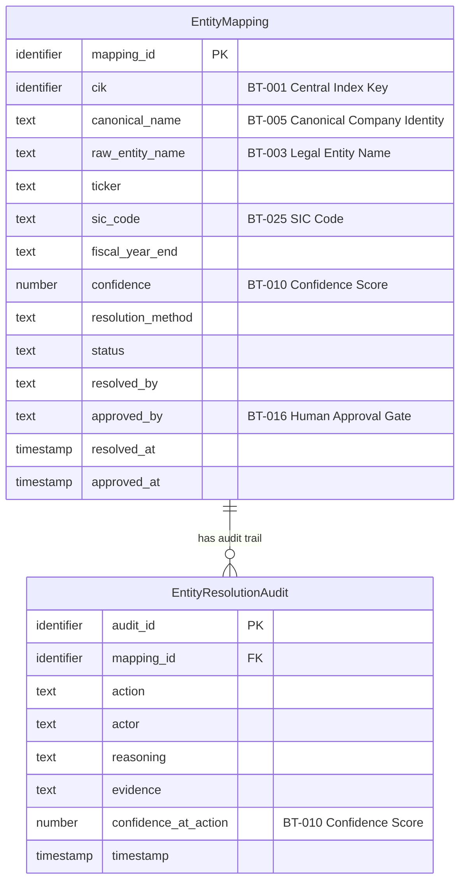
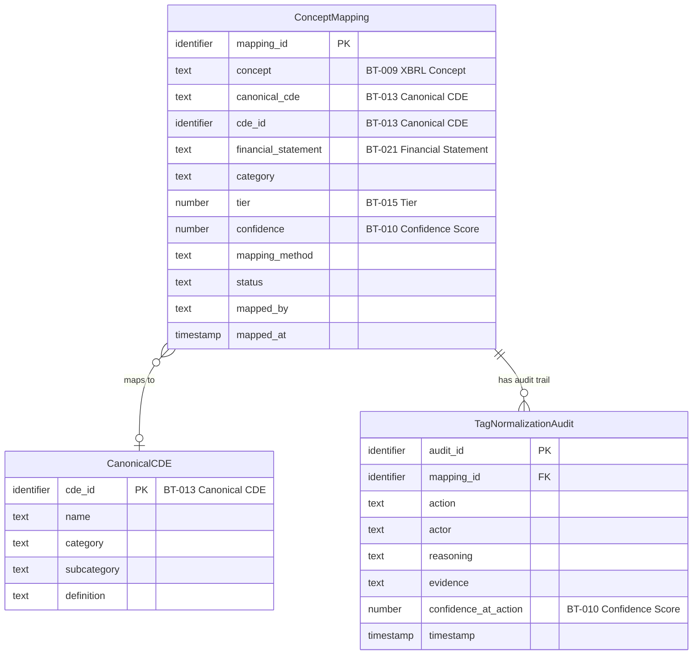
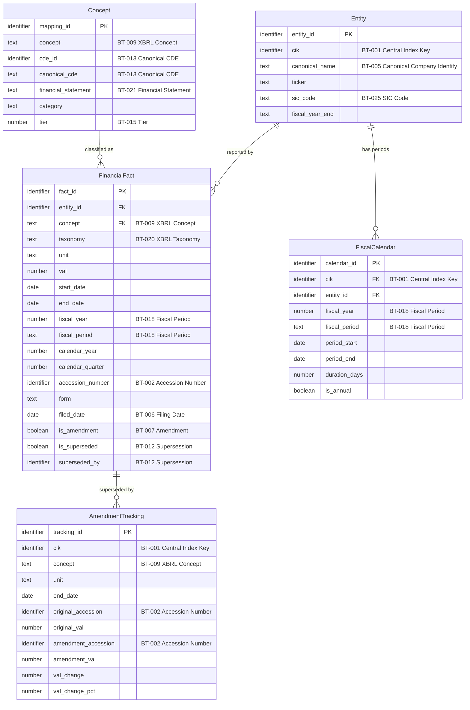
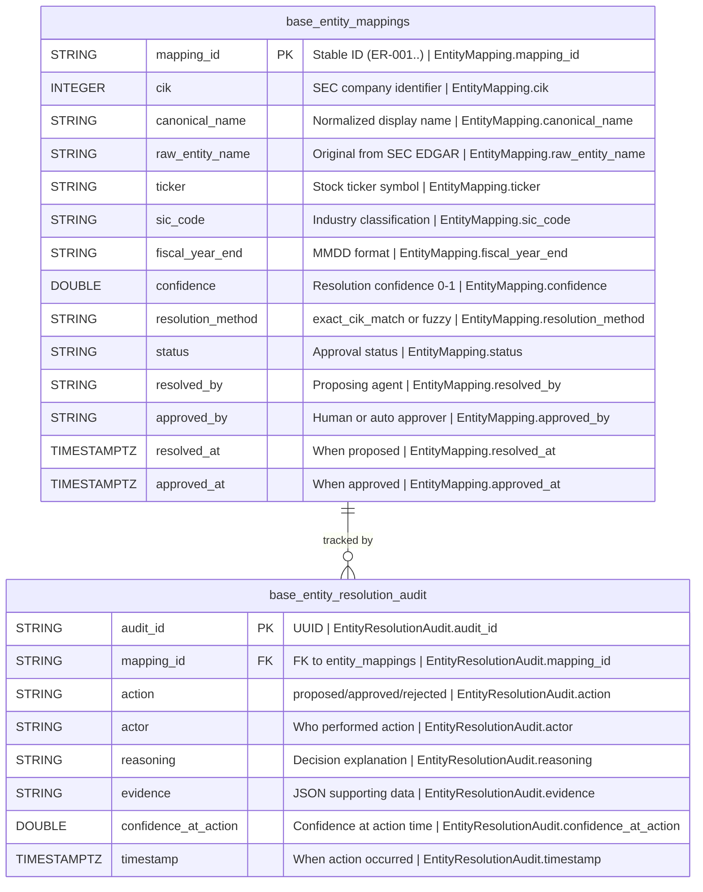
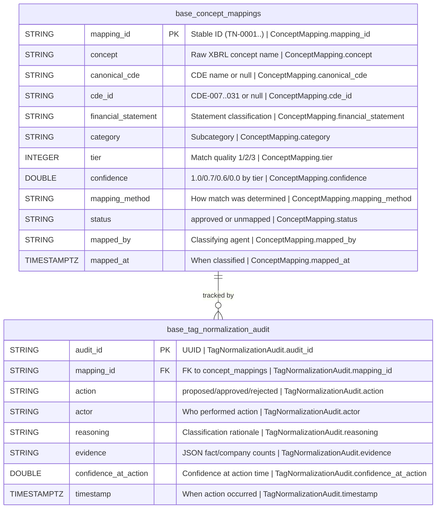
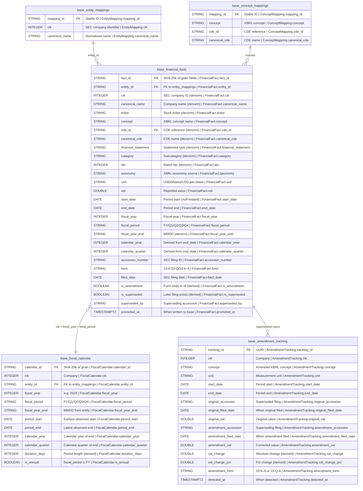

# SEC EDGAIR


AI agent pipeline that takes raw SEC EDGAR XBRL data and delivers it as a clean, tested, governed, semantically meaningful, AI-ready data product.

**Stack:** Python 3.11+, DuckDB + Apache Iceberg, Claude Code with specialized agents

**Status:** Phase 2 — Base Zone (in progress)

## Background

**SEC** (Securities and Exchange Commission) is the US government agency that regulates public companies. **EDGAR** (Electronic Data Gathering, Analysis, and Retrieval) is the SEC's public database where every public company files their financial reports — quarterly earnings (10-Q), annual reports (10-K), insider trades, etc.

**XBRL** (eXtensible Business Reporting Language) is a standardized format for tagging financial data so computers can read it. Instead of a PDF that says "Revenue: $50B", XBRL tags that number with metadata — concept name, currency, reporting period, filing entity. Every fact gets a machine-readable label.

Without XBRL, comparing Apple's revenue to Microsoft's means reading two different PDFs with different layouts. With XBRL, you can programmatically pull every public company's revenue into a table in seconds.

This project takes that raw XBRL data and pipes it through a 4-zone pipeline (Raw → Base → Consumable → AI-Ready) so it ends up clean, normalized, and ready for AI models to reason over — turning government financial filings into structured data an LLM can actually use.

## Architecture

```
Raw → Base → Consumable → AI-Ready
```

Each zone is governed by AI agents that produce lineage, data quality rules, CDE mappings, and audit trails as a byproduct of the transformation work. Every spec follows a mandatory agent pipeline: @data-analyst (EDA) → @dq-rule-writer (rules from evidence) → @dq-engineer (execute + gate) → @staff-engineer (final review).

## What's Built

### Phase 0: Infrastructure

| Spec | Status | What It Does |
|------|--------|-------------|
| `infra-create-agent-definitions` | Complete | Defined 10 specialized Claude Code agents (@governance-reviewer, @entity-resolver, @data-profiler, @lineage-tracker, @dq-engineer, @cde-tagger, @doc-generator, @pii-scanner, @temporal-modeler, @tag-normalizer) |
| `infra-validate-agent-definitions` | Complete | Smoke-tested all agent definitions |
| `infra-fix-agent-definitions` | Complete | Post-validation remediation |
| `infra-create-staff-engineer-agent` | Complete | Added @staff-engineer as the final quality gate in every spec pipeline |
| `infra-setup-duckdb-iceberg` | Complete | DuckDB + Apache Iceberg local read/write with PyIceberg SqlCatalog (SQLite-backed). Shared catalog at `data/catalog/catalog.db`, zone-separated warehouses. Time-travel via PyIceberg scan (DuckDB's native iceberg_scan doesn't reliably support snapshots). |
| `infra-dq-execution-framework` | Complete | DQ execution engine: 42 SQL rules across 8 dimensions, executed against real Iceberg tables. P0 gating, automatic triggers after every promote, `load_date` tracking on all tables, dedup guards on every write path. Rules are data (JSON+SQL), engine-swappable. |

### Phase 1: Raw Zone

| Spec | Status | What It Does |
|------|--------|-------------|
| `raw-ingest-xbrl-company-facts` | Complete | Ingests XBRL Company Facts from SEC EDGAR for 20 companies. Supports both per-company API calls and bulk ZIP download. Flattens deeply nested JSON into a 19-column flat Iceberg table (`raw.xbrl_company_facts`). **547,398 facts** across 20 companies, 3,285 distinct XBRL concepts. |
| `raw-profile-classify-company-facts` | Complete | Statistical profiling of all 19 fields (cardinality, null rates, distributions). PII scanning (none found — all public SEC data). Data classification with sensitivity tags. |

### Phase 2: Base Zone

| Spec | Status | What It Does |
|------|--------|-------------|
| `base-entity-resolution` | Complete | Maps SEC EDGAR CIKs to canonical company identities. 20 companies resolved via exact CIK match (confidence 1.0). Human approval gate with CLI (`approve`, `reject`, `status`). Produces `base.entity_mappings` + `base.entity_resolution_audit` Iceberg tables. |
| `base-xbrl-tag-normalization` | Complete | Maps 3,285 us-gaap XBRL concepts to 25 canonical financial CDEs via tiered matching engine. **Tier 1** (37 exact matches, confidence 1.0): core concepts like Revenue, Assets, Net Income. **Tier 2** (305 prefix/pattern matches, confidence 0.6-0.7): known variants. **Tier 3** (2,943 unmapped, confidence 0.0): long-tail concepts tagged with heuristic categories. Produces `base.concept_mappings` + `base.tag_normalization_audit` Iceberg tables. Reuses entity_resolution staging module for human approval gate. |
| `base-financial-facts-model` | Complete | Denormalized fact table joining raw XBRL facts with entity/concept metadata. **547K facts** enriched with 28 columns including supersession detection, fiscal calendar alignment, and amendment tracking. Produces `base.financial_facts` + `base.fiscal_calendar` + `base.amendment_tracking` Iceberg tables. 40 tests, 7 DQ rules at 100%. |
| `base-bitemporal-schema` | Complete | Temporal query helpers, snapshot management, and validation on top of `base.financial_facts`. Point-in-time queries (`as_known_on`), amendment history, period comparison, Iceberg time travel. No new tables — ergonomic layer. 29 tests, 5 DQ rules. |

### Phases 3-4: Consumable & AI-Ready

Not yet started.

## Data Pipeline Summary

```
SEC EDGAR API/Bulk ZIP
    ↓
raw.xbrl_company_facts          547,398 facts, 20 companies, 19 columns
    ↓
base.entity_mappings            20 CIK → canonical company identity mappings
base.concept_mappings           3,285 XBRL concept → CDE classifications
base.financial_facts            547K enriched facts, 28 columns, supersession tracked
base.fiscal_calendar            ~1,600 fiscal periods across 20 companies
base.amendment_tracking         Supersession pairs with value changes
    ↓
(consumable zone — next)
    ↓
(ai-ready zone — future)
```

## Governance

Every transformation produces governance artifacts automatically:

- **31 CDEs** defined in `governance/cde-catalog.json` (6 entity/filing + 25 financial)
- **8 Iceberg tables** documented in `governance/data-dictionary.json`
- **OpenLineage** events in `governance/lineage/`
- **30 DQ rules** with execution engine and scorecards in `governance/dq-rules/` and `governance/dq-scorecards/`
- **Audit trails** capturing every design decision in `governance/audit-trail/`
- **Business glossary** with 25 terms in `governance/business-glossary.json` (see below)
- **PII:** None detected. All data is public SEC filings — no personal or sensitive information.

## Data Quality

30 SQL-based DQ rules across 5 specs (raw + base), executed against real Iceberg tables via `python -m src.infra.dq_runner run`. Rules are defined as data (JSON + SQL), not code — engine-swappable to Soda Core or Great Expectations.

### Latest Results

| Spec | Rules | Passed | Failed | P0 Gate |
|------|-------|--------|--------|---------|
| raw-ingest-xbrl-company-facts | 8 | 8 | 0 | PASS |
| base-entity-resolution | 5 | 5 | 0 | PASS |
| base-financial-facts-model | 7 | 7 | 0 | PASS |
| base-xbrl-tag-normalization | 5 | 5 | 0 | PASS |
| base-bitemporal-schema | 5 | 5 | 0 | PASS |
| **Total** | **30** | **30/30** | **0** | |

### Raw Zone — Did the data land correctly?

| Rule | Dimension | P | Description | Result |
|------|-----------|---|-------------|--------|
| RAW-CF-001 | Completeness | P0 | All 20 expected CIKs present | PASS |
| RAW-CF-002 | Completeness | P0 | No nulls in required fields (cik, concept, unit, end_date, val, accession, filed_date) | PASS |
| RAW-CF-003 | Validity | P0 | CIK is a positive integer | PASS |
| RAW-CF-004 | Validity | P0 | Accession numbers match SEC format (NNNNNNNNNN-NN-NNNNNN) | PASS |
| RAW-CF-005 | Validity | P0 | No future filed_dates | PASS |
| RAW-CF-006 | Validity | P1 | All values are finite (no NaN/Inf) | PASS |
| RAW-CF-007 | Volume | P1 | Each CIK has ≥100 facts (fetch smoke test) | PASS |
| RAW-CF-008 | Freshness | P2 | Latest filing within last 2 years | PASS |

### Base Zone — Is the data correct?

| Rule | Dimension | P | Description | Result |
|------|-----------|---|-------------|--------|
| BASE-ER-001 | Completeness | P0 | Every raw CIK has an approved entity mapping | PASS |
| BASE-ER-002 | Uniqueness | P0 | No duplicate CIKs in approved mappings | PASS |
| BASE-ER-003 | Validity | P0 | Confidence scores in [0, 1] | PASS |
| BASE-ER-004 | Completeness | P0 | Approved mappings have approved_by and approved_at | PASS |
| BASE-ER-005 | Ref. Integrity | P0 | Audit entries reference real mappings | PASS |
| BASE-TN-001 | Completeness | P0 | Every Tier 1 concept has approved mapping with CDE | PASS |
| BASE-TN-002 | Uniqueness | P0 | No concept maps to multiple CDEs | PASS |
| BASE-TN-003 | Validity | P0 | Confidence scores in [0, 1] | PASS |
| BASE-TN-004 | Coverage | P1 | Mapped concepts cover ≥25% of raw facts | PASS |
| BASE-TN-005 | Ref. Integrity | P0 | Approved mappings have valid cde_id | PASS |
| BASE-FM-001 | Ref. Integrity | P0 | Every fact has a non-null entity_id | PASS |
| BASE-FM-002 | Uniqueness | P0 | fact_id is unique (no duplicate grain) | PASS |
| BASE-FM-003 | Consistency | P0 | Superseded facts have superseded_by | PASS |
| BASE-FM-004 | Completeness | P1 | Fiscal calendar covers all fact periods | PASS |
| BASE-FM-005 | Validity | P0 | calendar_quarter is 1-4 | PASS |
| BASE-FM-006 | Ref. Integrity | P0 | Amendment tracking references real accessions | PASS |
| BASE-FM-007 | Completeness | P0 | Every fact's CIK has an entity mapping | PASS |
| BASE-BT-001 | Validity | P0 | No future filed_dates | PASS |
| BASE-BT-002 | Validity | P0 | start_date < end_date for period facts | PASS |
| BASE-BT-003 | Consistency | P0 | Superseded facts filed before superseding facts | PASS |
| BASE-BT-004 | Validity | P1 | filed_date ≥ end_date (99% threshold) | PASS |
| BASE-BT-005 | Ref. Integrity | P0 | Every superseded_by accession exists | PASS |

### Summary by Dimension

| Dimension | Raw | Base | Total |
|-----------|-----|------|-------|
| Validity | 4/4 | 6/6 | 10/10 |
| Completeness | 2/2 | 5/5 | 7/7 |
| Ref. Integrity | — | 5/5 | 5/5 |
| Uniqueness | — | 3/3 | 3/3 |
| Consistency | — | 2/2 | 2/2 |
| Volume | 1/1 | — | 1/1 |
| Coverage | — | 1/1 | 1/1 |
| Freshness | 1/1 | — | 1/1 |
| **Total** | **8/8** | **22/22** | **30/30** |

*All 30 rules are SQL-based and executed against real Iceberg data. Rules are defined as data (JSON), making the engine swappable.*

### Rule Lifecycle

```
PROPOSED → APPROVED → ACTIVE
```

Rules follow a lifecycle managed by `python -m src.infra.dq_runner`:

```bash
# View all rule statuses
python -m src.infra.dq_runner status

# Execute rules against real Iceberg data
python -m src.infra.dq_runner run

# View latest results
python -m src.infra.dq_runner results

# Generate scorecards from real execution
python -m src.infra.dq_runner scorecard --spec base-entity-resolution

# Approve proposed rules
python -m src.infra.dq_runner approve RULE-ID

# Acknowledge failures with reason
python -m src.infra.dq_runner acknowledge --spec NAME --run RUN_ID --reason "..."
```

P0 failures **block** spec completion. P1 failures **warn**. P2/P3 are **informational**.

Detailed scorecards per spec: [`governance/dq-scorecards/`](governance/dq-scorecards/)

## Business Glossary

25 business terms defined across three source tiers — all approved:

| Source | Terms | Approved By | Description |
|--------|-------|-------------|-------------|
| XBRL Taxonomy | 7 | Auto (external standard) | Authoritative financial reporting standard |
| SEC EDGAR | 7 | Auto (external standard) | Filing types, entity identifiers, regulatory concepts |
| Project-Specific | 11 | human:jeff | Pipeline concepts (supersession, tiers, confidence, etc.) |

### Entity Terms
| Term | Definition | Source |
|------|-----------|--------|
| Central Index Key (CIK) | SEC-assigned unique numeric identifier for every filing entity | SEC EDGAR |
| Legal Entity Name | Official company name as registered with the SEC | SEC EDGAR |
| Canonical Company Identity | Normalized, human-approved company identity — single source of truth | Project |
| SIC Code | Four-digit industry classification code assigned by the SEC | SEC EDGAR |

### Filing Terms
| Term | Definition | Source |
|------|-----------|--------|
| SEC Filing | Document submitted to the SEC (10-K, 10-Q, 8-K, amendments) | SEC EDGAR |
| Accession Number | Unique filing identifier (format: XXXXXXXXXX-YY-ZZZZZZ) | SEC EDGAR |
| Filing Date | Date the filing was submitted to and accepted by the SEC | SEC EDGAR |
| Amendment | Revised filing (10-K/A, 10-Q/A) that supersedes a prior submission | SEC EDGAR |

### Financial Terms
| Term | Definition | CDE |
|------|-----------|-----|
| Revenue | Total revenue from sale of goods and services, before deductions | CDE-015 |
| Net Income | Total profit after all expenses, interest, and taxes | CDE-019 |
| Total Assets | Sum of all current and non-current assets on the balance sheet | CDE-007 |
| Financial Fact | A single reported value — one number, one concept, one unit, one period, one filing | — |
| XBRL Concept | A specific financial metric tag from an XBRL taxonomy (e.g., us-gaap:Revenues) | — |
| XBRL Taxonomy | Classification system defining financial reporting concepts (us-gaap, dei, ifrs-full) | — |
| Financial Statement | Category of reporting: Balance Sheet, Income Statement, Cash Flow, Per-Share, Other | — |
| Fiscal Period | Company's reporting period (FY, Q1-Q4) — may not align with calendar year | CDE-005/006 |

### Pipeline Terms
| Term | Definition | Source |
|------|-----------|--------|
| Entity Resolution | Process of mapping raw CIK + entity name to a canonical company identity | Project |
| Tag Normalization | Classifying ~3,285 XBRL concepts into 25 canonical CDEs via tiered matching | Project |
| Canonical CDE | One of 25 standardized financial data elements for cross-company comparison | Project |
| Tier | Match quality classification: 1=exact (1.0), 2=pattern (0.6-0.7), 3=unmapped (0.0) | Project |
| Confidence Score | Numeric certainty (0.0-1.0) in a proposed mapping | Project |
| Confidence Floor | Minimum confidence (0.7) below which human approval is always required | Project |
| Human Approval Gate | Pipeline pause point requiring human review, controlled by `REQUIRE_HUMAN_APPROVAL` | Project |
| Supersession | Later filing replaces earlier filing for same company/concept/period — both preserved | Project |
| Fiscal Calendar | Mapping of fiscal periods to calendar dates, built from observed filing data | Project |

Full glossary: [`governance/business-glossary.json`](governance/business-glossary.json)

## 25 Canonical Financial CDEs

| Category | CDEs |
|----------|------|
| Balance Sheet (8) | Total Assets, Total Liabilities, Total Stockholders Equity, Cash & Equivalents, Accounts Receivable, Inventory, PP&E, Goodwill |
| Income Statement (8) | Revenue, Cost of Revenue, Gross Profit, Operating Income, Net Income, Income Tax Expense, R&D Expense, SG&A Expense |
| Cash Flow (4) | Operating CF, Investing CF, Financing CF, Capital Expenditures |
| Per-Share (3) | EPS Basic, EPS Diluted, Dividends Per Share |
| Other (2) | Comprehensive Income, Retained Earnings |

## Data Models

Full model documentation (conceptual, logical, physical) lives in [`governance/models/`](governance/models/). All models cross-reference the [business glossary](governance/business-glossary.json) — entities marked with **†** have a matching glossary term.

### Conceptual: Entity Resolution



| Entity | Business Term | CDE | PII |
|--------|-------------|-----|-----|
| RAW_ENTITY **†** | BT-003: Legal Entity Name | CDE-001, CDE-003 | None |
| CANONICAL_COMPANY **†** | BT-005: Canonical Company Identity | CDE-001, CDE-005, CDE-006 | None |
| RESOLUTION_DECISION **†** | BT-008: Entity Resolution | — | None |
| HUMAN_REVIEWER **†** | BT-016: Human Approval Gate | — | None |

### Conceptual: XBRL Tag Normalization



| Entity | Business Term | CDE | PII |
|--------|-------------|-----|-----|
| XBRL_CONCEPT **†** | BT-009: XBRL Concept | — | None |
| CANONICAL_CDE **†** | BT-013: Canonical CDE | CDE-007..CDE-031 | None |
| FINANCIAL_STATEMENT **†** | BT-021: Financial Statement | — | None |
| CLASSIFICATION_DECISION **†** | BT-011: Tag Normalization | — | None |
| HUMAN_REVIEWER **†** | BT-016: Human Approval Gate | — | None |

### Conceptual: Financial Facts Model



| Entity | Business Term | CDE | PII |
|--------|-------------|-----|-----|
| COMPANY **†** | BT-005: Canonical Company Identity | CDE-001, CDE-005 | None |
| FINANCIAL_FACT **†** | BT-017: Financial Fact | CDE-001..006, CDE-007..031 | None |
| FINANCIAL_CONCEPT **†** | BT-009: XBRL Concept | CDE-007..CDE-031 | None |
| FISCAL_PERIOD **†** | BT-018: Fiscal Period | CDE-005, CDE-006 | None |
| SEC_FILING **†** | BT-004: SEC Filing | CDE-002, CDE-004 | None |
| AMENDMENT **†** | BT-007: Amendment | CDE-002, CDE-004 | None |

### Logical: Entity Resolution



| Attribute | Business Term | CDE | PII |
|-----------|---------------|-----|-----|
| mapping_id | — | CDE-006 | None |
| cik | BT-001: Central Index Key (CIK) | CDE-001 | None |
| canonical_name | BT-005: Canonical Company Identity | CDE-005 | None |
| raw_entity_name | BT-003: Legal Entity Name | CDE-003 | None |
| sic_code | BT-025: SIC Code | — | None |
| confidence | BT-010: Confidence Score | — | None |
| approved_by | BT-016: Human Approval Gate | — | None |
| confidence_at_action | BT-010: Confidence Score | — | None |

### Logical: XBRL Tag Normalization



| Attribute | Business Term | CDE | PII |
|-----------|---------------|-----|-----|
| concept | BT-009: XBRL Concept | — | None |
| canonical_cde | BT-013: Canonical CDE | CDE-007..031 | None |
| cde_id | BT-013: Canonical CDE | CDE-007..031 | None |
| financial_statement | BT-021: Financial Statement | — | None |
| tier | BT-015: Tier | — | None |
| confidence | BT-010: Confidence Score | — | None |
| confidence_at_action | BT-010: Confidence Score | — | None |

### Logical: Financial Facts Model



| Attribute | Business Term | CDE | PII |
|-----------|---------------|-----|-----|
| cik | BT-001: Central Index Key (CIK) | CDE-001 | None |
| canonical_name | BT-005: Canonical Company Identity | CDE-005 | None |
| concept | BT-009: XBRL Concept | — | None |
| cde_id / canonical_cde | BT-013: Canonical CDE | CDE-007..031 | None |
| financial_statement | BT-021: Financial Statement | — | None |
| tier | BT-015: Tier | — | None |
| taxonomy | BT-020: XBRL Taxonomy | — | None |
| fiscal_year / fiscal_period | BT-018: Fiscal Period | CDE-005, CDE-006 | None |
| accession_number | BT-002: Accession Number | CDE-002 | None |
| filed_date | BT-006: Filing Date | CDE-004 | None |
| is_amendment | BT-007: Amendment | — | None |
| is_superseded / superseded_by | BT-012: Supersession | — | None |

### Physical: Entity Resolution



> Column-level business terms and definitions in [base-entity-resolution-physical.md](governance/models/base-entity-resolution-physical.md).

### Physical: XBRL Tag Normalization



> Column-level business terms and definitions in [base-xbrl-tag-normalization-physical.md](governance/models/base-xbrl-tag-normalization-physical.md).

### Physical: Financial Facts Model



> Column-level business terms and definitions in [base-financial-facts-model-physical.md](governance/models/base-financial-facts-model-physical.md).

## Quick Start

```bash
# Install
uv sync

# Run tests (229 tests)
uv run pytest

# Data quality — execute rules against real Iceberg data
uv run python -m src.infra.dq_runner status
uv run python -m src.infra.dq_runner run
uv run python -m src.infra.dq_runner results
uv run python -m src.infra.dq_runner scorecard --spec base-entity-resolution

# Run XBRL tag normalization
uv run python -m src.base.xbrl_tag_normalization.cli normalize
uv run python -m src.base.xbrl_tag_normalization.cli status
uv run python -m src.base.xbrl_tag_normalization.cli approve
uv run python -m src.base.xbrl_tag_normalization.cli coverage

# Run entity resolution
uv run python -m src.base.entity_resolution.cli resolve
uv run python -m src.base.entity_resolution.cli approve

# Run financial facts model
uv run python -m src.base.financial_facts_model.cli all
uv run python -m src.base.financial_facts_model.cli status

# Bitemporal queries
uv run python -m src.base.bitemporal.cli query --cik 320193 --concept Assets
uv run python -m src.base.bitemporal.cli validate
```

## Project Structure

```
src/                            Source code organized by zone
  infra/                        DuckDB + Iceberg utilities, DQ engine, scorecard generator
  raw/                          Raw zone ingestion + profiling
  base/                         Base zone normalization
    entity_resolution/           CIK → canonical company identity
    xbrl_tag_normalization/      XBRL concept → canonical CDE
    financial_facts_model/       Denormalized facts + fiscal calendar + amendments
    bitemporal/                  Temporal queries + snapshot management + validation
data/                           Data files organized by zone (gitignored)
governance/                     Governance artifacts
  business-glossary.json        25 business terms (XBRL, SEC EDGAR, project-specific)
  cde-catalog.json              31 Critical Data Element definitions
  data-dictionary.json          8 table schemas with field-level docs
  models/                       Data models (conceptual, logical, physical) with Mermaid diagrams
  lineage/                      OpenLineage events
  eda/                          EDA reports from @data-analyst
  dq-rules/                     Data quality rule definitions (42 rules, JSON + SQL)
  dq-results/                   Timestamped DQ execution results
  dq-scorecards/                DQ scorecards from real data execution
  audit-trail/                  Design decision logs
docs/
  specs/                        Spec-driven development specs
  sessions/                     Claude Code session logs
tests/                          Tests organized by zone (229 passing)
.claude/agents/                 Agent definitions for Claude Code
```
