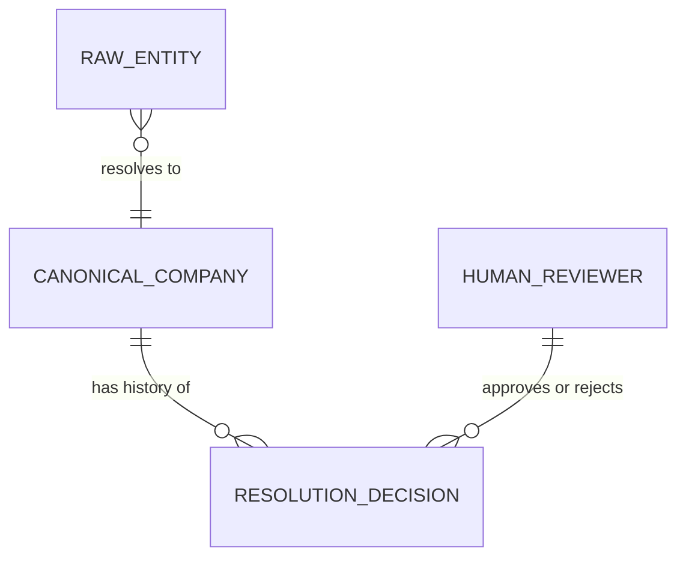
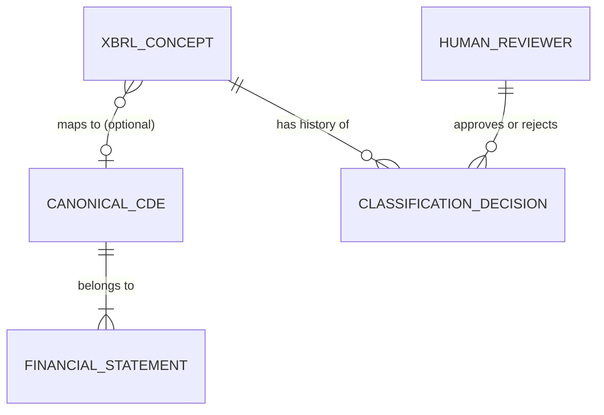
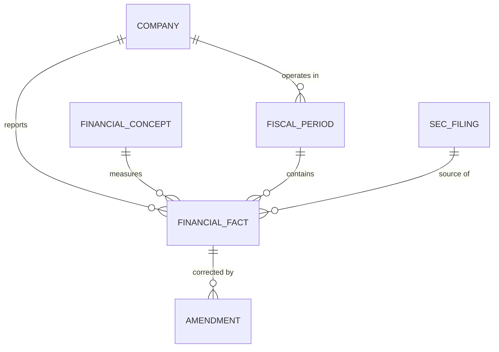
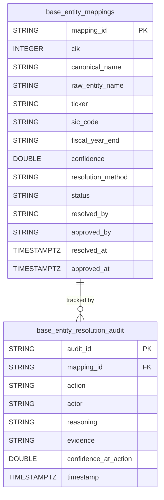
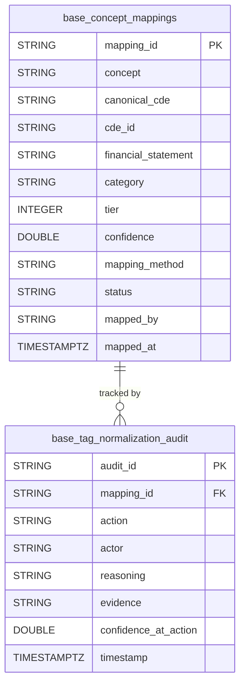
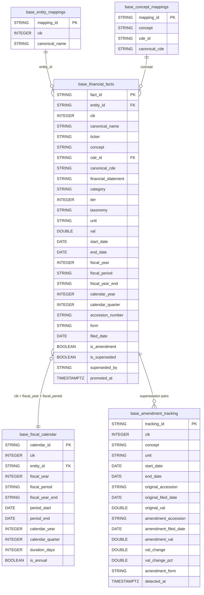

# SEC EDGAIR

AI agent pipeline that takes raw SEC EDGAR XBRL data and delivers it as a clean, tested, governed, semantically meaningful, AI-ready data product.

**Stack:** Python 3.11+, DuckDB + Apache Iceberg, Claude Code with specialized agents

**Status:** Phase 2 — Base Zone (in progress)

## Background

**SEC** (Securities and Exchange Commission) is the US government agency that regulates public companies. **EDGAR** (Electronic Data Gathering, Analysis, and Retrieval) is the SEC's public database where every public company files their financial reports — quarterly earnings (10-Q), annual reports (10-K), insider trades, etc.

**XBRL** (eXtensible Business Reporting Language) is a standardized format for tagging financial data so computers can read it. Instead of a PDF that says "Revenue: $50B", XBRL tags that number with metadata — concept name, currency, reporting period, filing entity. Every fact gets a machine-readable label.

Without XBRL, comparing Apple's revenue to Microsoft's means reading two different PDFs with different layouts. With XBRL, you can programmatically pull every public company's revenue into a table in seconds.

This project takes that raw XBRL data and pipes it through a 4-zone pipeline (Raw → Base → Consumable → AI-Ready) so it ends up clean, normalized, and ready for AI models to reason over — turning government financial filings into structured data an LLM can actually use.

## Architecture

```
Raw → Base → Consumable → AI-Ready
```

Each zone is governed by AI agents that produce lineage, data quality rules, CDE mappings, and audit trails as a byproduct of the transformation work. Every spec follows a mandatory 8-agent pipeline ending with @staff-engineer review.

## What's Built

### Phase 0: Infrastructure

| Spec | Status | What It Does |
|------|--------|-------------|
| `infra-create-agent-definitions` | Complete | Defined 10 specialized Claude Code agents (@governance-reviewer, @entity-resolver, @data-profiler, @lineage-tracker, @dq-engineer, @cde-tagger, @doc-generator, @pii-scanner, @temporal-modeler, @tag-normalizer) |
| `infra-validate-agent-definitions` | Complete | Smoke-tested all agent definitions |
| `infra-fix-agent-definitions` | Complete | Post-validation remediation |
| `infra-create-staff-engineer-agent` | Complete | Added @staff-engineer as the final quality gate in every spec pipeline |
| `infra-setup-duckdb-iceberg` | Complete | DuckDB + Apache Iceberg local read/write with PyIceberg SqlCatalog (SQLite-backed). Shared catalog at `data/catalog/catalog.db`, zone-separated warehouses. Time-travel via PyIceberg scan (DuckDB's native iceberg_scan doesn't reliably support snapshots). |

### Phase 1: Raw Zone

| Spec | Status | What It Does |
|------|--------|-------------|
| `raw-ingest-xbrl-company-facts` | Complete | Ingests XBRL Company Facts from SEC EDGAR for 20 companies. Supports both per-company API calls and bulk ZIP download. Flattens deeply nested JSON into a 19-column flat Iceberg table (`raw.xbrl_company_facts`). **547,398 facts** across 20 companies, 3,285 distinct XBRL concepts. |
| `raw-profile-classify-company-facts` | Complete | Statistical profiling of all 19 fields (cardinality, null rates, distributions). PII scanning (none found — all public SEC data). Data classification with sensitivity tags. |

### Phase 2: Base Zone

| Spec | Status | What It Does |
|------|--------|-------------|
| `base-entity-resolution` | Complete | Maps SEC EDGAR CIKs to canonical company identities. 20 companies resolved via exact CIK match (confidence 1.0). Human approval gate with CLI (`approve`, `reject`, `status`). Produces `base.entity_mappings` + `base.entity_resolution_audit` Iceberg tables. |
| `base-xbrl-tag-normalization` | Complete | Maps 3,285 us-gaap XBRL concepts to 25 canonical financial CDEs via tiered matching engine. **Tier 1** (37 exact matches, confidence 1.0): core concepts like Revenue, Assets, Net Income. **Tier 2** (305 prefix/pattern matches, confidence 0.6-0.7): known variants. **Tier 3** (2,943 unmapped, confidence 0.0): long-tail concepts tagged with heuristic categories. Produces `base.concept_mappings` + `base.tag_normalization_audit` Iceberg tables. Reuses entity_resolution staging module for human approval gate. |

### Phases 3-4: Consumable & AI-Ready

Not yet started.

## Data Pipeline Summary

```
SEC EDGAR API/Bulk ZIP
    ↓
raw.xbrl_company_facts          547,398 facts, 20 companies, 19 columns
    ↓
base.entity_mappings            20 CIK → canonical company identity mappings
base.concept_mappings           3,285 XBRL concept → CDE classifications
    ↓
(consumable zone — next)
    ↓
(ai-ready zone — future)
```

## Governance

Every transformation produces governance artifacts automatically:

- **31 CDEs** defined in `governance/cde-catalog.json` (6 entity/filing + 25 financial)
- **5 Iceberg tables** documented in `governance/data-dictionary.json`
- **OpenLineage** events in `governance/lineage/`
- **DQ rules** with scorecards in `governance/dq-rules/` and `governance/dq-scorecards/`
- **Audit trails** capturing every design decision in `governance/audit-trail/`
- **PII:** None detected. All data is public SEC filings — no personal or sensitive information.

## 25 Canonical Financial CDEs

| Category | CDEs |
|----------|------|
| Balance Sheet (8) | Total Assets, Total Liabilities, Total Stockholders Equity, Cash & Equivalents, Accounts Receivable, Inventory, PP&E, Goodwill |
| Income Statement (8) | Revenue, Cost of Revenue, Gross Profit, Operating Income, Net Income, Income Tax Expense, R&D Expense, SG&A Expense |
| Cash Flow (4) | Operating CF, Investing CF, Financing CF, Capital Expenditures |
| Per-Share (3) | EPS Basic, EPS Diluted, Dividends Per Share |
| Other (2) | Comprehensive Income, Retained Earnings |

## Data Models

Full model documentation (conceptual, logical, physical) lives in [`governance/models/`](governance/models/).

### Conceptual: Entity Resolution



### Conceptual: XBRL Tag Normalization



### Conceptual: Financial Facts Model



### Physical: Entity Resolution



### Physical: XBRL Tag Normalization



### Physical: Financial Facts Model



## Quick Start

```bash
# Install
uv sync

# Run tests (106 tests)
uv run pytest

# Run XBRL tag normalization
uv run python -m src.base.xbrl_tag_normalization.cli normalize
uv run python -m src.base.xbrl_tag_normalization.cli status
uv run python -m src.base.xbrl_tag_normalization.cli approve
uv run python -m src.base.xbrl_tag_normalization.cli coverage

# Run entity resolution
uv run python -m src.base.entity_resolution.cli resolve
uv run python -m src.base.entity_resolution.cli approve
```

## Project Structure

```
src/                            Source code organized by zone
  infra/                        DuckDB + Iceberg utilities
  raw/                          Raw zone ingestion + profiling
  base/                         Base zone normalization
    entity_resolution/           CIK → canonical company identity
    xbrl_tag_normalization/      XBRL concept → canonical CDE
data/                           Data files organized by zone (gitignored)
governance/                     Governance artifacts
  cde-catalog.json              31 Critical Data Element definitions
  data-dictionary.json          5 table schemas with field-level docs
  models/                       Data models (conceptual, logical, physical) with Mermaid diagrams
  lineage/                      OpenLineage events
  dq-rules/                     Data quality rule definitions
  dq-scorecards/                DQ validation results
  audit-trail/                  Design decision logs
docs/
  specs/                        Spec-driven development specs
  sessions/                     Claude Code session logs
tests/                          Tests organized by zone (106 passing)
.claude/agents/                 Agent definitions for Claude Code
```
