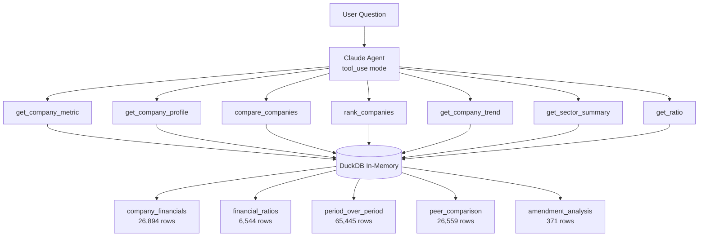

# AI-Ready Chat Interface — Conceptual Model

## Architecture Overview

The AI-Ready chat interface is a **read-only query layer** over the 5 consumable Iceberg tables. It creates no new tables or stored data. The architecture is: tool use over DuckDB.

## Entities

| Entity | Description | Business Terms |
|--------|-------------|----------------|
| Financial Chat Agent | Claude-powered conversational interface using tool use | — |
| Tool Functions (7) | Validated Python functions with typed parameters | — |
| Consumable Tables (5) | Source data loaded into DuckDB at startup | BT-001 through BT-048 |
| Anomaly Checker | Query-time rule engine producing data quality flags | — |
| Number Formatter | Consistent formatting ($394.3B, 25.3%, $6.42) | — |

## Key Design Decisions

| Decision | Rationale |
|----------|-----------|
| Tool use, not text-to-SQL | Claude halluccinates column names and misuses long-format schemas |
| No embeddings or RAG | Structured data + DuckDB. Vector stores add complexity for zero benefit |
| Anomaly flags at query time | ~15 rules are static and few. Computing at query time is simpler than storing |
| In-memory DuckDB | 125K rows fits easily. PyIceberg scan -> Arrow -> DuckDB register pattern |

## Data Flow

1. On startup: PyIceberg scans all 5 consumable tables -> Arrow -> DuckDB register
2. User asks a question via CLI
3. Claude receives question + system prompt (company roster, metric catalog, anomaly rules)
4. Claude calls 1-3 tool functions with typed parameters
5. Each tool runs parameterized SQL against in-memory DuckDB, formats values, checks anomalies
6. Tool results returned to Claude for natural language synthesis
7. Claude responds with formatted answer citing specific numbers from real data
