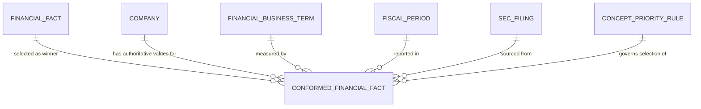

## Conceptual Model: Conformed Facts
**Spec:** docs/specs/base-conformed-facts.md
**Date:** 2026-03-15
**Agent:** @semantic-modeler
**Mode:** Greenfield
**Stage:** Conceptual (1 of 3)
**Status:** APPROVED

> **†** Entities marked with † have a matching business glossary term

### Business Terms Referenced
| Term ID | Term | Definition (from glossary) |
|---------|------|---------------------------|
| BT-001 | Central Index Key (CIK) | Unique numeric identifier assigned by the SEC to every entity that files with the Commission. |
| BT-002 | Accession Number | Unique identifier for each filing submitted to SEC EDGAR. |
| BT-004 | SEC Filing | A document submitted to and accepted by the SEC through the EDGAR system. |
| BT-005 | Canonical Company Identity | A normalized, human-approved company identity that serves as the single source of truth for "who is this company?" across the pipeline. |
| BT-009 | XBRL Concept | A specific financial metric tag from an XBRL taxonomy. |
| BT-013 | Financial Business Term | One of the standardized financial metric terms in the business glossary that serve as the common language for cross-company financial comparison. |
| BT-017 | Financial Fact | A single reported financial value — one number, for one XBRL concept, in one unit, for one reporting period, from one SEC filing. |
| BT-018 | Fiscal Period | A company's reporting period, identified by fiscal year and period type (FY, Q1-Q4). |
| BT-019 | Fiscal Calendar | Mapping between company-specific fiscal periods and standard calendar dates. |
| BT-021 | Financial Statement | The financial statement a metric belongs to (income statement, balance sheet, cash flow). |

### Entities
| Entity | Description | Business Owner | Business Term | Is CDE | Is PII |
|--------|-------------|----------------|---------------|--------|--------|
| Conformed Financial Fact † | The single authoritative value for a financial metric for a given company and fiscal period. Produced by applying collision resolution (concept priority, unit filtering, supersession filtering) to competing Financial Facts and selecting one winner per grain. Grain: (company, business_term, fiscal_year, fiscal_period). | Finance / Data Engineering | BT-017 | Yes | No |
| Company † | A publicly traded company that files financial reports with the SEC. Identified by CIK, resolved to a canonical identity. (Existing entity from base-financial-facts-model.) | Data Governance | BT-005 | Yes | No |
| Financial Fact † | A single reported financial value from an SEC filing. The source pool from which conformed facts are selected. Multiple financial facts may compete for the same grain. (Existing entity from base-financial-facts-model.) | Finance / Data Engineering | BT-017 | Yes | No |
| Financial Business Term † | A standardized financial metric (e.g., Revenue, Total Assets) that serves as the common language for cross-company comparison. Each conformed fact measures exactly one business term. (Existing entity from base-xbrl-tag-normalization.) | Data Governance | BT-013 | Yes | No |
| Fiscal Period † | A company's reporting period (FY, Q1-Q4) mapped to calendar dates. Part of the conformed fact grain. (Existing entity from base-financial-facts-model.) | Finance / Accounting | BT-018 | Yes | No |
| SEC Filing † | A document submitted to the SEC (10-K, 10-Q, 10-K/A). The filing that produced the winning financial fact. (Existing entity from base-financial-facts-model.) | Regulatory / Legal | BT-004 | Yes | No |
| Concept Priority Rule | A governance-managed rule that defines which XBRL concepts take precedence when multiple concepts map to the same business term, and which unit is expected. Stored as a governance artifact, not a database table. | Data Governance | BT-009 | Yes | No |

### Relationships
| From | To | Relationship | Cardinality | Description |
|------|----|-------------|-------------|-------------|
| Financial Fact | Conformed Financial Fact | selected as winner | N:1 | Many financial facts may compete for one grain; exactly one is selected as the conformed value. The winning fact's `fact_id` is preserved as `source_fact_id` for lineage. |
| Company | Conformed Financial Fact | has authoritative values for | 1:N | A company has one conformed fact per business term per fiscal period. |
| Financial Business Term | Conformed Financial Fact | measured by | 1:N | Each conformed fact measures exactly one business term. Multiple conformed facts exist for the same term (one per company-period). |
| Fiscal Period | Conformed Financial Fact | reported in | 1:N | Conformed facts belong to specific fiscal periods. |
| SEC Filing | Conformed Financial Fact | sourced from | 1:N | Each conformed fact traces to exactly one SEC filing (via the winning financial fact). |
| Concept Priority Rule | Conformed Financial Fact | governs selection of | 1:N | The rule for a given business term determines which XBRL concept wins when multiple compete. |

### Business Rules
- **One-fact-per-grain invariant:** There is exactly one Conformed Financial Fact per (company, business_term, fiscal_year, fiscal_period). This is the defining property of the table.
- **Supersession filtering:** Only non-superseded financial facts are candidates for conformation. Superseded facts (from earlier filings replaced by amendments) are excluded before collision resolution.
- **Null filtering:** Financial facts with null business_term_id or null fiscal_year are excluded — they cannot participate in a meaningful grain.
- **Unit filtering:** Only facts with the expected unit for their business term are eligible (e.g., USD for Revenue, USD/shares for EPS). The expected unit is defined per business term in the concept priority rules.
- **Collision resolution order:** When multiple XBRL concepts map to the same business term for the same company-period: (1) select the primary concept per the priority list in concept-priority-rules.json, (2) if no primary concept match, fall back to tier/frequency ranking, (3) if only one candidate exists, it wins automatically.
- **Selection reason is recorded:** Every conformed fact records why it was selected ("primary_concept", "tier_frequency_fallback", or "sole_candidate") for auditability.
- **Lineage is preserved:** Every conformed fact preserves the `source_fact_id` linking directly back to the winning Financial Fact, enabling one-hop traceability to the original SEC filing.
- **Concept priority rules are governance artifacts:** The rules determining which XBRL concept wins are stored as structured JSON in `governance/conformation/concept-priority-rules.json`, not hardcoded in application config. Changes to these rules are governance events.

### Design Rationale
The Conformed Financial Fact entity exists to resolve a structural problem: `base.financial_facts` faithfully preserves all competing XBRL concepts per business term per period (which is valuable for audit), but downstream consumers need a single authoritative value. Without this entity, every consumable table must independently implement collision resolution, unit filtering, and supersession filtering — leading to duplicated business logic, consumable-to-consumable dependencies, and broken lineage.

By performing conformation in the base zone, we uphold the architectural principle that the base zone is the "single source of truth with business logic applied" while the consumable zone handles only presentation and assembly. The Conformed Financial Fact is not a new kind of data — it is a curated view of existing Financial Facts, with one winner selected per grain and full lineage metadata explaining why.

The entity is deliberately separate from Financial Fact (rather than adding columns to the existing table) because the two answer different questions: Financial Fact answers "what did the SEC filings actually say?" while Conformed Financial Fact answers "what is the single best value for each metric?" These are distinct responsibilities with different grains.

The Concept Priority Rule is modeled as an entity (rather than embedded logic) because the priority lists are business decisions managed through governance, not technical implementation details. Making them explicit as a governance artifact enables auditability and change tracking.
