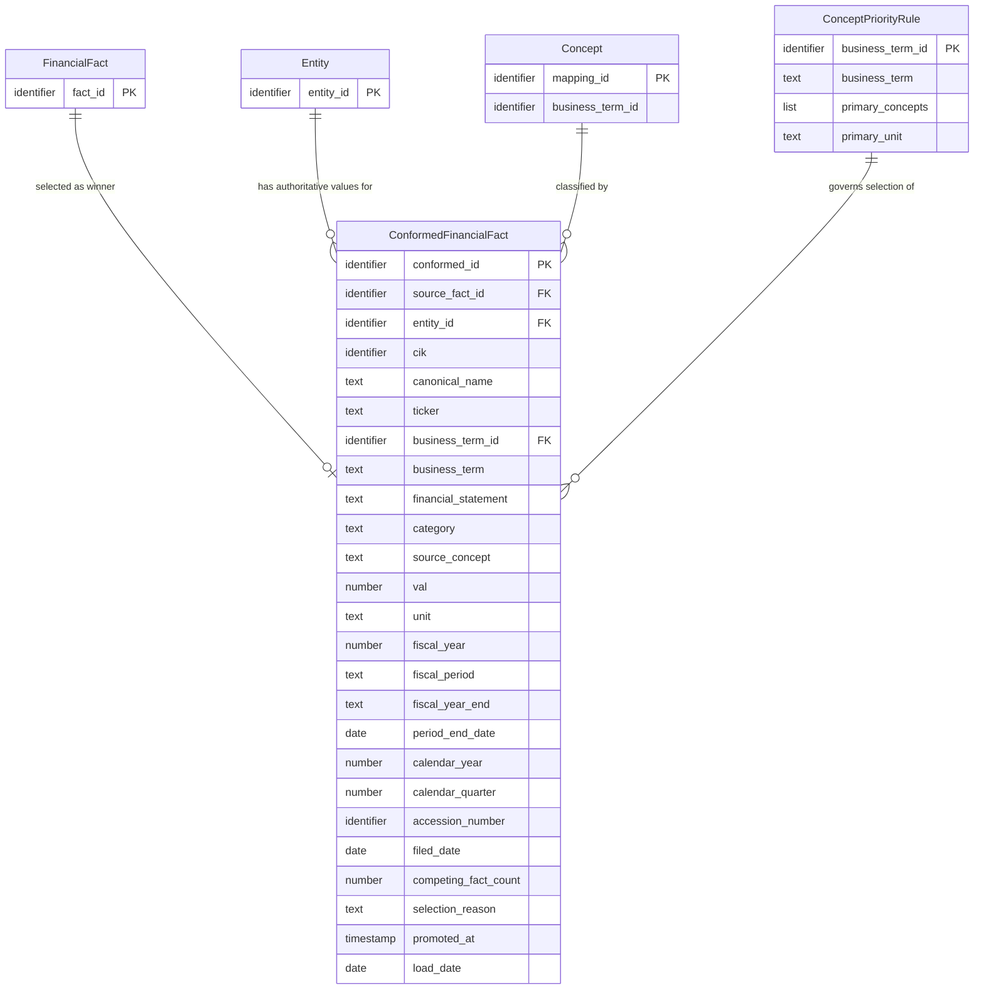

## Logical Model: Conformed Facts
**Spec:** docs/specs/base-conformed-facts.md
**Date:** 2026-03-15
**Agent:** @semantic-modeler
**Mode:** Greenfield
**Stage:** Logical (2 of 3)
**Status:** APPROVED
**Derived From:** governance/models/base-conformed-facts-conceptual.md (PROPOSED 2026-03-15)

> **†** Entities marked with † have a matching business glossary term

### Entities

#### ConformedFinancialFact †
- **Primary Key:** conformed_id (deterministic hash of grain)
- **Natural Key:** (cik, business_term_id, fiscal_year, fiscal_period)
- **Description:** The single authoritative value for a financial metric for a given company and fiscal period. Produced by applying supersession filtering, null filtering, unit filtering, and collision resolution to competing Financial Facts. Exactly one row per grain.

| Attribute | Domain | Nullable | Description | Business Term | Is CDE | Is PII |
|-----------|--------|----------|-------------|---------------|--------|--------|
| conformed_id | Identifier | No | Deterministic SHA-256 hash of grain fields, truncated to 16 chars | — | No | No |
| source_fact_id | Identifier | No | FK to FinancialFact — the winning fact selected by collision resolution | BT-017 | No | No |
| entity_id | Identifier | No | FK to Entity — resolved entity identity | BT-008 | No | No |
| cik | Identifier | No | SEC company identifier (part of grain) | BT-001 | Yes | No |
| canonical_name | Text | No | Normalized company name (denormalized from Entity) | BT-005 | Yes | No |
| ticker | Text | Yes | Stock ticker symbol (denormalized from Entity) | — | No | No |
| business_term_id | Identifier | No | FK to business glossary — the financial metric being measured (part of grain) | BT-013 | No | No |
| business_term | Text | No | Human-readable business term name (denormalized) | BT-013 | No | No |
| financial_statement | Text (enum) | No | Statement classification: income_statement, balance_sheet, cash_flow_statement (denormalized from Concept) | BT-021 | No | No |
| category | Text | No | Financial metric subcategory (denormalized from Concept) | — | No | No |
| source_concept | Text | No | The XBRL concept that won collision resolution | BT-009 | No | No |
| val | Number | No | The financial value from the winning fact | — | No | No |
| unit | Text | No | Measurement unit after unit filtering (e.g., USD, USD/shares) | — | No | No |
| fiscal_year | Number | No | Fiscal year of reporting (part of grain) | BT-018 | No | No |
| fiscal_period | Text (enum) | No | FY, Q1, Q2, Q3, Q4 (part of grain) | BT-018 | No | No |
| fiscal_year_end | Text (MMDD) | Yes | Company's fiscal year end date (denormalized) | — | No | No |
| period_end_date | Date | No | Calendar date of the reporting period end | — | No | No |
| calendar_year | Number | No | Calendar year of period_end_date (derived) | BT-019 | No | No |
| calendar_quarter | Number (1-4) | No | Calendar quarter of period_end_date (derived) | BT-019 | No | No |
| accession_number | Identifier | No | SEC filing identifier of the winning fact | BT-002 | Yes | No |
| filed_date | Date | No | Date the winning fact's filing was submitted to the SEC | BT-006 | Yes | No |
| competing_fact_count | Number | No | How many candidate facts competed for this grain (>=1) | — | No | No |
| selection_reason | Text (enum) | No | Why this fact won: "primary_concept", "tier_frequency_fallback", or "sole_candidate" | — | No | No |
| promoted_at | Timestamp | No | When this row was written to Iceberg | — | No | No |
| load_date | Date | No | Pipeline run date | — | No | No |

#### ConceptPriorityRule †
- **Primary Key:** business_term_id
- **Description:** A governance-managed rule defining which XBRL concepts take precedence when multiple concepts map to the same business term, and which unit is expected. Stored as a JSON governance artifact in `governance/conformation/concept-priority-rules.json`, not as a database table.

| Attribute | Domain | Nullable | Description | Business Term | Is CDE | Is PII |
|-----------|--------|----------|-------------|---------------|--------|--------|
| business_term_id | Identifier | No | The business term this rule applies to (e.g., BT-022 for Revenue) | BT-013 | No | No |
| business_term | Text | No | Human-readable name (denormalized for readability) | BT-013 | No | No |
| primary_concepts | List of Text | No | Ordered list of XBRL concepts — first match wins | BT-009 | No | No |
| primary_unit | Text | No | Expected unit for this business term (e.g., USD, USD/shares) | — | No | No |

#### FinancialFact (reference — defined in base-financial-facts-model)
- See governance/models/base-financial-facts-model-logical.md

#### Entity (reference — defined in base-entity-resolution)
- See governance/models/base-entity-resolution-logical.md

#### Concept (reference — defined in base-xbrl-tag-normalization)
- See governance/models/base-xbrl-tag-normalization-logical.md

### Relationships
| Parent Entity | Child Entity | FK Field | Cardinality | On Delete |
|--------------|-------------|----------|-------------|-----------|
| FinancialFact | ConformedFinancialFact | source_fact_id | 1:0..1 | Restrict |
| Entity | ConformedFinancialFact | entity_id | 1:N | Restrict |
| Concept | ConformedFinancialFact | business_term_id + source_concept | 1:N | Restrict |
| ConceptPriorityRule | ConformedFinancialFact | business_term_id | 1:N | Restrict |

### Normalization Decisions
- **ConformedFinancialFact is intentionally denormalized** — canonical_name, ticker, business_term, financial_statement, category, and fiscal_year_end are all copied from parent entities (Entity, Concept). This follows the same pattern as FinancialFact in the existing base model: the conformed fact table is the primary query surface for all downstream consumables, and avoiding joins at query time is worth the storage cost at ~27K rows.
- **ConceptPriorityRule is a governance artifact, not a table** — it is stored as structured JSON (`governance/conformation/concept-priority-rules.json`), not in DuckDB/Iceberg. It is modeled as a logical entity because it participates in a relationship with ConformedFinancialFact (the rules govern which fact wins), but its storage is file-based, not table-based. This makes changes to priority rules governance events tracked in version control.
- **source_fact_id is a direct FK, not a composite key** — rather than re-joining on the FinancialFact grain fields (cik, concept, unit, start_date, end_date, accession_number), ConformedFinancialFact stores the winning fact's `fact_id` directly. This enables one-hop lineage tracing without complex joins.

### Grain Definitions
- **ConformedFinancialFact:** One row per (cik, business_term_id, fiscal_year, fiscal_period). This is the same grain as the current `consumable.company_financials` table — the spec moves conformation logic to the base zone without changing the grain. Expected ~26,894 rows (matching current company_financials).
- **ConceptPriorityRule:** One rule per business_term_id. Currently 25 business terms have rules (BT-022 through BT-048, plus selected others). This is a sparse set — not every business term needs collision resolution rules (some have only one possible XBRL concept).

### Alternatives Considered
- **Adding conformed columns to FinancialFact** — rejected. FinancialFact preserves all filing versions including superseded rows and competing concepts (grain: one row per fact per filing). ConformedFinancialFact has a different grain (one row per metric per company per period). Mixing these grains in one table would break the existing base DQ rules and blur the distinction between "what did the filings say?" and "what is the best value?"
- **Storing ConceptPriorityRule as an Iceberg table** — rejected. Priority rules are governance decisions, not data. They change through human review, not through pipeline execution. Version-controlled JSON with audit trail is the appropriate storage pattern for governance artifacts. If the number of rules grows significantly, this decision can be revisited.
- **Using the FinancialFact natural key as FK instead of fact_id** — rejected. The 6-field composite natural key (cik, concept, unit, start_date, end_date, accession_number) would make lineage joins expensive and error-prone. The deterministic `fact_id` hash provides a single-column FK with the same guarantees.
- **Separate lineage metadata entity** — rejected. The lineage fields (source_fact_id, competing_fact_count, selection_reason) are intrinsic properties of the conformation process, not a separate concern. Extracting them into a separate entity would add complexity without benefit at this scale.
