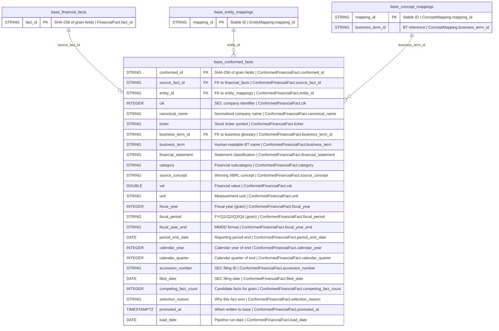

## Physical Model: Conformed Facts
**Spec:** docs/specs/base-conformed-facts.md
**Date:** 2026-03-15
**Agent:** @semantic-modeler
**Mode:** Greenfield
**Stage:** Physical (3 of 3)
**Status:** APPROVED
**Derived From:** governance/models/base-conformed-facts-logical.md (APPROVED 2026-03-15)



> **+** Entities marked with + have a matching business glossary term

### Tables

#### base.conformed_facts
- **Grain:** One row per (cik, business_term_id, fiscal_year, fiscal_period) -- the single authoritative value for each financial metric per company per period
- **Partitioning:** None (estimated ~27K rows; full scans are sub-second)
- **Sort Order:** cik, business_term_id, fiscal_year, fiscal_period (grain order for efficient range scans)
- **Estimated Row Count:** ~26,894

| # | Column | Iceberg Type | Field ID | Required | Description | Source Mapping | Business Term | Is CDE | Is PII |
|---|--------|-------------|----------|----------|-------------|----------------|---------------|--------|--------|
| 1 | conformed_id | StringType | 1 | Yes | SHA-256 hash of grain fields (cik, business_term_id, fiscal_year, fiscal_period), truncated to 16 chars | Computed: SHA-256(cik, business_term_id, fiscal_year, fiscal_period)[:16] | -- | No | No |
| 2 | source_fact_id | StringType | 2 | Yes | FK to base.financial_facts.fact_id -- the winning fact selected by collision resolution | base.financial_facts.fact_id | BT-017 | No | No |
| 3 | entity_id | StringType | 3 | Yes | FK to base.entity_mappings.mapping_id -- resolved entity identity | base.financial_facts.entity_id | BT-008 | No | No |
| 4 | cik | IntegerType | 4 | Yes | SEC Central Index Key (part of grain) | base.financial_facts.cik | BT-001 | Yes | No |
| 5 | canonical_name | StringType | 5 | Yes | Normalized company name (denormalized from entity_mappings) | base.financial_facts.canonical_name | BT-005 | Yes | No |
| 6 | ticker | StringType | 6 | No | Stock ticker symbol (denormalized from entity_mappings) | base.financial_facts.ticker | -- | No | No |
| 7 | business_term_id | StringType | 7 | Yes | FK to business glossary -- the financial metric being measured (part of grain) | base.financial_facts.business_term_id (after legacy ID normalization) | BT-013 | No | No |
| 8 | business_term | StringType | 8 | Yes | Human-readable business term name (denormalized) | base.financial_facts.business_term | BT-013 | No | No |
| 9 | financial_statement | StringType | 9 | Yes | Statement classification: income_statement, balance_sheet, cash_flow_statement (denormalized from concept_mappings) | base.financial_facts.financial_statement | BT-021 | No | No |
| 10 | category | StringType | 10 | Yes | Financial metric subcategory (denormalized from concept_mappings) | base.financial_facts.category | -- | No | No |
| 11 | source_concept | StringType | 11 | Yes | The XBRL concept that won collision resolution | base.financial_facts.concept | BT-009 | No | No |
| 12 | val | DoubleType | 12 | Yes | The financial value from the winning fact | base.financial_facts.val | -- | No | No |
| 13 | unit | StringType | 13 | Yes | Measurement unit after unit filtering (e.g., USD, USD/shares) | base.financial_facts.unit | -- | No | No |
| 14 | fiscal_year | IntegerType | 14 | Yes | Fiscal year of reporting (part of grain) | base.financial_facts.fiscal_year | BT-018 | No | No |
| 15 | fiscal_period | StringType | 15 | Yes | FY, Q1, Q2, Q3, Q4 (part of grain) | base.financial_facts.fiscal_period | BT-018 | No | No |
| 16 | fiscal_year_end | StringType | 16 | No | Company's fiscal year end date in MMDD format (denormalized from entity_mappings) | base.financial_facts.fiscal_year_end | -- | No | No |
| 17 | period_end_date | DateType | 17 | Yes | Calendar date of the reporting period end | base.financial_facts.end_date | -- | No | No |
| 18 | calendar_year | IntegerType | 18 | Yes | Calendar year of period_end_date (derived) | base.financial_facts.calendar_year | BT-019 | No | No |
| 19 | calendar_quarter | IntegerType | 19 | Yes | Calendar quarter of period_end_date (derived) | base.financial_facts.calendar_quarter | BT-019 | No | No |
| 20 | accession_number | StringType | 20 | Yes | SEC accession number of the winning fact's filing | base.financial_facts.accession_number | BT-002 | Yes | No |
| 21 | filed_date | DateType | 21 | Yes | Date the winning fact's filing was submitted to the SEC | base.financial_facts.filed_date | BT-006 | Yes | No |
| 22 | competing_fact_count | IntegerType | 22 | Yes | Number of candidate facts that competed for this grain (>=1) | Computed during collision resolution | -- | No | No |
| 23 | selection_reason | StringType | 23 | Yes | Why this fact won: "primary_concept", "tier_frequency_fallback", or "sole_candidate" | Computed during collision resolution | -- | No | No |
| 24 | promoted_at | TimestamptzType | 24 | Yes | When this row was written to base zone | Generated at promote time | -- | No | No |
| 25 | load_date | DateType | 25 | Yes | Pipeline run date | Generated at promote time | -- | No | No |

### Iceberg Schema Definition

```python
from pyiceberg.schema import Schema
from pyiceberg.types import (
    DateType,
    DoubleType,
    IntegerType,
    NestedField,
    StringType,
    TimestamptzType,
)

CONFORMED_FACTS_SCHEMA = Schema(
    NestedField(field_id=1, name="conformed_id", field_type=StringType(), required=True),
    NestedField(field_id=2, name="source_fact_id", field_type=StringType(), required=True),
    NestedField(field_id=3, name="entity_id", field_type=StringType(), required=True),
    NestedField(field_id=4, name="cik", field_type=IntegerType(), required=True),
    NestedField(field_id=5, name="canonical_name", field_type=StringType(), required=True),
    NestedField(field_id=6, name="ticker", field_type=StringType(), required=False),
    NestedField(field_id=7, name="business_term_id", field_type=StringType(), required=True),
    NestedField(field_id=8, name="business_term", field_type=StringType(), required=True),
    NestedField(field_id=9, name="financial_statement", field_type=StringType(), required=True),
    NestedField(field_id=10, name="category", field_type=StringType(), required=True),
    NestedField(field_id=11, name="source_concept", field_type=StringType(), required=True),
    NestedField(field_id=12, name="val", field_type=DoubleType(), required=True),
    NestedField(field_id=13, name="unit", field_type=StringType(), required=True),
    NestedField(field_id=14, name="fiscal_year", field_type=IntegerType(), required=True),
    NestedField(field_id=15, name="fiscal_period", field_type=StringType(), required=True),
    NestedField(field_id=16, name="fiscal_year_end", field_type=StringType(), required=False),
    NestedField(field_id=17, name="period_end_date", field_type=DateType(), required=True),
    NestedField(field_id=18, name="calendar_year", field_type=IntegerType(), required=True),
    NestedField(field_id=19, name="calendar_quarter", field_type=IntegerType(), required=True),
    NestedField(field_id=20, name="accession_number", field_type=StringType(), required=True),
    NestedField(field_id=21, name="filed_date", field_type=DateType(), required=True),
    NestedField(field_id=22, name="competing_fact_count", field_type=IntegerType(), required=True),
    NestedField(field_id=23, name="selection_reason", field_type=StringType(), required=True),
    NestedField(field_id=24, name="promoted_at", field_type=TimestamptzType(), required=True),
    NestedField(field_id=25, name="load_date", field_type=DateType(), required=True),
)
```

### Physical Design Decisions

- **Iceberg table identifier:** `base.conformed_facts`
- **No partitioning** -- at ~27K rows, the table is trivially scannable in sub-second queries. Partitioning would add overhead without benefit. Consistent with all other base tables in this project.
- **No BooleanType columns** -- unlike `base.financial_facts` (which has `is_amendment`, `is_superseded`), conformed facts are already filtered to exclude superseded rows and null business terms. The boolean flags are consumed during build, not stored.
- **conformed_id is a truncated SHA-256** -- deterministic hash of the grain fields (cik, business_term_id, fiscal_year, fiscal_period), truncated to 16 hex chars. Enables idempotent re-runs: same grain always produces the same ID. Collision-safe at this data volume.
- **source_fact_id enables one-hop lineage** -- direct FK to `base.financial_facts.fact_id` rather than storing the 6-field composite natural key. Consumers can trace: `conformed_facts.source_fact_id` -> `financial_facts.fact_id` -> raw grain fields -> SEC filing.
- **Denormalized for query performance** -- entity metadata (canonical_name, ticker), concept metadata (business_term, financial_statement, category), and temporal metadata (fiscal_year_end, calendar_year, calendar_quarter) are all copied from source tables. This avoids joins at query time for the primary consumption surface. Storage cost is negligible at ~27K rows.
- **val is DoubleType, not DecimalType** -- consistent with `base.financial_facts`. SEC EDGAR values are reported as floating-point; introducing DecimalType here would require type conversion at the boundary. All downstream consumables already handle DoubleType.
- **ticker is the only optional column** -- some entities (e.g., private companies or entities without a public listing) may not have a ticker. All other columns are required, reflecting the conformation guarantee: every row is a complete, validated, authoritative fact.
- **fiscal_year_end is optional** -- inherited from entity_mappings where some entities may lack this metadata. All other temporal fields (fiscal_year, fiscal_period, period_end_date) are required.
- **Sort order recommendation: (cik, business_term_id, fiscal_year, fiscal_period)** -- matches the grain and the most common query pattern: "show me all values for company X, metric Y, across time." This clusters data for efficient range scans without requiring partitioning.
- **competing_fact_count and selection_reason are lineage metadata** -- these two columns make the collision resolution process transparent. They do not affect the conformed value but enable audit queries like "which facts had multi-concept collisions?" and "how often does the fallback resolver fire?"
