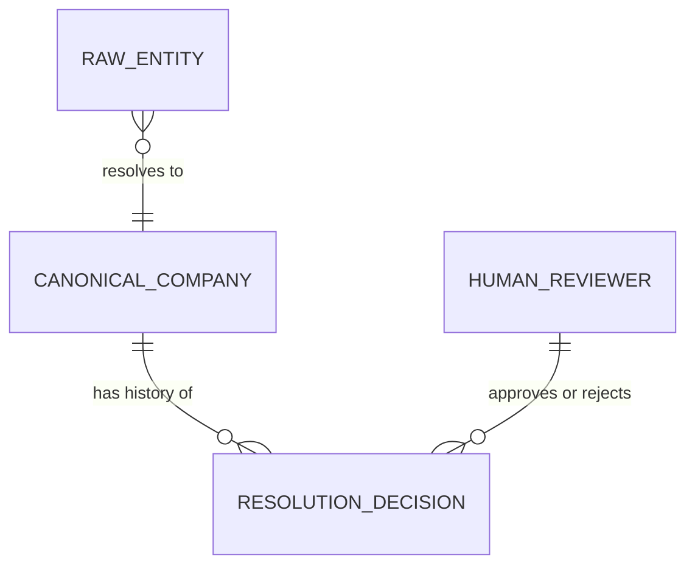

## Conceptual Model: Entity Resolution
**Spec:** docs/specs/base-entity-resolution.md
**Date:** 2026-03-14
**Agent:** @semantic-modeler
**Mode:** Backfill (reverse-engineered from existing implementation)
**Stage:** Conceptual (1 of 3)
**Status:** PROPOSED

> **†** Entities marked with † have a matching business glossary term

### Entities
| Entity | Description | Business Owner | Business Term |
|--------|-------------|----------------|--------------|
| Raw Entity | A company name and CIK as received from SEC EDGAR. May be inconsistent (all-caps, abbreviations, legal suffixes). | Data Engineering | BT-003: Legal Entity Name |
| Canonical Company | A normalized, human-approved company identity. The single source of truth for "who is this company?" across the pipeline. | Data Governance | BT-005: Canonical Company Identity |
| Resolution Decision | A recorded action (propose, approve, reject) on a mapping between a raw entity and a canonical company. Provides full audit trail. | Data Governance | BT-008: Entity Resolution |
| Human Reviewer | A person who approves or rejects proposed entity mappings. The human-in-the-loop gate. | Data Stewardship | BT-016: Human Approval Gate |

### Relationships
| From | To | Relationship | Cardinality | Description |
|------|----|-------------|-------------|-------------|
| Raw Entity | Canonical Company | resolves to | N:1 | Multiple raw entity names (from different filings) can resolve to the same canonical company |
| Canonical Company | Resolution Decision | has history of | 1:N | Every mapping has a full audit trail of decisions |
| Human Reviewer | Resolution Decision | approves or rejects | 1:N | Humans gate the progression from proposed to approved |

### Business Rules
- Every raw CIK must resolve to exactly one canonical company
- No canonical company exists without at least one resolution decision (proposed)
- High-confidence matches (exact CIK lookup) can be auto-approved when the system is in dev/demo mode
- Low-confidence matches (below threshold) always require human approval, regardless of mode
- Resolution decisions are append-only — history is never modified or deleted

### Design Rationale
The entity resolution model exists because SEC EDGAR entity names are inconsistent. "APPLE INC", "Apple Inc.", and "APPLE INC." all refer to the same company. Rather than cleaning names inline, the pipeline resolves each CIK to a canonical identity with human oversight. This creates a reusable company dimension that all downstream tables reference. The audit trail ensures every mapping decision is traceable for governance.
