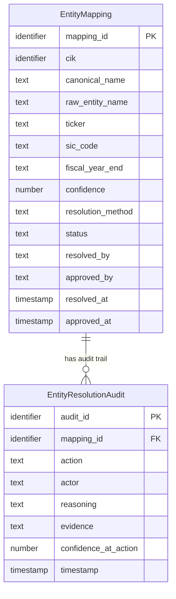

## Logical Model: Entity Resolution
**Spec:** docs/specs/base-entity-resolution.md
**Date:** 2026-03-14
**Agent:** @semantic-modeler
**Mode:** Backfill (reverse-engineered from existing implementation)
**Stage:** Logical (2 of 3)
**Status:** PROPOSED
**Derived From (backfill):** governance/models/base-entity-resolution-physical.md + source code

> **†** Entities marked with † have a matching business glossary term

### Entities

#### EntityMapping
- **Primary Key:** mapping_id
- **Natural Key:** cik (one mapping per CIK)
- **Description:** A canonical company identity resolved from raw SEC EDGAR entity data. Maps a CIK to a normalized, human-approved company identity with metadata.

| Attribute | Domain | Nullable | Description | CDE Reference | PII | Business Term |
|-----------|--------|----------|-------------|---------------|-----|--------------|
| mapping_id | Identifier | No | Stable human-readable ID | — | None | — |
| cik | Identifier | No | SEC-assigned company identifier | CDE-001 | None | BT-001 |
| canonical_name | Text | No | Normalized display name | CDE-003 | None | BT-005 |
| raw_entity_name | Text | No | Original name from SEC EDGAR | — | None | BT-003 |
| ticker | Text | Yes | Primary stock ticker | — | None | — |
| sic_code | Text | Yes | Industry classification code | — | None | BT-025 |
| fiscal_year_end | Text (MMDD) | Yes | Month/day of fiscal year end | — | None | — |
| confidence | Number (0-1) | No | Resolution confidence score | — | None | BT-010 |
| resolution_method | Text (enum) | No | How the mapping was determined | — | None | — |
| status | Text (enum) | No | Approval status | — | None | — |
| resolved_by | Text | No | Agent that proposed the mapping | — | None | — |
| approved_by | Text | Yes | Human or auto approver | — | None | BT-016 |
| resolved_at | Timestamp | No | When proposed | — | None | — |
| approved_at | Timestamp | Yes | When approved | — | None | — |

#### EntityResolutionAudit
- **Primary Key:** audit_id
- **Foreign Key:** mapping_id → EntityMapping.mapping_id
- **Description:** Append-only log of every action taken on an entity mapping. Provides full decision history for governance.

| Attribute | Domain | Nullable | Description | CDE Reference | PII | Business Term |
|-----------|--------|----------|-------------|---------------|-----|--------------|
| audit_id | Identifier | No | Unique event ID | — | None | — |
| mapping_id | Identifier | No | Which mapping this action applies to | — | None | — |
| action | Text (enum) | No | proposed, approved, rejected, updated | — | None | — |
| actor | Text | No | Who performed the action | — | None | — |
| reasoning | Text | No | Explanation of decision | — | None | — |
| evidence | Structured (JSON) | No | Supporting data for the decision | — | None | — |
| confidence_at_action | Number (0-1) | No | Confidence at time of action | — | None | BT-010 |
| timestamp | Timestamp | No | When action occurred | — | None | — |

### Relationships
| Parent Entity | Child Entity | FK Field | Cardinality | On Delete |
|--------------|-------------|----------|-------------|-----------|
| EntityMapping | EntityResolutionAudit | mapping_id | 1:N | Cascade |

### Normalization Decisions
- **Fully normalized** — two entities, one relationship. No redundant data.
- **Evidence stored as structured text (JSON)** rather than a separate evidence table — volume is too low to justify a third entity.
- **Natural key (cik) is not the primary key** — mapping_id is used instead because the approval workflow needs a stable reference that exists before the mapping is finalized.

### Grain Definitions
- **EntityMapping:** One row per resolved company (by CIK). Currently 20 rows.
- **EntityResolutionAudit:** One row per action event. Append-only, ~2-3 events per mapping.

### Alternatives Considered
- **Single table with audit columns** — rejected because audit history would be lost on updates. The append-only pattern preserves full decision lineage.
- **Separate dimension for resolution_method** — rejected, only 2 values (exact_cik_match, fuzzy_name_normalize). Not worth the join.
