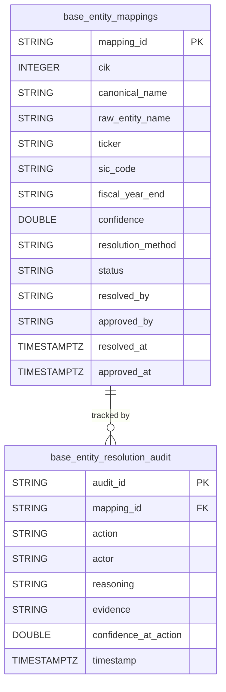

## Physical Model: Entity Resolution
**Spec:** docs/specs/base-entity-resolution.md
**Date:** 2026-03-14
**Agent:** @semantic-modeler
**Mode:** Backfill (reverse-engineered from existing implementation)
**Stage:** Physical (3 of 3)
**Status:** PROPOSED
**Derived From (backfill):** Existing Iceberg tables + source code (documenting as-built)
**Source Files:** src/base/entity_resolution/schema.py, resolve.py, promote.py

### Tables

#### base.entity_mappings
- **Grain:** One resolved entity — one row per unique CIK/company mapping
- **Partitioning:** None (20 rows)
- **Row Count:** 20

| Column | DuckDB Type | Nullable | Description | Source Mapping |
|--------|------------|----------|-------------|----------------|
| mapping_id | STRING | No | Stable ID (ER-001, ER-002...) | Generated sequentially |
| cik | INTEGER | No | SEC Central Index Key | raw.xbrl_company_facts.cik |
| canonical_name | STRING | No | Normalized company display name | KNOWN_ENTITIES lookup or title-case heuristic |
| raw_entity_name | STRING | No | As-received from SEC EDGAR | raw.xbrl_company_facts.entity_name (most common per CIK) |
| ticker | STRING | Yes | Primary stock ticker symbol | KNOWN_ENTITIES lookup |
| sic_code | STRING | Yes | Standard Industrial Classification | KNOWN_ENTITIES lookup |
| fiscal_year_end | STRING | Yes | MMDD format | KNOWN_ENTITIES lookup |
| confidence | DOUBLE | No | Resolution confidence (0.0-1.0) | 1.0 for exact CIK match, 0.5 for fuzzy |
| resolution_method | STRING | No | "exact_cik_match" or "fuzzy_name_normalize" | Determined by KNOWN_ENTITIES hit/miss |
| status | STRING | No | Always "approved" (post-gate) | Set on approval |
| resolved_by | STRING | No | Agent name | "@entity-resolver" |
| approved_by | STRING | Yes | Approver identity | "human:jeff" or "auto" |
| resolved_at | TIMESTAMPTZ | No | When mapping was proposed | Generated at resolve time |
| approved_at | TIMESTAMPTZ | Yes | When mapping was approved | Set on approval |

#### base.entity_resolution_audit
- **Grain:** One audit event per action on a mapping (append-only log)
- **Partitioning:** None (low volume)
- **Row Count:** ~40-60 (2-3 events per mapping)

| Column | DuckDB Type | Nullable | Description | Source Mapping |
|--------|------------|----------|-------------|----------------|
| audit_id | STRING | No | UUID primary key | Generated (uuid4) |
| mapping_id | STRING | No | FK to entity_mappings | From proposal |
| action | STRING | No | "proposed", "approved", "rejected", "updated" | Pipeline stage |
| actor | STRING | No | Who performed action | "@entity-resolver", "human:jeff", "auto" |
| reasoning | STRING | No | Why decision was made | Generated explanation |
| evidence | STRING | No | JSON string with supporting data | Serialized evidence dict |
| confidence_at_action | DOUBLE | No | Confidence at time of action | From proposal |
| timestamp | TIMESTAMPTZ | No | When action occurred | Generated at action time |

### Physical Design Decisions
- **No partitioning** — both tables are small (20 entities, ~60 audit rows). Scan-all is fine.
- **STRING for mapping_id** — uses "ER-NNN" format for human readability in staging/approval workflow.
- **evidence stored as JSON string** — avoids nested types in Iceberg. Parsed by consumers as needed.
- **Audit table is append-only** — no updates or deletes. Full history of every decision.
- **TIMESTAMPTZ for all timestamps** — UTC, timezone-aware for cross-system consistency.
