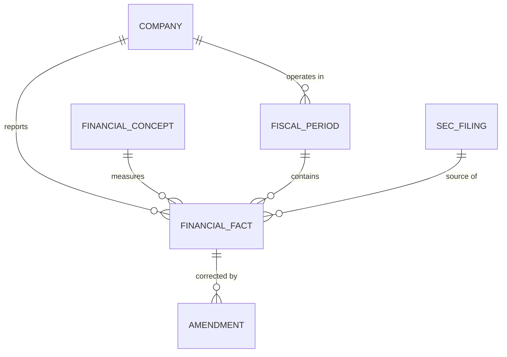

## Conceptual Model: Financial Facts Model
**Spec:** docs/specs/base-financial-facts-model.md
**Date:** 2026-03-14
**Agent:** @semantic-modeler
**Mode:** Backfill (reverse-engineered from existing implementation)
**Stage:** Conceptual (1 of 3)
**Status:** APPROVED

### Entities
| Entity | Description | Business Owner |
|--------|-------------|----------------|
| Company | A publicly traded company that files financial reports with the SEC. Identified by CIK, resolved to a canonical identity. | Data Governance |
| Financial Fact | A single reported financial value — one number, for one concept, in one unit, for one reporting period, from one SEC filing. The atomic unit of financial data. | Finance / Data Engineering |
| Financial Concept | An XBRL metric being measured (e.g., Revenue, Total Assets). May map to a canonical CDE for cross-company comparison. | Data Governance |
| Fiscal Period | A company's reporting period (Q1-Q4, Full Year) mapped to calendar dates. Each company has its own fiscal calendar. | Finance / Accounting |
| SEC Filing | A document submitted to the SEC (10-K, 10-Q, 10-K/A). The source of all financial facts. Identified by accession number. | Regulatory / Legal |
| Amendment | A correction where a later filing supersedes an earlier one for the same fact. Tracks what changed and by how much. | Finance / Audit |

### Relationships
| From | To | Relationship | Cardinality | Description |
|------|----|-------------|-------------|-------------|
| Company | Financial Fact | reports | 1:N | A company reports thousands of facts across its filings |
| Financial Concept | Financial Fact | measures | 1:N | Each fact measures exactly one concept |
| Fiscal Period | Financial Fact | contains | 1:N | Facts belong to specific fiscal periods |
| SEC Filing | Financial Fact | source of | 1:N | Each filing contains many facts |
| Company | Fiscal Period | operates in | 1:N | Each company has its own fiscal calendar with ~80 periods |
| Financial Fact | Amendment | corrected by | 1:N (sparse) | Most facts are never amended. When they are, the amendment records what changed. |

### Business Rules
- Every financial fact must reference exactly one company, one concept, one filing, and one fiscal period
- A fact's identity is determined by (company, concept, unit, period start, period end, filing) — this is the grain
- When a company files an amendment (10-K/A, 10-Q/A), the amended facts supersede the originals but both are preserved
- Consumers who want "latest values" filter to non-superseded facts
- Fiscal periods are derived from observed filing data, not computed from fiscal year-end dates
- Financial facts are denormalized with company and concept metadata for query efficiency — this is a deliberate analytical design choice

### Design Rationale
The financial facts model is the heart of the Base zone. It joins raw XBRL data with resolved company identities and normalized concept classifications to produce an enriched, queryable fact table. The model preserves all filing versions (including amendments) rather than keeping only the latest — this supports temporal analysis and audit. The fiscal calendar is built from observed data rather than calculated dates because real-world reporting has irregularities. Amendment tracking is a separate entity because supersession analysis is a distinct concern from fact storage.
