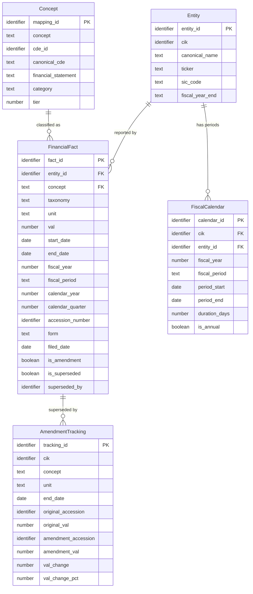

## Logical Model: Financial Facts Model
**Spec:** docs/specs/base-financial-facts-model.md
**Date:** 2026-03-14
**Agent:** @semantic-modeler
**Mode:** Backfill (reverse-engineered from existing implementation)
**Stage:** Logical (2 of 3)
**Status:** APPROVED
**Derived From (backfill):** governance/models/base-financial-facts-model-physical.md + source code

> **†** Entities marked with † have a matching business glossary term

### Entities

#### FinancialFact
- **Primary Key:** fact_id (deterministic hash of grain)
- **Natural Key:** (cik, concept, unit, start_date, end_date, accession_number)
- **Description:** A single reported financial value from an SEC filing, enriched with entity and concept metadata. The central fact table of the Base zone.

| Attribute | Domain | Nullable | Description | CDE Reference | Business Term | PII |
|-----------|--------|----------|-------------|---------------|--------------|-----|
| fact_id | Identifier | No | Deterministic hash of grain fields | — | — | None |
| entity_id | Identifier | No | Reference to resolved entity | — | — | None |
| cik | Identifier | No | SEC company identifier | CDE-001 | BT-001 | None |
| canonical_name | Text | No | Normalized company name (denormalized) | CDE-003 | BT-005 | None |
| ticker | Text | Yes | Stock ticker (denormalized) | — | — | None |
| concept | Text | No | XBRL concept name | — | BT-009 | None |
| cde_id | Identifier | Yes | Canonical CDE reference (null Tier 3) | CDE-007..CDE-031 | BT-013 | None |
| canonical_cde | Text | Yes | CDE name (null Tier 3, denormalized) | — | BT-013 | None |
| financial_statement | Text (enum) | No | Statement classification (denormalized) | — | BT-021 | None |
| category | Text | No | Subcategory (denormalized) | — | — | None |
| tier | Number (1-3) | No | Mapping quality tier (denormalized) | — | BT-015 | None |
| taxonomy | Text | No | XBRL taxonomy source | — | BT-020 | None |
| unit | Text | No | Measurement unit | — | — | None |
| val | Number | No | Reported value | — | — | None |
| start_date | Date | Yes | Period start (null for instant facts) | — | — | None |
| end_date | Date | No | Period end | — | — | None |
| fiscal_year | Number | No | Fiscal year of reporting | CDE-005 | BT-018 | None |
| fiscal_period | Text (enum) | No | FY, Q1, Q2, Q3, Q4 | CDE-006 | BT-018 | None |
| fiscal_year_end | Text (MMDD) | Yes | Company's fiscal year end (denormalized) | — | — | None |
| calendar_year | Number | No | Calendar year of end_date (derived) | — | — | None |
| calendar_quarter | Number (1-4) | No | Calendar quarter of end_date (derived) | — | — | None |
| accession_number | Identifier | No | SEC filing identifier | CDE-002 | BT-002 | None |
| form | Text | No | Filing form type | — | — | None |
| filed_date | Date | No | When filed with SEC | CDE-004 | BT-006 | None |
| is_amendment | Boolean | No | Filing is an amendment (derived) | — | BT-007 | None |
| is_superseded | Boolean | No | Later filing supersedes this one (derived) | — | BT-012 | None |
| superseded_by | Identifier | Yes | Accession of superseding filing | — | BT-012 | None |

#### FiscalCalendar
- **Primary Key:** calendar_id (deterministic hash of grain)
- **Natural Key:** (cik, fiscal_year, fiscal_period)
- **Description:** Temporal dimension mapping fiscal periods to calendar dates for each company. Built from observed filing data, not theoretical calendars.

| Attribute | Domain | Nullable | Description | CDE Reference | Business Term | PII |
|-----------|--------|----------|-------------|---------------|--------------|-----|
| calendar_id | Identifier | No | Deterministic hash of grain | — | — | None |
| cik | Identifier | No | Company | CDE-001 | BT-001 | None |
| entity_id | Identifier | No | Reference to resolved entity | — | — | None |
| fiscal_year | Number | No | Fiscal year | CDE-005 | BT-018 | None |
| fiscal_period | Text (enum) | No | FY, Q1, Q2, Q3, Q4 | CDE-006 | BT-018 | None |
| fiscal_year_end | Text (MMDD) | No | Company's fiscal year end | — | — | None |
| period_start | Date | Yes | Earliest observed start_date | — | — | None |
| period_end | Date | No | Latest observed end_date | — | — | None |
| calendar_year | Number | No | Calendar year of period_end (derived) | — | — | None |
| calendar_quarter | Number (1-4) | No | Calendar quarter of period_end (derived) | — | — | None |
| duration_days | Number | Yes | Period length in days (derived) | — | — | None |
| is_annual | Boolean | No | Whether this is a full-year period (derived) | — | — | None |

#### AmendmentTracking
- **Primary Key:** tracking_id
- **Description:** Records each supersession event where an amended filing replaces an original. One row per (original → amendment) pair.

| Attribute | Domain | Nullable | Description | CDE Reference | Business Term | PII |
|-----------|--------|----------|-------------|---------------|--------------|-----|
| tracking_id | Identifier | No | Unique event ID | — | — | None |
| cik | Identifier | No | Company | CDE-001 | BT-001 | None |
| concept | Text | No | XBRL concept that was amended | — | BT-009 | None |
| unit | Text | No | Measurement unit | — | — | None |
| start_date | Date | Yes | Period start of amended fact | — | — | None |
| end_date | Date | No | Period end of amended fact | — | — | None |
| original_accession | Identifier | No | Superseded filing | CDE-002 | BT-002 | None |
| original_filed_date | Date | No | When original was filed | CDE-004 | BT-006 | None |
| original_val | Number | No | Original reported value | — | — | None |
| amendment_accession | Identifier | No | Superseding filing | CDE-002 | BT-002 | None |
| amendment_filed_date | Date | No | When amendment was filed | CDE-004 | BT-006 | None |
| amendment_val | Number | No | Corrected value | — | — | None |
| val_change | Number | No | Absolute change (derived) | — | — | None |
| val_change_pct | Number | Yes | Percentage change (derived, null if div/0) | — | — | None |
| amendment_form | Text | No | Form type of amendment | — | BT-007 | None |

#### Entity (reference — defined in base-entity-resolution)
- See governance/models/base-entity-resolution-logical.md

#### Concept (reference — defined in base-xbrl-tag-normalization)
- See governance/models/base-xbrl-tag-normalization-logical.md

### Relationships
| Parent Entity | Child Entity | FK Field | Cardinality | On Delete |
|--------------|-------------|----------|-------------|-----------|
| Entity | FinancialFact | entity_id | 1:N | Restrict |
| Concept | FinancialFact | concept | 1:N | Restrict |
| Entity | FiscalCalendar | cik + entity_id | 1:N | Restrict |
| FinancialFact | AmendmentTracking | supersession grain | 1:N (sparse) | Cascade |

### Normalization Decisions
- **FinancialFact is intentionally denormalized** — canonical_name, ticker, canonical_cde, financial_statement, category, tier, and fiscal_year_end are all copied from parent entities. This is a deliberate analytical optimization: the fact table is the primary query surface, and avoiding joins at query time is worth the storage cost at 547K rows.
- **FiscalCalendar uses observed dates, not computed dates** — period_start and period_end come from actual filing data (min/max of observed dates), not from fiscal_year_end arithmetic. This handles companies that report outside expected windows.
- **AmendmentTracking stores both original and amendment values** — denormalized to avoid joining back to financial_facts. Makes it self-contained for amendment analysis.
- **Entity and Concept are cross-references** — defined in their own specs' logical models. The financial_facts_model uses them as parent dimensions.

### Grain Definitions
- **FinancialFact:** One row per (cik, concept, unit, start_date, end_date, accession_number). Preserves all filing versions — amendments create new rows, not updates.
- **FiscalCalendar:** One row per (cik, fiscal_year, fiscal_period). ~80 periods per company.
- **AmendmentTracking:** One row per supersession pair. Sparse — only exists where amendments were filed.

### Alternatives Considered
- **Normalized fact table (no denormalization)** — rejected. Would require 3-way join (entity + concept + fact) for every query. At this scale the join cost is trivial, but the ergonomic cost is real. Every consumer would need to know the join keys.
- **Separate dimension for filing metadata** — rejected. Accession number, form, and filed_date are part of the fact grain, not a separate dimension. A filing can contain many facts, but facts aren't reused across filings.
- **Computing fiscal calendar from fiscal_year_end math** — rejected. Real-world fiscal calendars have irregularities. Observed dates are ground truth.
- **Storing amendment_tracking as a view over financial_facts** — considered but rejected. Precomputing makes amendment analysis faster and the tracking table serves as an explicit governance artifact showing what changed.
