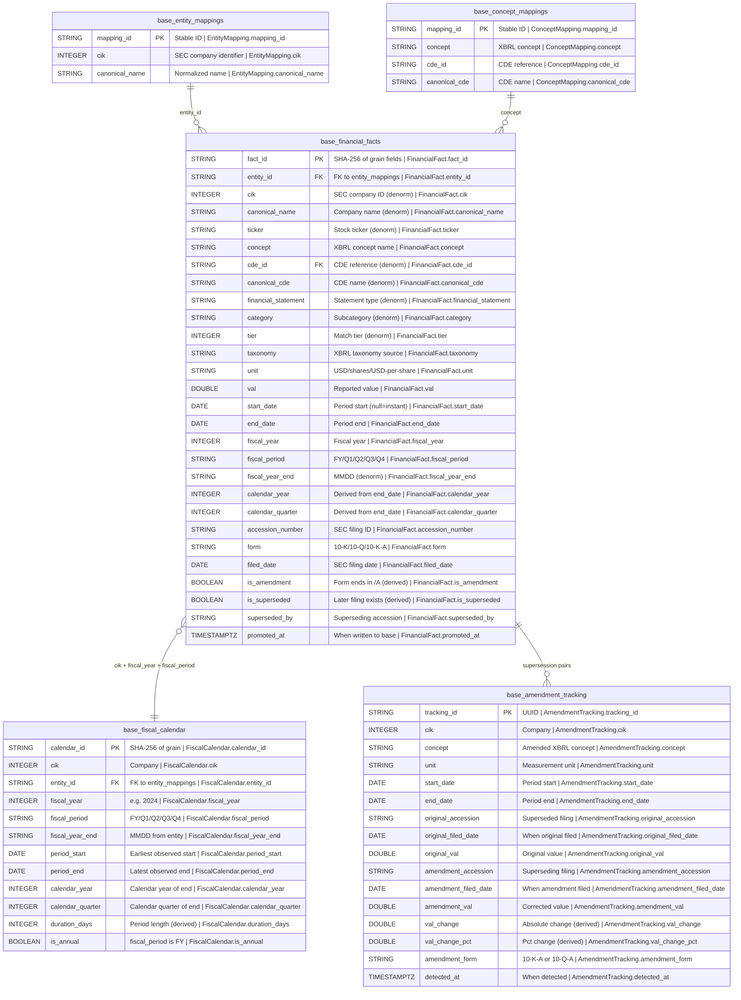

## Physical Model: Financial Facts Model
**Spec:** docs/specs/base-financial-facts-model.md
**Date:** 2026-03-14
**Agent:** @semantic-modeler
**Mode:** Backfill (reverse-engineered from existing implementation)
**Stage:** Physical (3 of 3)
**Status:** PROPOSED
**Derived From (backfill):** Existing Iceberg tables + source code (documenting as-built)
**Source Files:** src/base/financial_facts_model/schema.py, model.py, fiscal_calendar.py, amendments.py, promote.py

### Tables

#### base.financial_facts
- **Grain:** One fact observation per (cik, concept, unit, start_date, end_date, accession_number) — preserves all filing versions including amendments
- **Partitioning:** None
- **Estimated Row Count:** ~547,000

| Column | DuckDB Type | Nullable | Description | Source Mapping |
|--------|------------|----------|-------------|----------------|
| fact_id | STRING | No | SHA-256 hash of grain fields, truncated to 16 chars | Computed: SHA-256(cik, concept, unit, start_date, end_date, accession_number)[:16] |
| entity_id | STRING | No | FK to entity_mappings.mapping_id | Looked up by CIK |
| cik | INTEGER | No | SEC Central Index Key | raw.xbrl_company_facts.cik |
| canonical_name | STRING | No | Normalized company name | entity_mappings.canonical_name |
| ticker | STRING | Yes | Stock ticker | entity_mappings.ticker |
| concept | STRING | No | XBRL concept name | raw.xbrl_company_facts.concept |
| cde_id | STRING | Yes | CDE catalog reference (null for Tier 3) | concept_mappings.cde_id |
| canonical_cde | STRING | Yes | CDE name (null for Tier 3) | concept_mappings.canonical_cde |
| financial_statement | STRING | No | Statement classification | concept_mappings.financial_statement |
| category | STRING | No | Subcategory | concept_mappings.category |
| tier | INTEGER | No | Mapping tier (1/2/3) | concept_mappings.tier |
| taxonomy | STRING | No | XBRL taxonomy (us-gaap, dei, etc.) | raw.xbrl_company_facts.taxonomy |
| unit | STRING | No | Measurement unit (USD, shares, USD/shares) | raw.xbrl_company_facts.unit |
| val | DOUBLE | No | Reported fact value | raw.xbrl_company_facts.val |
| start_date | DATE | Yes | Period start (null for instant facts) | raw.xbrl_company_facts.start_date |
| end_date | DATE | No | Period end | raw.xbrl_company_facts.end_date |
| fiscal_year | INTEGER | No | Fiscal year | raw.xbrl_company_facts.fiscal_year |
| fiscal_period | STRING | No | FY, Q1, Q2, Q3, Q4 | raw.xbrl_company_facts.fiscal_period |
| fiscal_year_end | STRING | Yes | MMDD format | entity_mappings.fiscal_year_end |
| calendar_year | INTEGER | No | Calendar year of end_date | Computed: end_date.year |
| calendar_quarter | INTEGER | No | Calendar quarter of end_date | Computed: (end_date.month - 1) / 3 + 1 |
| accession_number | STRING | No | SEC accession number | raw.xbrl_company_facts.accession_number |
| form | STRING | No | Filing form type | raw.xbrl_company_facts.form |
| filed_date | DATE | No | SEC filing date | raw.xbrl_company_facts.filed_date |
| is_amendment | BOOLEAN | No | Form ends in "/A" | Computed: form.endswith("/A") |
| is_superseded | BOOLEAN | No | Later filing exists for same supersession grain | Computed by _apply_supersession() |
| superseded_by | STRING | Yes | Accession number of superseding filing | Set by _apply_supersession() |
| promoted_at | TIMESTAMPTZ | No | When written to base zone | Generated at promote time |

#### base.fiscal_calendar
- **Grain:** One row per (cik, fiscal_year, fiscal_period)
- **Partitioning:** None
- **Estimated Row Count:** ~1,600 (20 companies x ~80 periods)

| Column | DuckDB Type | Nullable | Description | Source Mapping |
|--------|------------|----------|-------------|----------------|
| calendar_id | STRING | No | SHA-256 hash of (cik, fiscal_year, fiscal_period) | Computed |
| cik | INTEGER | No | Company | raw.xbrl_company_facts.cik |
| entity_id | STRING | No | FK to entity_mappings | Looked up by CIK |
| fiscal_year | INTEGER | No | e.g., 2024 | raw.xbrl_company_facts.fiscal_year |
| fiscal_period | STRING | No | FY, Q1, Q2, Q3, Q4 | raw.xbrl_company_facts.fiscal_period |
| fiscal_year_end | STRING | No | MMDD from entity_mappings | entity_mappings.fiscal_year_end |
| period_start | DATE | Yes | Earliest start_date observed for this period | Computed: min(start_date) |
| period_end | DATE | No | Latest end_date observed for this period | Computed: max(end_date) |
| calendar_year | INTEGER | No | Calendar year of period_end | Computed: period_end.year |
| calendar_quarter | INTEGER | No | Calendar quarter of period_end | Computed: (period_end.month - 1) / 3 + 1 |
| duration_days | INTEGER | Yes | period_end - period_start in days | Computed (null if period_start is null) |
| is_annual | BOOLEAN | No | True if fiscal_period == "FY" | Computed |

#### base.amendment_tracking
- **Grain:** One row per supersession pair (original filing → amending filing)
- **Partitioning:** None
- **Estimated Row Count:** Sparse (only amendments exist)

| Column | DuckDB Type | Nullable | Description | Source Mapping |
|--------|------------|----------|-------------|----------------|
| tracking_id | STRING | No | UUID primary key | Generated (uuid4) |
| cik | INTEGER | No | Company | From financial_facts |
| concept | STRING | No | XBRL concept amended | From financial_facts |
| unit | STRING | No | Measurement unit | From financial_facts |
| start_date | DATE | Yes | Period start of amended fact | From financial_facts |
| end_date | DATE | No | Period end of amended fact | From financial_facts |
| original_accession | STRING | No | First filing (superseded) | From superseded fact |
| original_filed_date | DATE | No | When original was filed | From superseded fact |
| original_val | DOUBLE | No | Original reported value | From superseded fact |
| amendment_accession | STRING | No | Amending filing | From superseding fact |
| amendment_filed_date | DATE | No | When amendment was filed | From superseding fact |
| amendment_val | DOUBLE | No | New reported value | From superseding fact |
| val_change | DOUBLE | No | amendment_val - original_val | Computed |
| val_change_pct | DOUBLE | Yes | Percentage change (null if original_val = 0) | Computed |
| amendment_form | STRING | No | "10-K/A", "10-Q/A" | From superseding fact |
| detected_at | TIMESTAMPTZ | No | When detected by pipeline | Generated at detection time |

### Physical Design Decisions
- **Denormalized financial_facts** — entity and concept metadata is duplicated into the fact table to avoid joins at query time. This is intentional: the fact table is the primary query surface, and 547K rows with 28 columns is trivially scannable.
- **fact_id is a truncated SHA-256** — deterministic, collision-resistant at 16 hex chars for this data volume. Enables idempotent re-runs.
- **Supersession is precomputed** — is_superseded and superseded_by are set during build, not at query time. Consumers can filter `WHERE NOT is_superseded` for latest values.
- **No partitioning on any table** — data volume doesn't justify it. Full scans are sub-second.
- **fiscal_calendar uses observed boundaries** — period_start and period_end come from actual data, not from fiscal_year_end math. This handles edge cases where companies report outside expected windows.
- **amendment_tracking is sparse** — most facts are not amended. Table only contains rows where supersession was detected.
