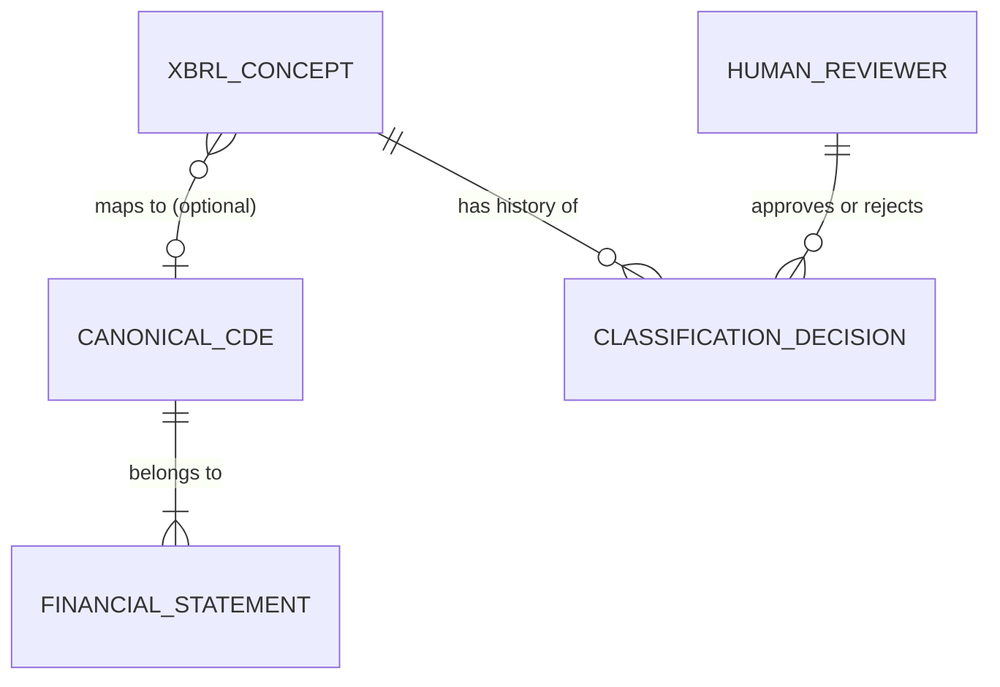

## Conceptual Model: XBRL Tag Normalization
**Spec:** docs/specs/base-xbrl-tag-normalization.md
**Date:** 2026-03-14
**Agent:** @semantic-modeler
**Mode:** Backfill (reverse-engineered from existing implementation)
**Stage:** Conceptual (1 of 3)
**Status:** PROPOSED

> **†** Entities marked with † have a matching business glossary term

### Entities
| Entity | Description | Business Owner | Business Term | CDE | PII |
|--------|-------------|----------------|--------------|-----|-----|
| XBRL Concept† | A specific financial metric tag from the us-gaap XBRL taxonomy (e.g., "Revenues", "EarningsPerShareBasic"). There are ~3,285 distinct concepts in the dataset. | Data Engineering | BT-009 | — | None |
| Canonical CDE† | One of 25 standardized financial data elements (e.g., "Revenue", "Total Assets", "Net Income"). The common language for cross-company comparison. | Data Governance | BT-013 | CDE-007..CDE-031 | None |
| Financial Statement† | A category of financial reporting: Balance Sheet, Income Statement, Cash Flow, Per-Share, or Other. Every concept is classified into one. | Finance / Accounting | BT-021 | — | None |
| Classification Decision† | A recorded action (propose, approve, reject, classify as unmapped) on a concept-to-CDE mapping. Full audit trail. | Data Governance | BT-011 | — | None |
| Human Reviewer† | A person who approves or rejects proposed concept classifications. | Data Stewardship | BT-016 | — | None |

### Relationships
| From | To | Relationship | Cardinality | Description |
|------|----|-------------|-------------|-------------|
| XBRL Concept | Canonical CDE | maps to | N:1 (optional) | Many XBRL concepts can map to the same CDE. ~90% of concepts are unmapped (Tier 3 long-tail tags). |
| Canonical CDE | Financial Statement | belongs to | N:1 | Each CDE belongs to one financial statement category |
| XBRL Concept | Classification Decision | has history of | 1:N | Every concept has a classification audit trail |
| Human Reviewer | Classification Decision | approves or rejects | 1:N | Humans gate the progression for mapped concepts |

### Business Rules
- Every XBRL concept must be classified — either mapped to a CDE (Tier 1/2) or explicitly marked unmapped (Tier 3)
- A concept maps to at most one canonical CDE (no many-to-many)
- Unmapped concepts (Tier 3) still receive a financial statement and category via heuristic classification
- Classification confidence is fixed by tier: Tier 1 = 1.0, Tier 2 = 0.6-0.7, Tier 3 = 0.0
- The 25 canonical CDEs are a stable reference set — adding or removing a CDE requires a governance spec

### Design Rationale
The XBRL taxonomy contains thousands of concepts, but most financial analysis only needs ~25 core metrics (Revenue, Net Income, Total Assets, etc.). This model maps the long tail of XBRL tags to those 25 canonical CDEs using a tiered matching engine. The tiered approach acknowledges that exact matches are rare — most of the value comes from pattern-based approximate matching (Tier 2) and explicit "we don't know what this is" classification (Tier 3). The human approval gate ensures that the automated matching engine's results are reviewed before they flow into downstream analysis.
