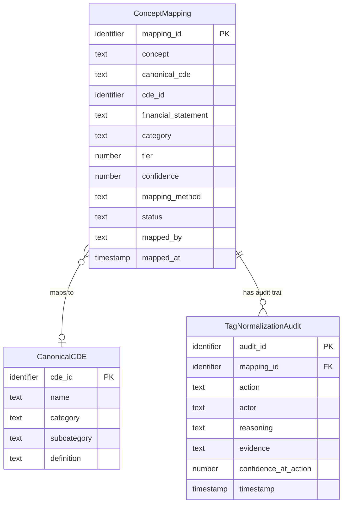

## Logical Model: XBRL Tag Normalization
**Spec:** docs/specs/base-xbrl-tag-normalization.md
**Date:** 2026-03-14
**Agent:** @semantic-modeler
**Mode:** Backfill (reverse-engineered from existing implementation)
**Stage:** Logical (2 of 3)
**Status:** PROPOSED
**Derived From (backfill):** governance/models/base-xbrl-tag-normalization-physical.md + source code

> **†** Entities marked with † have a matching business glossary term

### Entities

#### ConceptMapping
- **Primary Key:** mapping_id
- **Natural Key:** concept (one mapping per distinct XBRL concept)
- **Description:** Classification of a us-gaap XBRL concept into a canonical CDE with tiered confidence. Maps the XBRL taxonomy's ~3,285 concepts to 25 standardized financial data elements.

| Attribute | Domain | Nullable | Description | CDE Reference | Glossary Ref |
|-----------|--------|----------|-------------|---------------|--------------|
| mapping_id | Identifier | No | Stable human-readable ID | — | — |
| concept | Text | No | Raw XBRL concept name (e.g., "Revenues") | — | BT-009 |
| canonical_cde | Text | Yes | Mapped CDE name (null for unmapped) | — | BT-013 |
| cde_id | Identifier | Yes | CDE catalog reference (null for unmapped) | CDE-007..CDE-031 | BT-013 |
| financial_statement | Text (enum) | No | Statement classification | — | BT-021 |
| category | Text | No | Subcategory within statement | — | — |
| tier | Number (1-3) | No | Match quality tier | — | BT-015 |
| confidence | Number (0-1) | No | Match confidence score | — | BT-010 |
| mapping_method | Text (enum) | No | How the match was determined | — | — |
| status | Text (enum) | No | Approval/classification status | — | — |
| mapped_by | Text | No | Agent that classified | — | — |
| mapped_at | Timestamp | No | When classified | — | — |

#### CanonicalCDE
- **Primary Key:** cde_id
- **Description:** One of 25 canonical financial data elements that XBRL concepts map to. Defined in governance/cde-catalog.json. This entity is a reference table — it exists in config, not as an Iceberg table.
- **Note:** This is a logical entity only. Physically it lives in CDE_DEFINITIONS in config.py and governance/cde-catalog.json, not in an Iceberg table.

| Attribute | Domain | Nullable | Description | CDE Reference | Glossary Ref |
|-----------|--------|----------|-------------|---------------|--------------|
| cde_id | Identifier | No | CDE-007 through CDE-031 | Self-referencing | BT-013 |
| name | Text | No | Human-readable name (e.g., "Revenue") | — | — |
| category | Text | No | balance_sheet, income_statement, cash_flow, per_share, other | — | — |
| subcategory | Text | No | More specific grouping | — | — |
| definition | Text | No | Business definition | — | — |

#### TagNormalizationAudit
- **Primary Key:** audit_id
- **Foreign Key:** mapping_id → ConceptMapping.mapping_id
- **Description:** Append-only log of every classification action. Identical structure to EntityResolutionAudit (shared staging module).

| Attribute | Domain | Nullable | Description | CDE Reference | Glossary Ref |
|-----------|--------|----------|-------------|---------------|--------------|
| audit_id | Identifier | No | Unique event ID | — | — |
| mapping_id | Identifier | No | Which concept mapping this applies to | — | — |
| action | Text (enum) | No | proposed, approved, rejected, classified_unmapped | — | — |
| actor | Text | No | Who performed the action | — | — |
| reasoning | Text | No | Explanation of classification decision | — | — |
| evidence | Structured (JSON) | No | fact_count, company_count for coverage | — | — |
| confidence_at_action | Number (0-1) | No | Confidence at time of action | — | BT-010 |
| timestamp | Timestamp | No | When action occurred | — | — |

### Relationships
| Parent Entity | Child Entity | FK Field | Cardinality | On Delete |
|--------------|-------------|----------|-------------|-----------|
| CanonicalCDE | ConceptMapping | cde_id | 1:N (optional) | Restrict |
| ConceptMapping | TagNormalizationAudit | mapping_id | 1:N | Cascade |

### Normalization Decisions
- **CanonicalCDE is a logical entity not materialized as an Iceberg table** — it lives in config and governance artifacts. The concept_mappings table references it by cde_id but there's no physical FK constraint. This is acceptable because the CDE catalog is static (25 entries, changes only with spec approval).
- **Tier 3 unmapped concepts have null CDE fields** — this is a deliberate design choice. 2,943 of 3,285 concepts are long-tail XBRL tags that don't map to any canonical CDE. Forcing a mapping would reduce data quality.
- **Shared audit table pattern** — TagNormalizationAudit uses the same schema as EntityResolutionAudit. The staging module (entity_resolution/staging.py) is reused, not duplicated.

### Grain Definitions
- **ConceptMapping:** One row per distinct us-gaap XBRL concept. 3,285 rows.
- **TagNormalizationAudit:** One row per classification action. Append-only.

### Alternatives Considered
- **Separate tables per tier** — rejected. Having one table with a tier column is simpler and allows coverage queries across all tiers.
- **Materializing CanonicalCDE as an Iceberg table** — rejected. 25 static rows don't justify a table. Config is the right home. If the CDE catalog grows significantly, this decision should be revisited.
- **Storing matching rules alongside mappings** — rejected. Rules live in config (EXACT_MAPPINGS, PREFIX_RULES, PATTERN_RULES). The mapping_method field captures which rule type matched, which is sufficient for audit.
