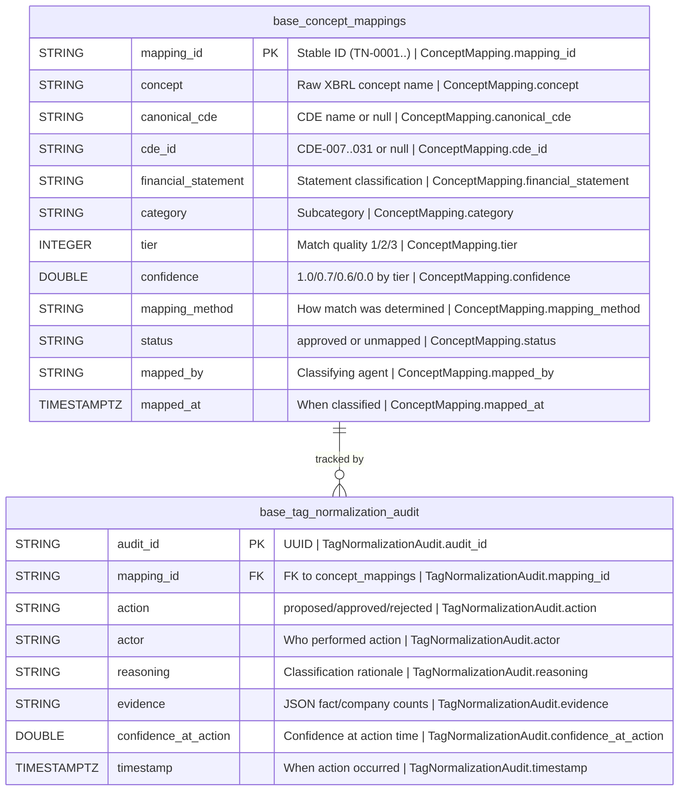

## Physical Model: XBRL Tag Normalization
**Spec:** docs/specs/base-xbrl-tag-normalization.md
**Date:** 2026-03-14
**Agent:** @semantic-modeler
**Mode:** Backfill (reverse-engineered from existing implementation)
**Stage:** Physical (3 of 3)
**Status:** PROPOSED
**Derived From (backfill):** Existing Iceberg tables + source code (documenting as-built)
**Source Files:** src/base/xbrl_tag_normalization/schema.py, normalize.py, promote.py

### Tables

#### base.concept_mappings
- **Grain:** One row per distinct us-gaap XBRL concept
- **Partitioning:** None
- **Row Count:** 3,285

| Column | DuckDB Type | Nullable | Description | Source Mapping | Business Term | Term Def | CDE | PII |
|--------|------------|----------|-------------|----------------|---------------|----------|-----|-----|
| mapping_id | STRING | No | Stable ID (TN-0001...) | Generated sequentially | — | — | — | None |
| concept | STRING | No | Raw us-gaap XBRL concept name | raw.xbrl_company_facts distinct concepts (us-gaap taxonomy only) | XBRL Concept | A tagged financial metric from the XBRL taxonomy | — | None |
| canonical_cde | STRING | Yes | Mapped CDE name (null for Tier 3) | CDE_DEFINITIONS lookup via tier matching | Canonical CDE | Standardized financial data element for cross-company comparison | CDE-007..CDE-031 (dynamic) | None |
| cde_id | STRING | Yes | CDE catalog reference CDE-007..CDE-031 (null for Tier 3) | From EXACT_MAPPINGS, PREFIX_RULES, or PATTERN_RULES | Canonical CDE | Standardized financial data element for cross-company comparison | CDE-007..CDE-031 (dynamic) | None |
| financial_statement | STRING | No | balance_sheet, income_statement, cash_flow, per_share, other | From matching rule or HEURISTIC_CATEGORIES | Financial Statement | A formal accounting report (balance sheet, income, cash flow) | — | None |
| category | STRING | No | Subcategory (revenue, assets, eps, tax...) | From matching rule or HEURISTIC_CATEGORIES | — | — | — | None |
| tier | INTEGER | No | 1 (exact), 2 (prefix/pattern), 3 (unmapped) | Determined by matching engine | Tier | Classification level indicating match quality (1=exact, 2=pattern, 3=unmapped) | — | None |
| confidence | DOUBLE | No | 1.0 / 0.7 / 0.6 / 0.0 by tier | Fixed per tier level | Confidence Score | Numeric score expressing certainty of a mapping or classification | — | None |
| mapping_method | STRING | No | exact_match, prefix_match, pattern_match, unmapped | From matching engine | — | — | — | None |
| status | STRING | No | "approved" (Tier 1+2), "unmapped" (Tier 3) | Set by approval gate | — | — | — | None |
| mapped_by | STRING | No | "@tag-normalizer" | Fixed | — | — | — | None |
| mapped_at | TIMESTAMPTZ | No | When mapping was proposed | Generated at normalize time | — | — | — | None |

#### base.tag_normalization_audit
- **Grain:** One audit event per action on a concept mapping (append-only log)
- **Partitioning:** None
- **Row Count:** ~6,500 (2 events per mapping: proposed + approved/classified)

| Column | DuckDB Type | Nullable | Description | Source Mapping | Business Term | Term Def | CDE | PII |
|--------|------------|----------|-------------|----------------|---------------|----------|-----|-----|
| audit_id | STRING | No | UUID primary key | Generated (uuid4) | — | — | — | None |
| mapping_id | STRING | No | FK to concept_mappings | From proposal | — | — | — | None |
| action | STRING | No | "proposed", "approved", "rejected", "classified_unmapped" | Pipeline stage | — | — | — | None |
| actor | STRING | No | Who performed action | "@tag-normalizer", "human:jeff", "auto" | — | — | — | None |
| reasoning | STRING | No | Why decision was made | Generated explanation with match details | — | — | — | None |
| evidence | STRING | No | JSON string (fact_count, company_count) | Serialized from raw data analysis | — | — | — | None |
| confidence_at_action | DOUBLE | No | Confidence at time of action | From proposal | Confidence Score | Numeric score expressing certainty of a mapping or classification | — | None |
| timestamp | TIMESTAMPTZ | No | When action occurred | Generated at action time | — | — | — | None |

### Physical Design Decisions
- **No partitioning** — 3,285 rows scans instantly.
- **Tiered confidence is fixed, not computed** — Tier 1 = 1.0, Tier 2 prefix = 0.7, Tier 2 pattern = 0.6, Tier 3 = 0.0. Simplifies reasoning about match quality.
- **canonical_cde and cde_id are nullable** — Tier 3 unmapped concepts have no CDE assignment. This is intentional; 2,943 of 3,285 concepts are long-tail tags that don't map to any of the 25 canonical CDEs.
- **Reuses entity_resolution staging module** — the approval gate logic (staging.py) is shared, not duplicated.
- **evidence stored as JSON string** — contains fact_count and company_count for coverage analysis.
