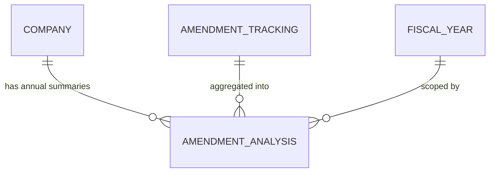

## Conceptual Model: Amendment Analysis
**Spec:** docs/specs/consumable-amendment-analysis.md
**Date:** 2026-03-15
**Agent:** @semantic-modeler
**Mode:** Greenfield (new consumable zone table)
**Stage:** Conceptual (1 of 3)
**Status:** APPROVED

> **Mapping note:** Business Term and CDE columns reference IDs only (BT-XXX). Authoritative definitions live in `governance/business-glossary.json`.

### Entities
| Entity | Description | Business Owner | Business Term | Is CDE | Is PII |
|--------|-------------|----------------|--------------|--------|--------|
| Company | A publicly traded company identified by CIK. One of 20 large-cap US companies. | Data Governance | BT-005 | Yes | No |
| Amendment Analysis | A summary of amendment patterns for one company in one fiscal year. Captures frequency, magnitude, and timing of financial restatements. One row per (company, fiscal_year). | Finance / Data Engineering | BT-054 | No | No |
| Amendment Tracking | Source table of individual amendment facts. Each row is one value change in one XBRL concept between an original and amended filing. | Data Engineering | BT-011 | No | No |
| Fiscal Year | Calendar year derived from the end_date of the period being amended. Scopes the analysis to annual summaries. | Finance / Accounting | BT-018 | Yes | No |

### Relationships
| From | To | Relationship | Cardinality | Description |
|------|----|-------------|-------------|-------------|
| Company | Amendment Analysis | has annual summaries | 1:N | Each company has one summary per fiscal year with amendments |
| Amendment Tracking | Amendment Analysis | aggregated into | N:1 | Many individual amendments are summarized into one company/year row |
| Fiscal Year | Amendment Analysis | scoped by | 1:N | Each summary belongs to exactly one fiscal year |

### Business Rules
- The grain is (cik, fiscal_year) -- exactly one summary row per company per year
- Only years with amendments produce rows. Companies with zero amendments in a year have no row.
- All magnitude statistics use ABS(val_change) -- direction (increase/decrease) is irrelevant for magnitude analysis
- Percentage change statistics exclude nulls (val_change_pct is null when original_val was 0)
- days_to_amend is computed as amendment_filed_date - original_filed_date in days
- largest_concept captures the XBRL concept with the single largest absolute value change in that company/year
- Company metadata (ticker, canonical_name, sector, entity_id) is denormalized from consumable.company_financials
- Fiscal year is derived from the calendar year of end_date (the period being amended), not the filing date

### Design Rationale
Amendment tracking has 239K individual amendment rows. The first question an analyst asks is "which companies amend most?" -- answering this requires GROUP BY, COUNT, MEDIAN, and joins across 239K rows. This table precomputes those aggregates per company per year, reducing the analytical surface from 239K rows to ~340 summary rows. It captures frequency (how often), magnitude (how big), diversity (how many concepts), and timing (how quickly) of amendments.
