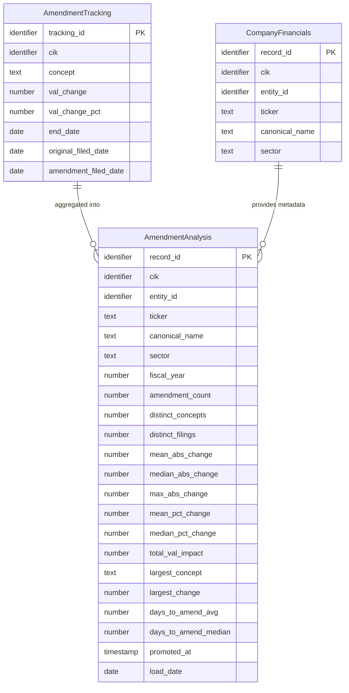

## Logical Model: Amendment Analysis
**Spec:** docs/specs/consumable-amendment-analysis.md
**Date:** 2026-03-15
**Agent:** @semantic-modeler
**Mode:** Greenfield (new consumable zone table)
**Stage:** Logical (2 of 3)
**Status:** APPROVED
**Derived From:** governance/models/consumable-amendment-analysis-conceptual.md

> **Mapping note:** Business Term and CDE columns reference IDs only (BT-XXX). Authoritative definitions live in `governance/business-glossary.json`.

### Entities

#### AmendmentAnalysis
- **Primary Key:** record_id (deterministic SHA-256 hash of grain fields)
- **Natural Key:** (cik, fiscal_year)
- **Description:** One summary row per company per fiscal year. Aggregates amendment frequency, magnitude, and timing from base.amendment_tracking, enriched with company metadata from consumable.company_financials.

| Attribute | Domain | Nullable | Description | Business Term | Is CDE | Is PII |
|-----------|--------|----------|-------------|--------------|--------|--------|
| record_id | Identifier | No | Deterministic SHA-256 hash of (cik, fiscal_year) | -- | No | No |
| cik | Identifier | No | SEC company identifier | BT-001 | Yes | No |
| entity_id | Identifier | No | Resolved entity reference | -- | No | No |
| ticker | Text | Yes | Stock ticker symbol (denormalized) | -- | No | No |
| canonical_name | Text | No | Normalized company name (denormalized) | BT-005 | Yes | No |
| sector | Text | No | Industry sector (denormalized) | BT-049 | No | No |
| fiscal_year | Number | No | Calendar year of end_date (period being amended) | BT-018 | Yes | No |
| amendment_count | Number | No | COUNT(*) of amendments in this company/year | BT-054 | No | No |
| distinct_concepts | Number | No | COUNT(DISTINCT concept) amended | BT-054 | No | No |
| distinct_filings | Number | No | COUNT(DISTINCT amendment_accession) | BT-054 | No | No |
| mean_abs_change | Number (double) | No | AVG(ABS(val_change)) | BT-054 | No | No |
| median_abs_change | Number (double) | No | MEDIAN(ABS(val_change)) | BT-054 | No | No |
| max_abs_change | Number (double) | No | MAX(ABS(val_change)) | BT-054 | No | No |
| mean_pct_change | Number (double) | Yes | AVG(ABS(val_change_pct)) excluding nulls | BT-054 | No | No |
| median_pct_change | Number (double) | Yes | MEDIAN(ABS(val_change_pct)) excluding nulls | BT-054 | No | No |
| total_val_impact | Number (double) | No | SUM(ABS(val_change)) — total dollar magnitude | BT-054 | No | No |
| largest_concept | Text | No | XBRL concept with MAX(ABS(val_change)) | BT-054 | No | No |
| largest_change | Number (double) | No | The MAX(ABS(val_change)) value | BT-054 | No | No |
| days_to_amend_avg | Number (double) | No | AVG(amendment_filed_date - original_filed_date) in days | BT-054 | No | No |
| days_to_amend_median | Number (double) | No | MEDIAN(amendment_filed_date - original_filed_date) in days | BT-054 | No | No |
| promoted_at | Timestamp | No | When this row was written to the consumable zone | -- | No | No |
| load_date | Date | No | System date for load tracking | -- | No | No |

#### AmendmentTracking (reference -- defined in base-financial-facts-model)
- See base.amendment_tracking
- Provides: cik, concept, val_change, val_change_pct, end_date, original_filed_date, amendment_filed_date, amendment_accession

#### CompanyFinancials (reference -- defined in consumable-company-financials)
- See governance/models/consumable-company-financials-logical.md
- Provides: cik, entity_id, ticker, canonical_name, sector

### Relationships
| Parent Entity | Child Entity | FK Field | Cardinality | On Delete |
|--------------|-------------|----------|-------------|-----------|
| AmendmentTracking | AmendmentAnalysis | cik + fiscal_year | N:1 | Restrict |
| CompanyFinancials | AmendmentAnalysis | cik | 1:N | Restrict |

### Grain Definitions
- **AmendmentAnalysis:** One row per (cik, fiscal_year). Each grain group aggregates all amendments for that company in that fiscal year.

### Normalization Decisions
- **Intentionally denormalized** -- company metadata (ticker, canonical_name, sector, entity_id) is copied from company_financials. Consumable zone avoids joins.
- **Percentage change stats are nullable** -- val_change_pct is null when original_val is 0. If all amendments in a company/year have null pct, the mean and median are also null.
- **largest_concept is the XBRL concept name** -- not a business term ID. Stored as the raw concept string from amendment_tracking for transparency.

### Alternatives Considered
- **Quarterly grain** -- rejected. Annual summaries are sufficient for trend analysis and keep the table small (~340 rows vs ~1,360).
- **Storing all amended concepts per row** -- rejected. The largest_concept captures the most significant one. Full concept lists belong in amendment_tracking.
- **Computing fiscal year from filed_date** -- rejected. The end_date (period being amended) is more meaningful than when the amendment was filed.
