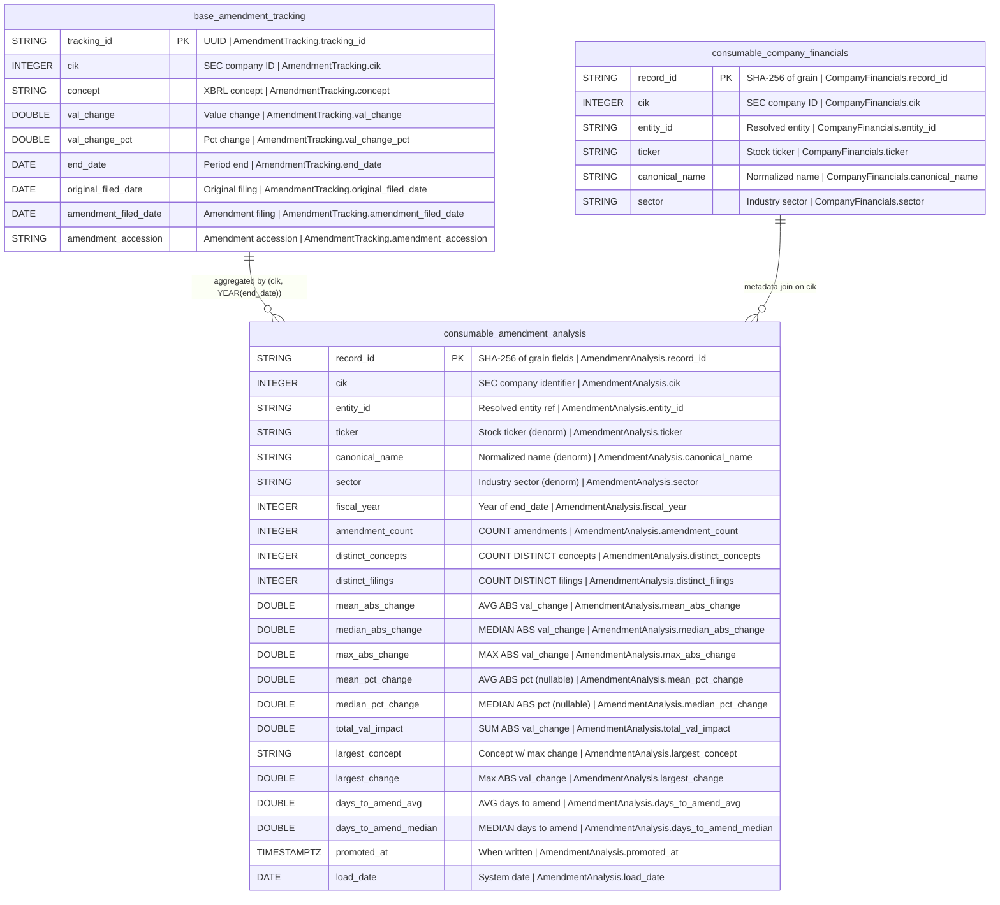

## Physical Model: Amendment Analysis
**Spec:** docs/specs/consumable-amendment-analysis.md
**Date:** 2026-03-15
**Agent:** @semantic-modeler
**Mode:** Greenfield (new consumable zone table)
**Stage:** Physical (3 of 3)
**Status:** APPROVED
**Derived From:** governance/models/consumable-amendment-analysis-logical.md

### Tables

#### consumable.amendment_analysis
- **Grain:** One row per (cik, fiscal_year)
- **Partitioning:** None (estimated ~340 rows, sub-second full scan)
- **Estimated Row Count:** ~340

| Column | Iceberg Type | Nullable | Description | Source Mapping | Business Term | Is CDE | Is PII |
|--------|-------------|----------|-------------|----------------|---------------|--------|--------|
| record_id | STRING | No | SHA-256 hash of (cik, fiscal_year), truncated to 16 chars | Computed | -- | No | No |
| cik | INTEGER | No | SEC Central Index Key | base.amendment_tracking.cik | BT-001 | Yes | No |
| entity_id | STRING | No | FK to entity_mappings | consumable.company_financials.entity_id | -- | No | No |
| ticker | STRING | Yes | Stock ticker symbol | consumable.company_financials.ticker | -- | No | No |
| canonical_name | STRING | No | Normalized company name | consumable.company_financials.canonical_name | BT-005 | Yes | No |
| sector | STRING | No | Industry sector | consumable.company_financials.sector | BT-049 | No | No |
| fiscal_year | INTEGER | No | Calendar year of end_date (period being amended) | EXTRACT(YEAR FROM base.amendment_tracking.end_date) | BT-018 | Yes | No |
| amendment_count | INTEGER | No | Number of amendments in this company/year | COUNT(*) | BT-054 | No | No |
| distinct_concepts | INTEGER | No | Distinct XBRL concepts amended | COUNT(DISTINCT concept) | BT-054 | No | No |
| distinct_filings | INTEGER | No | Distinct amendment filings | COUNT(DISTINCT amendment_accession) | BT-054 | No | No |
| mean_abs_change | DOUBLE | No | Average absolute value change | AVG(ABS(val_change)) | BT-054 | No | No |
| median_abs_change | DOUBLE | No | Median absolute value change | MEDIAN(ABS(val_change)) | BT-054 | No | No |
| max_abs_change | DOUBLE | No | Maximum absolute value change | MAX(ABS(val_change)) | BT-054 | No | No |
| mean_pct_change | DOUBLE | Yes | Average absolute percentage change (excludes nulls) | AVG(ABS(val_change_pct)) WHERE NOT NULL | BT-054 | No | No |
| median_pct_change | DOUBLE | Yes | Median absolute percentage change (excludes nulls) | MEDIAN(ABS(val_change_pct)) WHERE NOT NULL | BT-054 | No | No |
| total_val_impact | DOUBLE | No | Total dollar magnitude of all amendments | SUM(ABS(val_change)) | BT-054 | No | No |
| largest_concept | STRING | No | XBRL concept with largest absolute change | concept WHERE ABS(val_change) = MAX | BT-054 | No | No |
| largest_change | DOUBLE | No | Largest absolute change value | MAX(ABS(val_change)) | BT-054 | No | No |
| days_to_amend_avg | DOUBLE | No | Average days between original and amendment filing | AVG(amendment_filed_date - original_filed_date) | BT-054 | No | No |
| days_to_amend_median | DOUBLE | No | Median days between original and amendment filing | MEDIAN(amendment_filed_date - original_filed_date) | BT-054 | No | No |
| promoted_at | TIMESTAMPTZ | No | When written to consumable zone | Generated at promote time | -- | No | No |
| load_date | DATE | No | System date for load tracking | Generated at promote time | -- | No | No |

### Physical Design Decisions
- **Intentionally denormalized** -- company metadata is copied from company_financials. Consumable zone avoids joins.
- **record_id is a truncated SHA-256** -- deterministic, collision-resistant at 16 hex chars for ~340 rows. Enables idempotent re-runs.
- **No partitioning** -- data volume doesn't justify it. Full scans are sub-second.
- **Percentage change fields are nullable** -- val_change_pct is null when original_val = 0. If all amendments in a group have null pct, the aggregate is also null.
- **largest_concept stores raw XBRL concept name** -- not a business term ID. This preserves the exact concept that was amended, including tier 2/3 concepts not in the business glossary.
- **days_to_amend is computed as integer days** -- amendment_filed_date minus original_filed_date. DuckDB returns BIGINT for date subtraction; stored as DOUBLE for AVG/MEDIAN compatibility.
