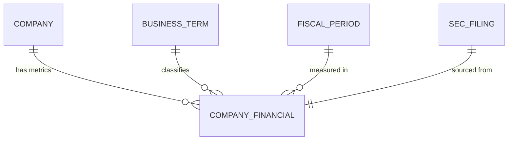

## Conceptual Model: Company Financials
**Spec:** docs/specs/consumable-company-financials.md
**Date:** 2026-03-14
**Agent:** @semantic-modeler
**Mode:** Greenfield (new consumable zone table)
**Stage:** Conceptual (1 of 3)
**Status:** APPROVED

> **Mapping note:** Business Term and CDE columns reference IDs only (BT-XXX). Authoritative definitions live in `governance/business-glossary.json`.

### Entities
| Entity | Description | Business Owner | Business Term | Is CDE | Is PII |
|--------|-------------|----------------|--------------|--------|--------|
| Company | A publicly traded company identified by CIK, with denormalized metadata (ticker, canonical name, sector, fiscal year end). One of 20 large-cap US companies in the pipeline. | Data Governance | BT-005 | Yes | No |
| Company Financial | A single financial metric value for one company in one fiscal period. The atomic unit of cross-company comparison. One row per (company, business term, fiscal year, fiscal period). Concept collisions resolved to a single value via primary concept preference. | Finance / Data Engineering | BT-013 | No | No |
| Business Term | A standardized financial metric name (e.g., Revenue, Net Income, Total Assets) that multiple XBRL concepts map to. 25 business terms in scope. | Data Governance | BT-013 | No | No |
| Fiscal Period | A company's reporting period (FY, Q1, Q2, Q3) with both fiscal and calendar year alignment. | Finance / Accounting | BT-018 | Yes | No |
| SEC Filing | The source filing (10-K, 10-Q) from which the financial value was extracted. Referenced by accession number for audit trail. | Regulatory / Legal | BT-004 | Yes | No |

### Relationships
| From | To | Relationship | Cardinality | Description |
|------|----|-------------|-------------|-------------|
| Company | Company Financial | has metrics | 1:N | Each company has many financial metric values across terms and periods |
| Business Term | Company Financial | classifies | 1:N | Each financial value maps to exactly one business term |
| Fiscal Period | Company Financial | measured in | 1:N | Each financial value belongs to one fiscal period |
| SEC Filing | Company Financial | sourced from | 1:1 | Each financial value traces to one source filing (accession number) |

### Business Rules
- Every company financial must reference exactly one company, one business term, and one fiscal period
- The grain is (cik, business_term_id, fiscal_year, fiscal_period) -- exactly one value per company per metric per period
- Only current facts (is_superseded=false) from the base zone are included
- Only mapped business terms (business_term_id IS NOT NULL) are included
- Concept collisions (multiple XBRL concepts mapping to the same business term) are resolved via primary concept preference -- one value selected, source_concept recorded for audit
- Unit is filtered to the primary unit for each business term category (USD for dollar amounts, USD/shares for per-share metrics)
- Company metadata (ticker, canonical_name, sector, fiscal_year_end) is denormalized from entity_mappings
- Business term metadata (business_term, financial_statement, category) is denormalized from concept_mappings
- Both fiscal year and calendar year fields are provided for temporal alignment across companies with different fiscal year ends

### Design Rationale
The Company Financials table is the core consumable zone artifact -- a denormalized, one-row-per-comparison-point table that eliminates all XBRL complexity. Consumers query "Apple's revenue in FY2024" without knowing about XBRL concepts, supersession, or fiscal calendar misalignment. The model resolves the three main complexity barriers in the base zone: (1) concept collision (34.3% of groups have 2+ concepts per business term), (2) supersession filtering (48.3% of base facts are superseded), and (3) unmapped concept filtering (70.1% of base facts have no business term). The result is a clean comparison surface of ~27K rows from 547K base facts.
