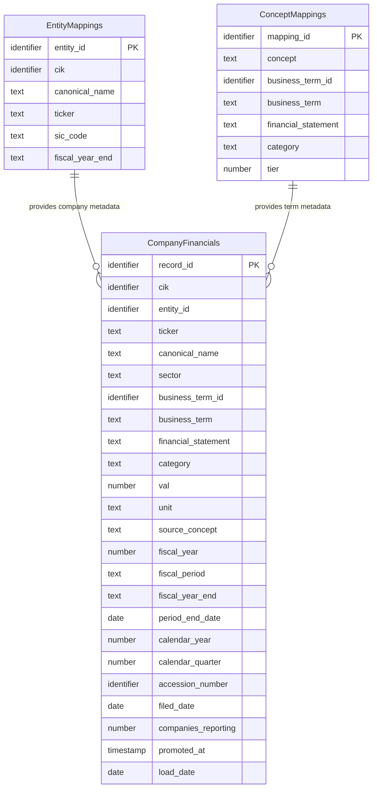

## Logical Model: Company Financials
**Spec:** docs/specs/consumable-company-financials.md
**Date:** 2026-03-14
**Agent:** @semantic-modeler
**Mode:** Greenfield (new consumable zone table)
**Stage:** Logical (2 of 3)
**Status:** APPROVED
**Derived From:** governance/models/consumable-company-financials-conceptual.md

> **Mapping note:** Business Term and CDE columns reference IDs only (BT-XXX). Authoritative definitions live in `governance/business-glossary.json`.

### Entities

#### CompanyFinancials
- **Primary Key:** record_id (deterministic SHA-256 hash of grain fields)
- **Natural Key:** (cik, business_term_id, fiscal_year, fiscal_period)
- **Description:** One financial metric value per company per business term per fiscal period. The core consumable table for cross-company financial comparison. Derived from base.financial_facts with concept collision resolution, supersession filtering, and unit filtering applied.

| Attribute | Domain | Nullable | Description | Business Term | Is CDE | Is PII |
|-----------|--------|----------|-------------|--------------|--------|--------|
| record_id | Identifier | No | Deterministic SHA-256 hash of (cik, business_term_id, fiscal_year, fiscal_period) | -- | No | No |
| cik | Identifier | No | SEC company identifier | BT-001 | Yes | No |
| entity_id | Identifier | No | Resolved entity reference | -- | No | No |
| ticker | Text | Yes | Stock ticker symbol (denormalized from entity_mappings) | -- | No | No |
| canonical_name | Text | No | Normalized company name (denormalized from entity_mappings) | BT-005 | Yes | No |
| sector | Text | No | Industry sector from SIC-to-sector mapping (denormalized) | BT-049 | No | No |
| business_term_id | Identifier | No | Reference to canonical financial business term | BT-013 | No | No |
| business_term | Text | No | Human-readable business term name (denormalized from concept_mappings) | BT-013 | No | No |
| financial_statement | Text (enum) | No | Statement classification: Balance Sheet, Income Statement, Cash Flow Statement | BT-021 | No | No |
| category | Text | No | Subcategory within financial statement (denormalized from concept_mappings) | -- | No | No |
| val | Number (double) | No | The reported financial value, selected via primary concept preference | -- | No | No |
| unit | Text | No | Measurement unit (USD or USD/shares) | -- | No | No |
| source_concept | Text | No | The XBRL concept selected by the collision resolution engine (audit trail) | BT-009 | No | No |
| fiscal_year | Number | No | Fiscal year of reporting | BT-018 | Yes | No |
| fiscal_period | Text (enum) | No | FY, Q1, Q2, Q3 | BT-018 | Yes | No |
| fiscal_year_end | Text (MMDD) | Yes | Company's fiscal year end date (denormalized from entity_mappings) | -- | No | No |
| period_end_date | Date | No | End date of the reporting period | -- | No | No |
| calendar_year | Number | No | Calendar year of period_end_date (for cross-company temporal alignment) | -- | No | No |
| calendar_quarter | Number (1-4) | No | Calendar quarter of period_end_date | -- | No | No |
| accession_number | Identifier | No | Source SEC filing identifier (audit trail) | BT-002 | Yes | No |
| filed_date | Date | No | Date the source filing was submitted to SEC | BT-006 | Yes | No |
| companies_reporting | Number | No | Count of distinct companies reporting this business term for this fiscal_period type | BT-050 | No | No |
| promoted_at | Timestamp | No | When this row was written to the consumable zone | -- | No | No |
| load_date | Date | No | System date for load tracking | -- | No | No |

#### EntityMappings (reference -- defined in base-entity-resolution)
- See governance/models/base-entity-resolution-logical.md
- Provides: cik, entity_id, canonical_name, ticker, sic_code (for sector derivation), fiscal_year_end

#### ConceptMappings (reference -- defined in base-xbrl-tag-normalization)
- See governance/models/base-xbrl-tag-normalization-logical.md
- Provides: business_term_id, business_term, financial_statement, category, tier (for concept collision tiebreaking)

### Relationships
| Parent Entity | Child Entity | FK Field | Cardinality | On Delete |
|--------------|-------------|----------|-------------|-----------|
| EntityMappings | CompanyFinancials | cik | 1:N | Restrict |
| ConceptMappings | CompanyFinancials | business_term_id + source_concept | 1:N | Restrict |

### Grain Definitions
- **CompanyFinancials:** One row per (cik, business_term_id, fiscal_year, fiscal_period). This is the natural grain for cross-company financial comparison. After concept collision resolution, each group has exactly one value.

### Normalization Decisions
- **CompanyFinancials is intentionally denormalized** -- canonical_name, ticker, sector, business_term, financial_statement, category, fiscal_year_end, and companies_reporting are all copied or derived from parent entities. This is a deliberate consumable zone design: the table is the primary query surface for analysts and LLMs, and avoiding joins is the entire point.
- **Sector is derived, not stored in source** -- sector is computed from entity_mappings.sic_code via a static lookup table. It does not exist in the base zone.
- **companies_reporting is a computed aggregate** -- count of distinct CIKs per (business_term_id, fiscal_period) across all years. Denormalized per row so consumers see coverage without a second query.
- **source_concept preserves audit trail** -- records which XBRL concept was selected during collision resolution. Without this, the derivation from base.financial_facts would be opaque.
- **Both fiscal and calendar year fields** -- different companies have different fiscal year ends. Calendar year/quarter fields enable apples-to-apples temporal alignment without requiring consumers to know each company's fiscal calendar.

### Alternatives Considered
- **Normalized design with separate dimension tables** -- rejected. The consumable zone exists to eliminate joins. Analysts want a single flat table.
- **Aggregating concept collisions (SUM/AVG)** -- rejected. Revenue is Revenue, not the sum of Revenue + RevenueFromContracts. Primary concept preference picks one authoritative value.
- **Including superseded facts with a flag** -- rejected. The consumable zone shows only current truth. Historical/amended analysis is a base zone concern.
- **Dynamic sector classification** -- rejected. With only 20 companies, a static SIC-to-sector mapping is simpler and more transparent.
