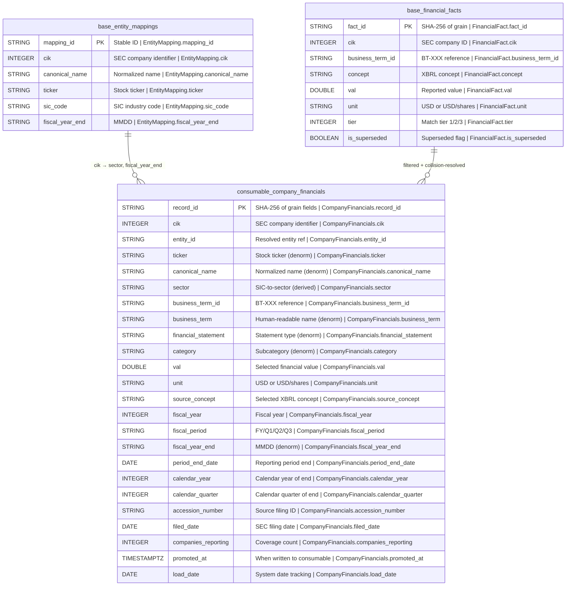

## Physical Model: Company Financials
**Spec:** docs/specs/consumable-company-financials.md
**Date:** 2026-03-14
**Agent:** @semantic-modeler
**Mode:** Greenfield (new consumable zone table)
**Stage:** Physical (3 of 3)
**Status:** APPROVED
**Derived From:** governance/models/consumable-company-financials-logical.md

### Tables

#### consumable.company_financials
- **Grain:** One row per (cik, business_term_id, fiscal_year, fiscal_period) -- after concept collision resolution and supersession/unit filtering
- **Partitioning:** None (estimated ~27K rows, sub-second full scan)
- **Estimated Row Count:** ~27,000

| Column | Iceberg Type | Nullable | Description | Source Mapping | Business Term | Is CDE | Is PII |
|--------|-------------|----------|-------------|----------------|---------------|--------|--------|
| record_id | STRING | No | SHA-256 hash of (cik, business_term_id, fiscal_year, fiscal_period), truncated to 16 chars | Computed | -- | No | No |
| cik | INTEGER | No | SEC Central Index Key | base.financial_facts.cik | BT-001 | Yes | No |
| entity_id | STRING | No | FK to entity_mappings.mapping_id | base.financial_facts.entity_id | -- | No | No |
| ticker | STRING | Yes | Stock ticker symbol | base.financial_facts.ticker | -- | No | No |
| canonical_name | STRING | No | Normalized company name | base.financial_facts.canonical_name | BT-005 | Yes | No |
| sector | STRING | No | Industry sector | Derived: SIC_TO_SECTOR[entity_mappings.sic_code] | BT-049 | No | No |
| business_term_id | STRING | No | Canonical business term reference | base.financial_facts.business_term_id | BT-013 | No | No |
| business_term | STRING | No | Human-readable business term name | base.financial_facts.business_term | BT-013 | No | No |
| financial_statement | STRING | No | Statement classification | base.financial_facts.financial_statement | BT-021 | No | No |
| category | STRING | No | Subcategory within statement | base.financial_facts.category | -- | No | No |
| val | DOUBLE | No | Financial value from primary concept selection | base.financial_facts.val (collision-resolved) | -- | No | No |
| unit | STRING | No | Measurement unit (USD or USD/shares) | base.financial_facts.unit (filtered to primary) | -- | No | No |
| source_concept | STRING | No | XBRL concept selected by collision resolution | base.financial_facts.concept (selected) | BT-009 | No | No |
| fiscal_year | INTEGER | No | Fiscal year of reporting | base.financial_facts.fiscal_year | BT-018 | Yes | No |
| fiscal_period | STRING | No | FY, Q1, Q2, Q3 | base.financial_facts.fiscal_period | BT-018 | Yes | No |
| fiscal_year_end | STRING | Yes | Company fiscal year end (MMDD) | base.entity_mappings.fiscal_year_end | -- | No | No |
| period_end_date | DATE | No | End date of reporting period | base.financial_facts.end_date | -- | No | No |
| calendar_year | INTEGER | No | Calendar year of period_end_date | base.financial_facts.calendar_year | -- | No | No |
| calendar_quarter | INTEGER | No | Calendar quarter of period_end_date | base.financial_facts.calendar_quarter | -- | No | No |
| accession_number | STRING | No | Source SEC filing accession number | base.financial_facts.accession_number | BT-002 | Yes | No |
| filed_date | DATE | No | Date source filing was submitted | base.financial_facts.filed_date | BT-006 | Yes | No |
| companies_reporting | INTEGER | No | Distinct CIKs reporting this business term for this fiscal_period type | Computed: COUNT(DISTINCT cik) per (business_term_id, fiscal_period) | BT-050 | No | No |
| promoted_at | TIMESTAMPTZ | No | When written to consumable zone | Generated at promote time | -- | No | No |
| load_date | DATE | No | System date for load tracking | Generated at promote time | -- | No | No |

### Physical Design Decisions
- **Intentionally denormalized** -- canonical_name, ticker, sector, business_term, financial_statement, category, fiscal_year_end, and companies_reporting are all copied or derived. The consumable zone is the primary query surface for analysts and LLMs; avoiding joins is the entire point.
- **record_id is a truncated SHA-256** -- deterministic, collision-resistant at 16 hex chars for this data volume (~27K rows). Enables idempotent re-runs.
- **Concept collision resolved before write** -- each (cik, business_term_id, fiscal_year, fiscal_period) group has exactly one row. The source_concept column records which XBRL concept was selected.
- **No partitioning** -- data volume doesn't justify it. Full scans are sub-second.
- **sector is derived at build time** -- computed from entity_mappings.sic_code via a static SIC_TO_SECTOR lookup. Not stored in any source table.
- **companies_reporting is a computed aggregate** -- count of distinct CIKs per (business_term_id, fiscal_period) across all years. Denormalized per row so consumers see coverage without a second query.
- **Unit filtering applied before write** -- only the primary unit per business term category is kept (USD for dollar amounts, USD/shares for per-share metrics).
