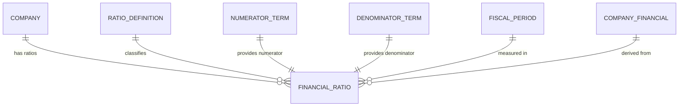

## Conceptual Model: Financial Ratios
**Spec:** docs/specs/consumable-financial-ratios.md
**Date:** 2026-03-14
**Agent:** @semantic-modeler
**Mode:** Greenfield (new consumable zone table)
**Stage:** Conceptual (1 of 3)
**Status:** APPROVED

> **Mapping note:** Business Term and CDE columns reference IDs only (BT-XXX). Authoritative definitions live in `governance/business-glossary.json`.

### Entities
| Entity | Description | Business Owner | Business Term | Is CDE | Is PII |
|--------|-------------|----------------|--------------|--------|--------|
| Company | A publicly traded company identified by CIK. One of 20 large-cap US companies. | Data Governance | BT-005 | Yes | No |
| Financial Ratio | A computed ratio value for one company in one fiscal period. The atomic unit of cross-company ratio comparison. One row per (company, ratio, fiscal year, fiscal period). | Finance / Data Engineering | BT-051 | No | No |
| Ratio Definition | A named ratio formula defined by a numerator and denominator business term. 7 ratios in scope: margins (gross, operating, net), leverage (debt-to-equity), efficiency (R&D intensity, SGA ratio, capex-to-revenue). | Finance / Data Governance | BT-051 | No | No |
| Numerator Term | The business term providing the numerator value (e.g., Net Income for Net Margin). References existing business terms from company_financials. | Finance | BT-013 | No | No |
| Denominator Term | The business term providing the denominator value (e.g., Revenue for margin ratios). References existing business terms from company_financials. | Finance | BT-013 | No | No |
| Fiscal Period | A company's reporting period (FY, Q1, Q2, Q3) with both fiscal and calendar year alignment. | Finance / Accounting | BT-018 | Yes | No |
| Company Financial | The source table providing absolute financial values. Each ratio requires two rows from this table. | Finance / Data Engineering | BT-013 | No | No |

### Relationships
| From | To | Relationship | Cardinality | Description |
|------|----|-------------|-------------|-------------|
| Company | Financial Ratio | has ratios | 1:N | Each company has many ratios across definitions and periods |
| Ratio Definition | Financial Ratio | classifies | 1:N | Each ratio value maps to exactly one ratio definition |
| Numerator Term | Financial Ratio | provides numerator | 1:1 | Each ratio has exactly one numerator business term |
| Denominator Term | Financial Ratio | provides denominator | 1:1 | Each ratio has exactly one denominator business term |
| Fiscal Period | Financial Ratio | measured in | 1:N | Each ratio belongs to one fiscal period |
| Company Financial | Financial Ratio | derived from | N:1 | Each ratio is derived from two company_financials rows (numerator + denominator) |

### Business Rules
- Every financial ratio requires both a numerator and denominator value from company_financials for the same (cik, fiscal_year, fiscal_period)
- The grain is (cik, ratio_id, fiscal_year, fiscal_period) -- exactly one ratio value per company per ratio per period
- Ratios are only computed where both components exist and denominator is non-zero
- CapEx-to-Revenue uses abs(numerator) because CapEx is reported as a negative cash outflow
- Negative denominators are allowed (Boeing's negative stockholders equity produces negative debt-to-equity)
- Both numerator and denominator values are preserved for full audit transparency
- Not all companies have all ratios (coverage ranges from 9 to 20 companies depending on component availability)
- Financial sector companies (JPM, GS, BRK.A) naturally lack some ratios (no Gross Profit, no traditional Operating Income)

### Design Rationale
The Financial Ratios table normalizes for company size, enabling meaningful cross-company comparison. Apple's $394B revenue vs Netflix's $33B is meaningless for comparison; Apple's 24.6% net margin vs Netflix's 18.3% is actionable. The table preserves full transparency by storing both component values alongside the computed ratio, so any consumer can verify the computation. Coverage varies by ratio because not all companies report all financial statement line items -- this is honest, not a bug.
