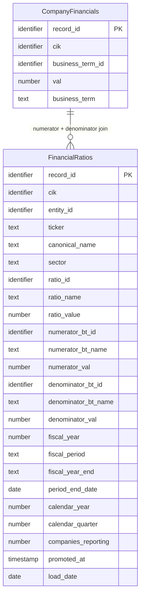

## Logical Model: Financial Ratios
**Spec:** docs/specs/consumable-financial-ratios.md
**Date:** 2026-03-14
**Agent:** @semantic-modeler
**Mode:** Greenfield (new consumable zone table)
**Stage:** Logical (2 of 3)
**Status:** APPROVED
**Derived From:** governance/models/consumable-financial-ratios-conceptual.md

> **Mapping note:** Business Term and CDE columns reference IDs only (BT-XXX). Authoritative definitions live in `governance/business-glossary.json`.

### Entities

#### FinancialRatios
- **Primary Key:** record_id (deterministic SHA-256 hash of grain fields)
- **Natural Key:** (cik, ratio_id, fiscal_year, fiscal_period)
- **Description:** One computed financial ratio per company per ratio definition per fiscal period. Derived from consumable.company_financials by joining numerator and denominator business terms on (cik, fiscal_year, fiscal_period).

| Attribute | Domain | Nullable | Description | Business Term | Is CDE | Is PII |
|-----------|--------|----------|-------------|--------------|--------|--------|
| record_id | Identifier | No | Deterministic SHA-256 hash of (cik, ratio_id, fiscal_year, fiscal_period) | -- | No | No |
| cik | Identifier | No | SEC company identifier | BT-001 | Yes | No |
| entity_id | Identifier | No | Resolved entity reference | -- | No | No |
| ticker | Text | Yes | Stock ticker symbol (denormalized) | -- | No | No |
| canonical_name | Text | No | Normalized company name (denormalized) | BT-005 | Yes | No |
| sector | Text | No | Industry sector (denormalized) | BT-049 | No | No |
| ratio_id | Identifier | No | Ratio definition reference (RATIO-001 through RATIO-007) | BT-051 | No | No |
| ratio_name | Text | No | Human-readable ratio name (e.g., "Net Margin") | BT-051 | No | No |
| ratio_value | Number (double) | No | Computed ratio = numerator_val / denominator_val | -- | No | No |
| numerator_bt_id | Identifier | No | Business term ID of the numerator component | BT-013 | No | No |
| numerator_bt_name | Text | No | Human-readable name of numerator business term | BT-013 | No | No |
| numerator_val | Number (double) | No | Absolute value of the numerator from company_financials | -- | No | No |
| denominator_bt_id | Identifier | No | Business term ID of the denominator component | BT-013 | No | No |
| denominator_bt_name | Text | No | Human-readable name of denominator business term | BT-013 | No | No |
| denominator_val | Number (double) | No | Absolute value of the denominator from company_financials | -- | No | No |
| fiscal_year | Number | No | Fiscal year of reporting | BT-018 | Yes | No |
| fiscal_period | Text (enum) | No | FY, Q1, Q2, Q3 | BT-018 | Yes | No |
| fiscal_year_end | Text (MMDD) | Yes | Company's fiscal year end date (denormalized) | -- | No | No |
| period_end_date | Date | No | End date of the reporting period | -- | No | No |
| calendar_year | Number | No | Calendar year of period_end_date | -- | No | No |
| calendar_quarter | Number (1-4) | No | Calendar quarter of period_end_date | -- | No | No |
| companies_reporting | Number | No | Count of distinct companies with this ratio for this fiscal_period type | BT-050 | No | No |
| promoted_at | Timestamp | No | When this row was written to the consumable zone | -- | No | No |
| load_date | Date | No | System date for load tracking | -- | No | No |

#### CompanyFinancials (reference -- defined in consumable-company-financials)
- See governance/models/consumable-company-financials-logical.md
- Provides: cik, business_term_id, val, business_term, fiscal_year, fiscal_period, and all company/temporal metadata

### Relationships
| Parent Entity | Child Entity | FK Field | Cardinality | On Delete |
|--------------|-------------|----------|-------------|-----------|
| CompanyFinancials | FinancialRatios | cik + numerator_bt_id + fiscal_year + fiscal_period | 1:N | Restrict |
| CompanyFinancials | FinancialRatios | cik + denominator_bt_id + fiscal_year + fiscal_period | 1:N | Restrict |

### Grain Definitions
- **FinancialRatios:** One row per (cik, ratio_id, fiscal_year, fiscal_period). Each grain group produces exactly one ratio value from one numerator/denominator pair.

### Normalization Decisions
- **Intentionally denormalized** -- company metadata (ticker, canonical_name, sector, fiscal_year_end) and both component names are copied from company_financials. Consumable zone avoids joins.
- **Both component values preserved** -- numerator_val and denominator_val are stored alongside ratio_value for full audit transparency. Any consumer can verify the computation.
- **companies_reporting is per ratio, not per business term** -- "Gross Margin available for 9 companies" is more useful than "Gross Profit available for 9" when analyzing ratios.
- **ratio_id and ratio_name are the classification** -- parallel to business_term_id/business_term in company_financials. Each ratio is a simple {numerator_bt, denominator_bt} pair.

### Alternatives Considered
- **Storing ratios as additional business terms in company_financials** -- rejected. Ratios have different structure (numerator/denominator/ratio_value) that doesn't fit the single-value schema. Separate table is cleaner.
- **Computing ratios at query time** -- rejected. The consumable zone precomputes for simplicity. "Apple's net margin in FY2024" should be a WHERE clause, not a subquery.
- **Imputing missing components** -- rejected. If a company doesn't report Gross Profit, we don't estimate it. Honest coverage is better than fabricated data.
