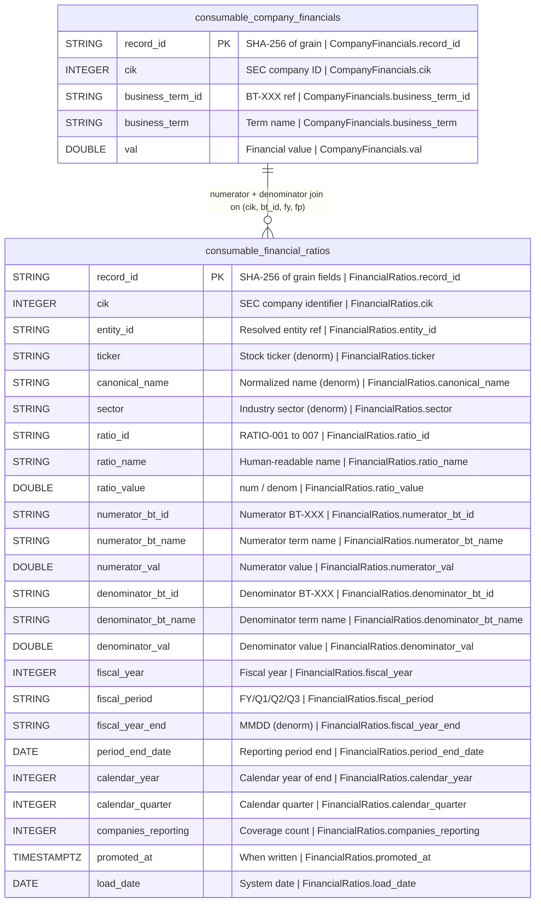

## Physical Model: Financial Ratios
**Spec:** docs/specs/consumable-financial-ratios.md
**Date:** 2026-03-14
**Agent:** @semantic-modeler
**Mode:** Greenfield (new consumable zone table)
**Stage:** Physical (3 of 3)
**Status:** APPROVED
**Derived From:** governance/models/consumable-financial-ratios-logical.md

### Tables

#### consumable.financial_ratios
- **Grain:** One row per (cik, ratio_id, fiscal_year, fiscal_period)
- **Partitioning:** None (estimated ~6.5K rows, sub-second full scan)
- **Estimated Row Count:** ~6,545

| Column | Iceberg Type | Nullable | Description | Source Mapping | Business Term | Is CDE | Is PII |
|--------|-------------|----------|-------------|----------------|---------------|--------|--------|
| record_id | STRING | No | SHA-256 hash of (cik, ratio_id, fiscal_year, fiscal_period), truncated to 16 chars | Computed | -- | No | No |
| cik | INTEGER | No | SEC Central Index Key | consumable.company_financials.cik | BT-001 | Yes | No |
| entity_id | STRING | No | FK to entity_mappings | consumable.company_financials.entity_id | -- | No | No |
| ticker | STRING | Yes | Stock ticker symbol | consumable.company_financials.ticker | -- | No | No |
| canonical_name | STRING | No | Normalized company name | consumable.company_financials.canonical_name | BT-005 | Yes | No |
| sector | STRING | No | Industry sector | consumable.company_financials.sector | BT-049 | No | No |
| ratio_id | STRING | No | Ratio definition ID (RATIO-001 through RATIO-007) | Config: RATIO_DEFINITIONS | BT-051 | No | No |
| ratio_name | STRING | No | Human-readable ratio name | Config: RATIO_DEFINITIONS | BT-051 | No | No |
| ratio_value | DOUBLE | No | Computed ratio = numerator_val / denominator_val | Computed | -- | No | No |
| numerator_bt_id | STRING | No | Business term ID of numerator | Config: RATIO_DEFINITIONS[].numerator_bt_id | BT-013 | No | No |
| numerator_bt_name | STRING | No | Name of numerator business term | consumable.company_financials.business_term (for numerator row) | BT-013 | No | No |
| numerator_val | DOUBLE | No | Value of numerator component | consumable.company_financials.val (for numerator row) | -- | No | No |
| denominator_bt_id | STRING | No | Business term ID of denominator | Config: RATIO_DEFINITIONS[].denominator_bt_id | BT-013 | No | No |
| denominator_bt_name | STRING | No | Name of denominator business term | consumable.company_financials.business_term (for denominator row) | BT-013 | No | No |
| denominator_val | DOUBLE | No | Value of denominator component | consumable.company_financials.val (for denominator row) | -- | No | No |
| fiscal_year | INTEGER | No | Fiscal year of reporting | consumable.company_financials.fiscal_year | BT-018 | Yes | No |
| fiscal_period | STRING | No | FY, Q1, Q2, Q3 | consumable.company_financials.fiscal_period | BT-018 | Yes | No |
| fiscal_year_end | STRING | Yes | Company fiscal year end (MMDD) | consumable.company_financials.fiscal_year_end | -- | No | No |
| period_end_date | DATE | No | End date of reporting period | consumable.company_financials.period_end_date | -- | No | No |
| calendar_year | INTEGER | No | Calendar year of period_end_date | consumable.company_financials.calendar_year | -- | No | No |
| calendar_quarter | INTEGER | No | Calendar quarter of period_end_date | consumable.company_financials.calendar_quarter | -- | No | No |
| companies_reporting | INTEGER | No | Distinct CIKs with this ratio for this fiscal_period type | Computed: COUNT(DISTINCT cik) per (ratio_id, fiscal_period) | BT-050 | No | No |
| promoted_at | TIMESTAMPTZ | No | When written to consumable zone | Generated at promote time | -- | No | No |
| load_date | DATE | No | System date for load tracking | Generated at promote time | -- | No | No |

### Physical Design Decisions
- **Intentionally denormalized** -- company metadata, component names, and companies_reporting are all copied or derived. Consumable zone avoids joins.
- **record_id is a truncated SHA-256** -- deterministic, collision-resistant at 16 hex chars for ~6.5K rows. Enables idempotent re-runs.
- **No partitioning** -- data volume doesn't justify it. Full scans are sub-second.
- **Both component values stored** -- numerator_val and denominator_val alongside ratio_value for full audit transparency.
- **CapEx abs applied at computation, original preserved** -- ratio_value uses abs(numerator_val) for RATIO-007 but numerator_val stores the original negative value. Consumer can see both.
- **companies_reporting is per ratio** -- count of distinct CIKs per (ratio_id, fiscal_period) across all years. More useful than per-business-term when analyzing ratios.
