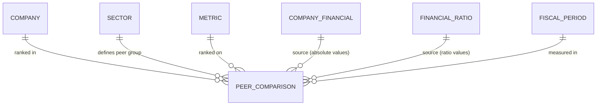

## Conceptual Model: Peer Comparison
**Spec:** docs/specs/consumable-peer-comparison.md
**Date:** 2026-03-15
**Agent:** @semantic-modeler
**Mode:** Greenfield (new consumable zone table)
**Stage:** Conceptual (1 of 3)
**Status:** APPROVED

> **Mapping note:** Business Term and CDE columns reference IDs only (BT-XXX). Authoritative definitions live in `governance/business-glossary.json`.

### Entities
| Entity | Description | Business Owner | Business Term | Is CDE | Is PII |
|--------|-------------|----------------|--------------|--------|--------|
| Company | A publicly traded company identified by CIK. One of 20 large-cap US companies. | Data Governance | BT-005 | Yes | No |
| Peer Comparison | A company's rank, percentile, and sector statistics for one metric in one fiscal period. The atomic unit of peer analysis. One row per (company, metric, year, period, metric_source). | Finance / Data Engineering | BT-053 | No | No |
| Sector | Industry sector classification used to define peer groups. Only sectors with 2+ companies are included. | Data Governance | BT-049 | No | No |
| Metric | A financial metric being compared (either a business term from company_financials or a ratio from financial_ratios). | Finance | BT-013 | No | No |
| Company Financial | Source table providing absolute financial values (Revenue, Net Income, etc.). | Finance / Data Engineering | BT-013 | No | No |
| Financial Ratio | Source table providing computed ratio values (Net Margin, Debt-to-Equity, etc.). | Finance / Data Engineering | BT-051 | No | No |
| Fiscal Period | A company's reporting period (FY, Q1, Q2, Q3) with both fiscal and calendar year alignment. | Finance / Accounting | BT-018 | Yes | No |

### Relationships
| From | To | Relationship | Cardinality | Description |
|------|----|-------------|-------------|-------------|
| Company | Peer Comparison | ranked in | 1:N | Each company has many peer comparison rows across metrics and periods |
| Sector | Peer Comparison | defines peer group | 1:N | Each sector defines a peer group for ranking |
| Metric | Peer Comparison | ranked on | 1:N | Each metric is ranked independently within each sector |
| Company Financial | Peer Comparison | source (absolute) | N:1 | Absolute values from company_financials are one metric source |
| Financial Ratio | Peer Comparison | source (ratios) | N:1 | Ratio values from financial_ratios are another metric source |
| Fiscal Period | Peer Comparison | measured in | 1:N | Rankings are computed per fiscal period |

### Business Rules
- Peer comparison requires a minimum of 2 companies in a sector group for a given (metric, year, period, source)
- Sectors with only 1 company (Energy, Industrials, Communication Services) produce no peer_comparison rows
- Highest metric_value gets rank 1 (dense ranking -- ties receive the same rank)
- Percentile formula: (peer_count - rank) / (peer_count - 1), producing 1.0 for rank 1 and 0.0 for last rank
- Sector average is the arithmetic mean of all values in the group
- Sector median is the middle value for odd count, average of two middle values for even count
- Two metric sources (company_financials and financial_ratios) are ranked independently
- Rankings are descriptive, not prescriptive -- rank 1 means "highest value," not "best"
- Missing metrics for a company exclude it from that metric's peer group (peer_count reflects actual participants)

### Design Rationale
The Peer Comparison table answers "Is this number good?" by providing sector context. Apple's Net Margin of 24.6% becomes meaningful when you know the Technology sector average is 19.1% and Apple ranks #2 of 5. Two metric sources are included because both absolute values (Revenue rank) and ratios (Net Margin rank) provide useful peer context. The minimum 2-company threshold ensures meaningful comparison -- a peer group of 1 produces trivially uninformative results.
