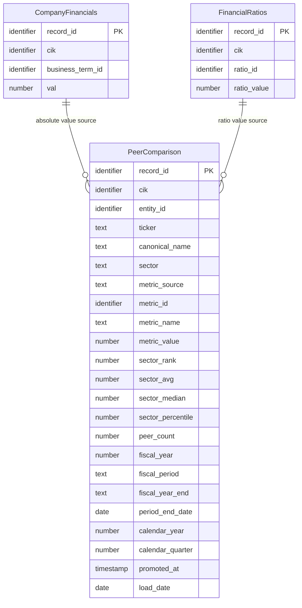

## Logical Model: Peer Comparison
**Spec:** docs/specs/consumable-peer-comparison.md
**Date:** 2026-03-15
**Agent:** @semantic-modeler
**Mode:** Greenfield (new consumable zone table)
**Stage:** Logical (2 of 3)
**Status:** APPROVED
**Derived From:** governance/models/consumable-peer-comparison-conceptual.md

> **Mapping note:** Business Term and CDE columns reference IDs only (BT-XXX). Authoritative definitions live in `governance/business-glossary.json`.

### Entities

#### PeerComparison
- **Primary Key:** record_id (deterministic SHA-256 hash of grain fields)
- **Natural Key:** (cik, metric_id, fiscal_year, fiscal_period, metric_source)
- **Description:** One peer comparison row per company per metric per fiscal period per metric source. Ranks companies within their sector and provides sector-level statistics.

| Attribute | Domain | Nullable | Description | Business Term | Is CDE | Is PII |
|-----------|--------|----------|-------------|--------------|--------|--------|
| record_id | Identifier | No | Deterministic SHA-256 hash of (cik, metric_id, fiscal_year, fiscal_period, metric_source) | -- | No | No |
| cik | Identifier | No | SEC company identifier | BT-001 | Yes | No |
| entity_id | Identifier | No | Resolved entity reference | -- | No | No |
| ticker | Text | Yes | Stock ticker symbol (denormalized) | -- | No | No |
| canonical_name | Text | No | Normalized company name (denormalized) | BT-005 | Yes | No |
| sector | Text | No | Industry sector -- defines peer group | BT-049 | No | No |
| metric_source | Text (enum) | No | `company_financials` or `financial_ratios` | BT-053 | No | No |
| metric_id | Identifier | No | business_term_id (BT-XXX) or ratio_id (RATIO-XXX) | BT-013 | No | No |
| metric_name | Text | No | Human-readable metric name | BT-013 | No | No |
| metric_value | Number (double) | No | The company's value for this metric | -- | No | No |
| sector_rank | Number (integer) | No | Rank within sector (1 = highest value, dense ranking) | BT-053 | No | No |
| sector_avg | Number (double) | No | Arithmetic mean of values across sector peers | BT-053 | No | No |
| sector_median | Number (double) | No | Median value across sector peers | BT-053 | No | No |
| sector_percentile | Number (double) | No | Percentile within sector (0.0 to 1.0) | BT-053 | No | No |
| peer_count | Number (integer) | No | Number of companies in sector with this metric | BT-053 | No | No |
| fiscal_year | Number | No | Fiscal year of reporting | BT-018 | Yes | No |
| fiscal_period | Text (enum) | No | FY, Q1, Q2, Q3 | BT-018 | Yes | No |
| fiscal_year_end | Text (MMDD) | Yes | Company's fiscal year end date (denormalized) | -- | No | No |
| period_end_date | Date | No | End date of the reporting period | -- | No | No |
| calendar_year | Number | No | Calendar year of period_end_date | -- | No | No |
| calendar_quarter | Number (1-4) | No | Calendar quarter of period_end_date | -- | No | No |
| promoted_at | Timestamp | No | When this row was written to the consumable zone | -- | No | No |
| load_date | Date | No | System date for load tracking | -- | No | No |

#### CompanyFinancials (reference -- defined in consumable-company-financials)
- See governance/models/consumable-company-financials-logical.md
- Provides: cik, business_term_id, business_term, val, sector, and all company/temporal metadata

#### FinancialRatios (reference -- defined in consumable-financial-ratios)
- See governance/models/consumable-financial-ratios-logical.md
- Provides: cik, ratio_id, ratio_name, ratio_value, sector, and all company/temporal metadata

### Relationships
| Parent Entity | Child Entity | FK Field | Cardinality | On Delete |
|--------------|-------------|----------|-------------|-----------|
| CompanyFinancials | PeerComparison | cik + business_term_id + fiscal_year + fiscal_period (where metric_source = 'company_financials') | 1:N | Restrict |
| FinancialRatios | PeerComparison | cik + ratio_id + fiscal_year + fiscal_period (where metric_source = 'financial_ratios') | 1:N | Restrict |

### Grain Definitions
- **PeerComparison:** One row per (cik, metric_id, fiscal_year, fiscal_period, metric_source). Each row includes the company's value, rank, percentile, and sector statistics.

### Normalization Decisions
- **Intentionally denormalized** -- company metadata (ticker, canonical_name, sector, fiscal_year_end) and metric names are copied from source tables. Consumable zone avoids joins.
- **sector_avg, sector_median, sector_percentile are computed aggregates** -- stored alongside individual values for single-query access. Rank 1 always gets percentile 1.0.
- **metric_source discriminates the two sources** -- same metric_id could theoretically appear in both sources but doesn't in practice (BT-XXX vs RATIO-XXX namespaces).
- **peer_count is per group** -- reflects actual participants in each (sector, metric_id, fiscal_year, fiscal_period, metric_source) group, not total companies in sector.

### Alternatives Considered
- **Separate tables for company_financials and financial_ratios peer comparisons** -- rejected. Both share the same structure and ranking logic. A single table with metric_source discriminator is simpler.
- **Computing rankings at query time** -- rejected. Window functions across sectors are complex. Precomputed rankings make "Apple's revenue rank in Technology" a simple WHERE clause.
- **Including single-company sectors** -- rejected. Rank 1 of 1 with percentile 1.0 is uninformative and wastes storage.
