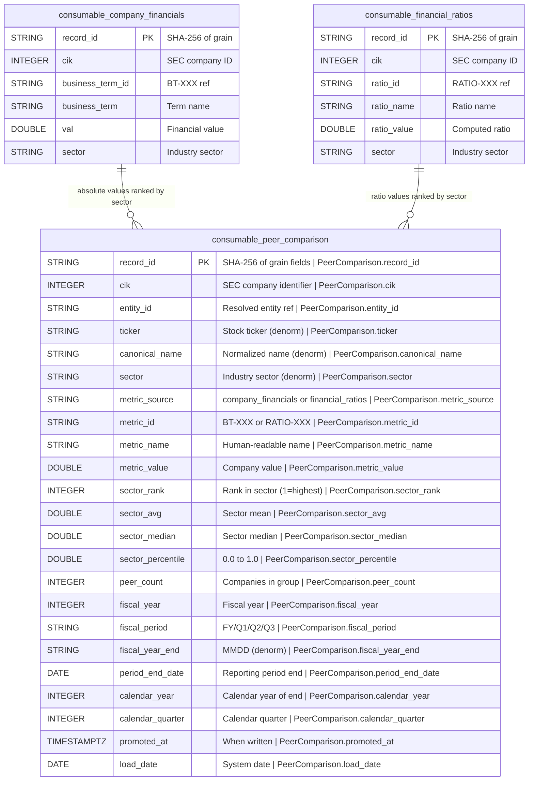

## Physical Model: Peer Comparison
**Spec:** docs/specs/consumable-peer-comparison.md
**Date:** 2026-03-15
**Agent:** @semantic-modeler
**Mode:** Greenfield (new consumable zone table)
**Stage:** Physical (3 of 3)
**Status:** APPROVED
**Derived From:** governance/models/consumable-peer-comparison-logical.md

### Tables

#### consumable.peer_comparison
- **Grain:** One row per (cik, metric_id, fiscal_year, fiscal_period, metric_source)
- **Partitioning:** None (estimated ~26.5K rows, sub-second full scan)
- **Estimated Row Count:** ~26,559

| Column | Iceberg Type | Nullable | Description | Source Mapping | Business Term | Is CDE | Is PII |
|--------|-------------|----------|-------------|----------------|---------------|--------|--------|
| record_id | STRING | No | SHA-256 hash of (cik, metric_id, fiscal_year, fiscal_period, metric_source), truncated to 16 chars | Computed | -- | No | No |
| cik | INTEGER | No | SEC Central Index Key | Source table cik | BT-001 | Yes | No |
| entity_id | STRING | No | FK to entity_mappings | Source table entity_id | -- | No | No |
| ticker | STRING | Yes | Stock ticker symbol | Source table ticker | -- | No | No |
| canonical_name | STRING | No | Normalized company name | Source table canonical_name | BT-005 | Yes | No |
| sector | STRING | No | Industry sector (defines peer group) | Source table sector | BT-049 | No | No |
| metric_source | STRING | No | `company_financials` or `financial_ratios` | Derived from source table | BT-053 | No | No |
| metric_id | STRING | No | business_term_id (BT-XXX) or ratio_id (RATIO-XXX) | Source table business_term_id or ratio_id | BT-013 | No | No |
| metric_name | STRING | No | Human-readable metric name | Source table business_term or ratio_name | BT-013 | No | No |
| metric_value | DOUBLE | No | The company's value for this metric | Source table val or ratio_value | -- | No | No |
| sector_rank | INTEGER | No | Rank within sector (1 = highest value, dense ranking) | Computed: dense rank by metric_value DESC within group | BT-053 | No | No |
| sector_avg | DOUBLE | No | Arithmetic mean of values across sector peers | Computed: AVG(metric_value) within group | BT-053 | No | No |
| sector_median | DOUBLE | No | Median value across sector peers | Computed: median of sorted values | BT-053 | No | No |
| sector_percentile | DOUBLE | No | Percentile within sector (0.0 to 1.0) | Computed: (peer_count - rank) / (peer_count - 1) | BT-053 | No | No |
| peer_count | INTEGER | No | Number of companies in sector with this metric | Computed: COUNT(DISTINCT cik) in group | BT-053 | No | No |
| fiscal_year | INTEGER | No | Fiscal year of reporting | Source table fiscal_year | BT-018 | Yes | No |
| fiscal_period | STRING | No | FY, Q1, Q2, Q3 | Source table fiscal_period | BT-018 | Yes | No |
| fiscal_year_end | STRING | Yes | Company fiscal year end (MMDD) | Source table fiscal_year_end | -- | No | No |
| period_end_date | DATE | No | End date of reporting period | Source table period_end_date | -- | No | No |
| calendar_year | INTEGER | No | Calendar year of period_end_date | Source table calendar_year | -- | No | No |
| calendar_quarter | INTEGER | No | Calendar quarter of period_end_date | Source table calendar_quarter | -- | No | No |
| promoted_at | TIMESTAMPTZ | No | When written to consumable zone | Generated at promote time | -- | No | No |
| load_date | DATE | No | System date for load tracking | Generated at promote time | -- | No | No |

### Physical Design Decisions
- **Intentionally denormalized** -- company metadata, metric names, and sector statistics are all copied or derived. Consumable zone avoids joins.
- **record_id is a truncated SHA-256** -- deterministic, collision-resistant at 16 hex chars for ~26.5K rows. Enables idempotent re-runs.
- **No partitioning** -- data volume doesn't justify it. Full scans are sub-second.
- **Dense ranking** -- ties get the same rank, next distinct value gets the next rank. More honest than arbitrary tiebreaking.
- **Percentile formula produces clean boundaries** -- rank 1 always gets 1.0, last rank always gets 0.0. No off-by-one ambiguity.
- **Two metric sources in one table** -- metric_source discriminator avoids duplicate schema. BT-XXX and RATIO-XXX namespaces prevent ID collisions.
