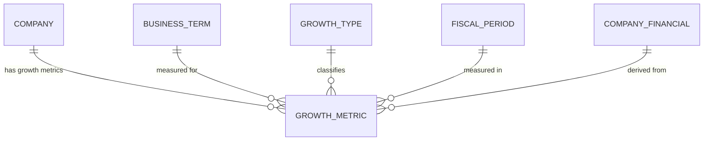

## Conceptual Model: Period-Over-Period Growth
**Spec:** docs/specs/consumable-period-over-period.md
**Date:** 2026-03-15
**Agent:** @semantic-modeler
**Mode:** Greenfield (new consumable zone table)
**Stage:** Conceptual (1 of 3)
**Status:** APPROVED

> **Mapping note:** Business Term and CDE columns reference IDs only (BT-XXX). Authoritative definitions live in `governance/business-glossary.json`.

### Entities
| Entity | Description | Business Owner | Business Term | Is CDE | Is PII |
|--------|-------------|----------------|--------------|--------|--------|
| Company | A publicly traded company identified by CIK. One of 20 large-cap US companies. | Data Governance | BT-005 | Yes | No |
| Growth Metric | A computed growth value for one company's business term between two time periods. The atomic unit of trend analysis. One row per (company, business term, fiscal year, fiscal period, growth type). | Finance / Data Engineering | BT-052 | No | No |
| Business Term | The financial metric being measured for growth (e.g., Revenue, Net Income). References existing business terms from company_financials. | Finance | BT-013 | No | No |
| Growth Type | The method of measuring change: yoy_change (absolute), yoy_pct_change (percentage), or cagr_5yr (compound annual). | Finance / Data Governance | BT-052 | No | No |
| Fiscal Period | A company's reporting period (FY, Q1, Q2, Q3) with both fiscal and calendar year alignment. | Finance / Accounting | BT-018 | Yes | No |
| Company Financial | The source table providing absolute financial values. Each growth metric requires two rows from this table (current period and prior/base period). | Finance / Data Engineering | BT-013 | No | No |

### Relationships
| From | To | Relationship | Cardinality | Description |
|------|----|-------------|-------------|-------------|
| Company | Growth Metric | has growth metrics | 1:N | Each company has many growth metrics across business terms, periods, and growth types |
| Business Term | Growth Metric | measured for | 1:N | Each growth metric measures change in exactly one business term |
| Growth Type | Growth Metric | classifies | 1:N | Each growth metric uses exactly one growth computation method |
| Fiscal Period | Growth Metric | measured in | 1:N | Each growth metric belongs to one fiscal period |
| Company Financial | Growth Metric | derived from | N:1 | Each growth metric is derived from two company_financials rows (current and prior/base period) |

### Business Rules
- Every growth metric requires both a current period and a comparison period value from company_financials for the same (cik, business_term_id, fiscal_period)
- The grain is (cik, business_term_id, fiscal_year, fiscal_period, growth_type) — exactly one growth value per company per business term per period per growth method
- YoY metrics compare fiscal_year to fiscal_year - 1 (same quarter, prior year)
- YoY percentage change uses abs(prior_val) in the denominator so sign-change transitions produce meaningful percentages
- YoY percentage change is not produced when prior_val = 0 (division by zero)
- CAGR compares fiscal_year to fiscal_year - 5 and requires base_val > 0
- Both current and prior/base values are preserved for full audit transparency
- All 25 business terms from company_financials are eligible for growth computation
- Not all companies have growth data for all years (depends on data availability in company_financials)

### Design Rationale
The Period-Over-Period Growth table transforms absolute financial values into trend signals. "Apple's Revenue was $394B" becomes "Apple's Revenue grew 2.9% YoY" and "Apple's 5-year Revenue CAGR is 8.2%." Growth types are modeled as separate rows (not columns) so adding new growth types (e.g., cagr_10yr, sequential quarter) is a config change, not a schema change. The table preserves full transparency by storing current_val and prior_val (or base_val) alongside the computed growth_value.
