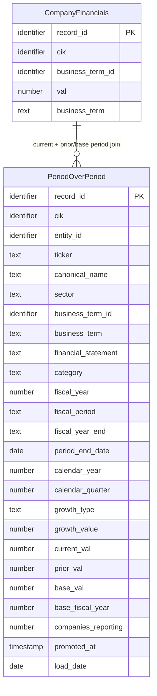

## Logical Model: Period-Over-Period Growth
**Spec:** docs/specs/consumable-period-over-period.md
**Date:** 2026-03-15
**Agent:** @semantic-modeler
**Mode:** Greenfield (new consumable zone table)
**Stage:** Logical (2 of 3)
**Status:** APPROVED
**Derived From:** governance/models/consumable-period-over-period-conceptual.md

> **Mapping note:** Business Term and CDE columns reference IDs only (BT-XXX). Authoritative definitions live in `governance/business-glossary.json`.

### Entities

#### PeriodOverPeriod
- **Primary Key:** record_id (deterministic SHA-256 hash of grain fields)
- **Natural Key:** (cik, business_term_id, fiscal_year, fiscal_period, growth_type)
- **Description:** One computed growth metric per company per business term per fiscal period per growth type. Derived from consumable.company_financials by self-joining on (cik, business_term_id, fiscal_period) across fiscal years.

| Attribute | Domain | Nullable | Description | Business Term | Is CDE | Is PII |
|-----------|--------|----------|-------------|--------------|--------|--------|
| record_id | Identifier | No | Deterministic SHA-256 hash of (cik, business_term_id, fiscal_year, fiscal_period, growth_type) | -- | No | No |
| cik | Identifier | No | SEC company identifier | BT-001 | Yes | No |
| entity_id | Identifier | No | Resolved entity reference | -- | No | No |
| ticker | Text | Yes | Stock ticker symbol (denormalized) | -- | No | No |
| canonical_name | Text | No | Normalized company name (denormalized) | BT-005 | Yes | No |
| sector | Text | No | Industry sector (denormalized) | BT-049 | No | No |
| business_term_id | Identifier | No | Business term being measured for growth | BT-013 | No | No |
| business_term | Text | No | Human-readable business term name | BT-013 | No | No |
| financial_statement | Text | No | Which financial statement this term belongs to | -- | No | No |
| category | Text | No | Business term category | -- | No | No |
| fiscal_year | Number | No | Fiscal year of the current period | BT-018 | Yes | No |
| fiscal_period | Text (enum) | No | FY, Q1, Q2, Q3 | BT-018 | Yes | No |
| fiscal_year_end | Text (MMDD) | Yes | Company's fiscal year end date (denormalized) | -- | No | No |
| period_end_date | Date | No | End date of the current reporting period | -- | No | No |
| calendar_year | Number | No | Calendar year of period_end_date | -- | No | No |
| calendar_quarter | Number (1-4) | No | Calendar quarter of period_end_date | -- | No | No |
| growth_type | Text (enum) | No | yoy_change, yoy_pct_change, or cagr_5yr | BT-052 | No | No |
| growth_value | Number (double) | No | The computed growth metric value | BT-052 | No | No |
| current_val | Number (double) | No | Value in the current period | -- | No | No |
| prior_val | Number (double) | Yes | Value in the prior period (NULL for CAGR) | -- | No | No |
| base_val | Number (double) | Yes | Value 5 years ago (only for CAGR, NULL for YoY) | -- | No | No |
| base_fiscal_year | Number | Yes | Fiscal year of the base value (only for CAGR) | -- | No | No |
| companies_reporting | Number | No | Count of distinct companies with this growth metric for this business term in this period type | BT-050 | No | No |
| promoted_at | Timestamp | No | When this row was written to the consumable zone | -- | No | No |
| load_date | Date | No | System date for load tracking | -- | No | No |

#### CompanyFinancials (reference — defined in consumable-company-financials)
- See governance/models/consumable-company-financials-logical.md
- Provides: cik, business_term_id, val, business_term, fiscal_year, fiscal_period, and all company/temporal metadata

### Relationships
| Parent Entity | Child Entity | FK Field | Cardinality | On Delete |
|--------------|-------------|----------|-------------|-----------|
| CompanyFinancials | PeriodOverPeriod | cik + business_term_id + fiscal_year + fiscal_period | 1:N | Restrict |
| CompanyFinancials | PeriodOverPeriod | cik + business_term_id + (fiscal_year-1 or fiscal_year-5) + fiscal_period | 1:N | Restrict |

### Grain Definitions
- **PeriodOverPeriod:** One row per (cik, business_term_id, fiscal_year, fiscal_period, growth_type). Each grain group produces exactly one growth value from the current period and the comparison period.

### Normalization Decisions
- **Intentionally denormalized** — company metadata (ticker, canonical_name, sector, fiscal_year_end) and business term metadata (business_term, financial_statement, category) are copied from company_financials. Consumable zone avoids joins.
- **Both component values preserved** — current_val and prior_val (or base_val for CAGR) are stored alongside growth_value for full audit transparency. Any consumer can verify the computation.
- **prior_val and base_val are mutually exclusive** — YoY rows have prior_val; CAGR rows have base_val and base_fiscal_year. This avoids conflating two different comparison semantics.
- **companies_reporting is per (growth_type, business_term_id, fiscal_period)** — "YoY Revenue Growth available for 20 companies" is the coverage signal consumers need.

### Alternatives Considered
- **Storing growth as additional columns on company_financials** — rejected. Growth has different structure (growth_type dimension, prior_val/base_val) and different grain (adds growth_type to the key). Separate table is cleaner.
- **Computing growth at query time** — rejected. CAGR requires fractional exponents; sign-change handling requires careful abs() logic. Pre-computing ensures consistency.
- **Single growth metric per row with a generic "comparison_val" field** — rejected. YoY and CAGR have semantically different comparison values (prior year vs. base year). Separate prior_val/base_val fields make the meaning explicit.
