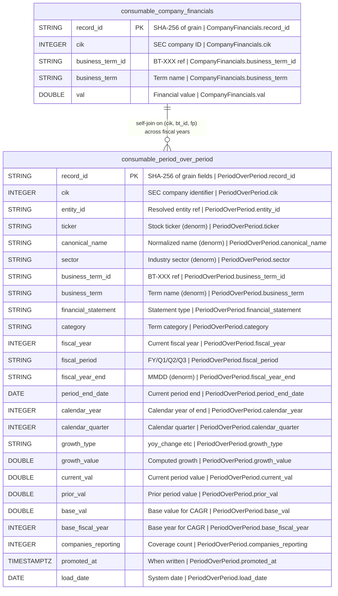

## Physical Model: Period-Over-Period Growth
**Spec:** docs/specs/consumable-period-over-period.md
**Date:** 2026-03-15
**Agent:** @semantic-modeler
**Mode:** Greenfield (new consumable zone table)
**Stage:** Physical (3 of 3)
**Status:** APPROVED
**Derived From:** governance/models/consumable-period-over-period-logical.md

### Tables

#### consumable.period_over_period
- **Grain:** One row per (cik, business_term_id, fiscal_year, fiscal_period, growth_type)
- **Partitioning:** None (estimated ~50K-55K rows, sub-second full scan)
- **Estimated Row Count:** ~52,000

| Column | Iceberg Type | Nullable | Description | Source Mapping | Business Term | Is CDE | Is PII |
|--------|-------------|----------|-------------|----------------|---------------|--------|--------|
| record_id | STRING | No | SHA-256 hash of (cik, business_term_id, fiscal_year, fiscal_period, growth_type), truncated to 16 chars | Computed | -- | No | No |
| cik | INTEGER | No | SEC Central Index Key | consumable.company_financials.cik | BT-001 | Yes | No |
| entity_id | STRING | No | FK to entity_mappings | consumable.company_financials.entity_id | -- | No | No |
| ticker | STRING | Yes | Stock ticker symbol | consumable.company_financials.ticker | -- | No | No |
| canonical_name | STRING | No | Normalized company name | consumable.company_financials.canonical_name | BT-005 | Yes | No |
| sector | STRING | No | Industry sector | consumable.company_financials.sector | BT-049 | No | No |
| business_term_id | STRING | No | Business term being measured for growth | consumable.company_financials.business_term_id | BT-013 | No | No |
| business_term | STRING | No | Human-readable business term name | consumable.company_financials.business_term | BT-013 | No | No |
| financial_statement | STRING | No | Which financial statement this term belongs to | consumable.company_financials.financial_statement | -- | No | No |
| category | STRING | No | Business term category | consumable.company_financials.category | -- | No | No |
| fiscal_year | INTEGER | No | Fiscal year of the current period | consumable.company_financials.fiscal_year | BT-018 | Yes | No |
| fiscal_period | STRING | No | FY, Q1, Q2, Q3 | consumable.company_financials.fiscal_period | BT-018 | Yes | No |
| fiscal_year_end | STRING | Yes | Company fiscal year end (MMDD) | consumable.company_financials.fiscal_year_end | -- | No | No |
| period_end_date | DATE | No | End date of current reporting period | consumable.company_financials.period_end_date | -- | No | No |
| calendar_year | INTEGER | No | Calendar year of period_end_date | consumable.company_financials.calendar_year | -- | No | No |
| calendar_quarter | INTEGER | No | Calendar quarter of period_end_date | consumable.company_financials.calendar_quarter | -- | No | No |
| growth_type | STRING | No | Growth computation method: yoy_change, yoy_pct_change, cagr_5yr | Config: GROWTH_TYPES | BT-052 | No | No |
| growth_value | DOUBLE | No | Computed growth metric value | Computed | BT-052 | No | No |
| current_val | DOUBLE | No | Value in the current period | consumable.company_financials.val (current row) | -- | No | No |
| prior_val | DOUBLE | Yes | Value in the prior year (YoY only, NULL for CAGR) | consumable.company_financials.val (prior row) | -- | No | No |
| base_val | DOUBLE | Yes | Value 5 years ago (CAGR only, NULL for YoY) | consumable.company_financials.val (base row) | -- | No | No |
| base_fiscal_year | INTEGER | Yes | Fiscal year of base value (CAGR only, NULL for YoY) | fiscal_year - 5 | -- | No | No |
| companies_reporting | INTEGER | No | Distinct CIKs with this growth metric for this (business_term_id, fiscal_period) | Computed: COUNT(DISTINCT cik) per (growth_type, business_term_id, fiscal_period) | BT-050 | No | No |
| promoted_at | TIMESTAMPTZ | No | When written to consumable zone | Generated at promote time | -- | No | No |
| load_date | DATE | No | System date for load tracking | Generated at promote time | -- | No | No |

### Physical Design Decisions
- **Intentionally denormalized** — company metadata, business term metadata, and companies_reporting are all copied or derived. Consumable zone avoids joins.
- **record_id is a truncated SHA-256** — deterministic, collision-resistant at 16 hex chars for ~52K rows. Enables idempotent re-runs.
- **No partitioning** — data volume doesn't justify it. Full scans are sub-second.
- **prior_val and base_val are nullable** — YoY rows have prior_val (base_val is NULL); CAGR rows have base_val and base_fiscal_year (prior_val is NULL). This makes the semantics explicit.
- **companies_reporting is per (growth_type, business_term_id, fiscal_period)** — count of distinct CIKs per combination. CAGR will have fewer companies than YoY because it requires 5+ years of data.
